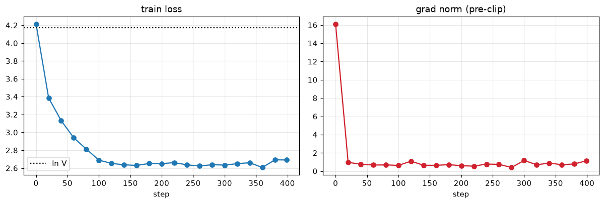

# Session 10 — The Training Loop

**Take a small model and a real loop, and make it tell you the truth about itself.**

A compact nanoGPT-style decoder (**10.77M params**, 6 layers) trained on
char-level Tiny Shakespeare, with the training step instrumented six ways —
every experiment done **by hand in the notebook cells**, not behind a wrapper:

1. every tensor shape in the step printed and named,
2. one gradient checked by finite differences against `backward()` — analytic and numeric match to **every printed digit** (~9 significant figures),
3. gradient accumulation deliberately broken — **15.38%** static error, a **+7.7%** held-out-loss gap in a real run,
4. the global grad norm logged every step and caught spiking **1 step before** the loss,
5. MFU measured honestly on an RTX A6000 — **4.75%** (a noisy single-window estimate), and why,
6. the number `0.1` written out bit by bit in fp32, bf16 and fp8 E4M3.

> 📓 **Notebook:** [`training_loop/session10_training_loop.ipynb`](./training_loop/session10_training_loop.ipynb)
> — executed top to bottom on an RTX A6000 (~1 min); `S10_SMOKE=1` gives a ~2-minute CPU pass.
> 🌐 **Web app:** [`webapp/index.html`](./webapp/index.html) — visual walkthrough of the experiment and its numbers.
> 🧩 **Code:** [`training_loop/src/trainloop/`](./training_loop/src/trainloop/) —
> plumbing only (model + data + utils); the six tasks live in the notebook.

```
session10/
├── README.md                     ← you are here (the submission)
├── webapp/                       ← visual walkthrough (dark/light, no build step)
│   ├── index.html · style.css · data.js · app.js
└── training_loop/
    ├── session10_training_loop.ipynb   ← the whole assignment, executed
    ├── src/trainloop/
    │   ├── model.py              # the GPT (learned pos emb, LN, GELU MLP, tied head)
    │   ├── data.py               # char-level Tiny Shakespeare + fixed/variable-length batches
    │   └── utils.py              # seeding, device pick, the S10_SMOKE switch
    └── assets/                   # plots + results.json, written by the run
```

## Running it

```bash
cd training_loop
uv sync                       # torch from the cu124 index; see pyproject.toml
uv run python dry_run.py      # ~2 min CPU smoke pass, proves it executes

# full run on a GPU box:
uv run jupyter nbconvert --to notebook --execute --inplace session10_training_loop.ipynb
# S10_PEAK_TFLOPS overrides the built-in peak lookup if the auto-guess is wrong
```

## Experiment setup

| | |
|---|---|
| **Hardware** | NVIDIA RTX A6000 · CUDA 12.4 · PyTorch 2.6.0 |
| **Dataset** | char-level Tiny Shakespeare — **1,003,854** train chars, 111,540 val, **vocab 65** |
| **Model** | nanoGPT-style decoder, from scratch (`src/trainloop/model.py`) — learned token + position embeddings, pre-norm LayerNorm, causal MHSA via `F.scaled_dot_product_attention`, 4× GELU MLP, weight-tied head |
| **Config** | `block_size=256`, `n_layer=6`, `n_head=6`, `n_embd=384` — **10,770,816 params** (10,672,512 non-embedding = the `N` in `6N`) |
| **Sanity anchor** | `ln(65) = 4.174` — where an untrained char model's loss should sit |

The numbers below are from that A6000 run. Every headline number is also written
to [`training_loop/assets/results.json`](./training_loop/assets/results.json) by
the notebook's final cell.

---

## 1. Print every tensor shape in the step

The notebook walks the forward pass one sub-module at a time
(`net.transformer.wte(xb)`, `blk.attn.c_attn(xn)`, …), un-rolling attention
explicitly — `q @ kᵀ / √Dh`, causal mask, softmax, `@ v` — so the `[B, H, T, T]`
score tensor the fused SDPA kernel hides is visible. Then it loops the
parameters and, after `backward()`, every `.grad`.

**Cross-check:** the by-hand logits match the model's own fused `forward()` to
**7.15 × 10⁻⁷** (max abs difference) — the un-rolled attention is arithmetically
the same kernel.

**Dimension legend** — `B=4, T=16, C=384, H=6, Dh=64, F=1536, V=65`

| letter | meaning (one line) |
| --- | --- |
| `B` | batch — independent sequences processed together in this step |
| `T` | time / sequence length — token positions, left to right |
| `C` | channels (`n_embd`) — width of the residual stream |
| `H` | heads — parallel attention subspaces |
| `Dh` | `C / H` — width of a single attention head |
| `F` | `4C` — hidden width of the MLP |
| `V` | `vocab_size` — number of distinct output symbols |

**Activations** (as printed, `B=4, T=16`)

| tensor | shape | what each dimension means |
| --- | --- | --- |
| `idx` (input) / `targets` | `[4, 16]` | `[B, T]` — B sequences of T token ids; targets are the next id at each position |
| token embedding `wte(x)` | `[4, 16, 384]` | `[B, T, C]` — each id → a C-vector; the table `wte.weight` is `[V, C]` |
| position embedding `wpe(pos)` | `[16, 384]` | `[T, C]` — one C-vector per slot 0…T-1, broadcast over B |
| residual stream `x` | `[4, 16, 384]` | `[B, T, C]` — token + position; the tensor every block reads and writes |
| `c_attn(ln_1(x))` | `[4, 16, 1152]` | `[B, T, 3C]` — one matmul produces q, k, v stacked |
| q, k, v (after head split) | `[4, 6, 16, 64]` | `[B, H, T, Dh]` — C folded into H heads of width Dh |
| attention scores | `[4, 6, 16, 16]` | `[B, H, T, T]` — how much every position attends to every position at or before it |
| `ctx = attn @ v` | `[4, 6, 16, 64]` | `[B, H, T, Dh]` — values mixed by attention |
| `c_proj(ctx)` | `[4, 16, 384]` | `[B, T, C]` — heads merged, projected back into the stream |
| `mlp.c_fc` → GELU | `[4, 16, 1536]` | `[B, T, F]` — widen to 4C, nonlinearity |
| `mlp.c_proj` | `[4, 16, 384]` | `[B, T, C]` — project back to C |
| `ln_f(x)` | `[4, 16, 384]` | `[B, T, C]` — final LayerNorm |
| `logits = lm_head(x)` | `[4, 16, 65]` | `[B, T, V]` — an unnormalised score for every vocab symbol at every position |
| per-token loss | `[4, 16]` | `[B, T]` — cross-entropy at each position |
| `loss` | `[]` | one scalar — the mean over the `B·T` counted tokens |

**Parameters** (per block, plus the shared tables — from the printed table)

| parameter | shape | #params | maps |
| --- | --- | ---: | --- |
| `transformer.wte.weight` / `lm_head.weight` (tied) | `[65, 384]` | 24,960 | token id ↔ embedding / hidden → vocab logits |
| `transformer.wpe.weight` | `[256, 384]` | 98,304 | position → embedding |
| `attn.c_attn.weight` | `[1152, 384]` | 442,368 | stream → q, k, v |
| `attn.c_proj.weight` | `[384, 384]` | 147,456 | attention output → stream |
| `mlp.c_fc.weight` | `[1536, 384]` | 589,824 | stream → MLP hidden |
| `mlp.c_proj.weight` | `[384, 1536]` | 589,824 | MLP hidden → stream |
| `ln_1 / ln_2 / ln_f .weight, .bias` | `[384]` | 384 each | LayerNorm gain and shift |
| | | **10,770,816** | total trainable |

**Gradients** — after `backward()`, every `.grad.shape` equals its parameter's
shape (`dL/dW` is one number per weight). **`grads with the WRONG shape: 0`,
`grads that are None: 0`.** The tied `wte`/`lm_head` tensor appears once; its
gradient has accumulated contributions from both the embedding lookup and the
output projection.

---

## 2. Verify one gradient by hand

The notebook picks `transformer.h.0.mlp.c_fc.weight[0, 0]` (value `+0.015489`) on
an fp64 `deepcopy` with dropout off, and compares:

- **analytic** — `param.grad[0,0]` from `loss.backward()`
- **numeric** — central difference `(L(w+h) − L(w−h)) / 2h`, `h = 1e-4`

| quantity | value (A6000 run) |
| --- | --- |
| `L(w+h)` | `4.321718141721` |
| `L(w−h)` | `4.321716520359` |
| analytic `dL/dw` | `+0.008106809185` |
| numeric `dL/dw` | `+0.008106809166` |
| absolute difference | `1.842 × 10⁻¹¹` |
| relative difference | `2.272 × 10⁻⁹` |
| **agreement** | **every printed digit** (≈9 significant figures) |

The two match to the last printed digit — a **relative** difference of
`2.3 × 10⁻⁹`, about 9 significant figures on an `8.1 × 10⁻³` value. (Central-
difference truncation is `O(h²·L''')`, so the clean agreement also says `L'''` is
modest for *this* weight; a worse-conditioned one would want a smaller `h`.) That
means `backward()` here is doing exactly the chain rule. **If it had not agreed**:
dropout still on (forward not repeatable), `h` too large (truncation) or too small
(fp64 rounding swamps the difference), fp32 instead of fp64, or an in-place op
corrupting the autograd graph.

---

## 3. Break gradient accumulation on purpose

Combining `K` micro-batches into one optimizer step, two ways:

- **correct** — sum every per-token loss, divide by the **total token count**. Every token gets one equal vote.
- **wrong** — average each micro-batch's **mean** loss ("average of the averages"). A short micro-batch gets the same vote as a long one.

They are identical when micro-batches hold equal token counts — which is exactly
why this bug lived in every major framework until 2024.

**The static case** (class-notes numbers) — token counts `(4, 4, 2)`, mean losses `(2.0, 2.0, 5.0)`:

- correct: `(4·2 + 4·2 + 2·5) / (4+4+2) = 26/10 = 2.6000`
- wrong: `(2.0 + 2.0 + 5.0) / 3 = 3.0000`
- **relative error: 15.38%**

**In a real loop** — `accumulate_correct` and `accumulate_wrong` are defined
inline in the notebook, then two copies of the same initial model are trained for
**120 steps**, fed the **same** unequal-length micro-batches every step (token
counts `(48, 48, 12)`, `micro_batch_size=8`), one under each rule:

| | correct (token-weighted) | wrong (avg-of-avgs) |
| --- | --- | --- |
| held-out loss¹ | **3.1303** | **3.3714** |
| gap at the last eval | — | **+7.70%** |

¹ scored on **one fixed 2,048-token batch** (32 × 64, seed 0) — the same batch
for both models, so each number is a one-batch estimate but the *comparison*
between the two rules is exact.


The curves start together and pull apart. The "wrong" rule is not noise — it
systematically over-weights the short (12-token) micro-batch's gradient, so it
optimises a slightly different objective than the one written down. **The fix is
one line: normalise the loss by token, not by micro-batch.**

---

## 4. Log the grad norm at every step, and catch it moving first

The notebook loop logs, every step: raw loss, an EMA-smoothed loss (β = 0.25),
and the global grad norm `sqrt(Σ gᵢ²)` — computed **after `backward()`, before
`opt.step()`**. At step **70 of 140** it feeds a single **poisoned batch**
(targets replaced with uniform noise). That batch has a large gradient → the norm
spikes on that step; the optimizer takes one bad step, and the loss on the
following normal batches degrades.

| quantity (A6000 run) | value |
| --- | --- |
| poisoned batch at step | 70 |
| grad norm, step 69 → 70 | `0.809 → 3.834` (**4.7×**) |
| grad-norm spike at step | **70** |
| smoothed loss rose > 5% at step | **71** |
| **grad norm led the loss by** | **1 step** |


**On the method.** At this model size and over 140 steps nothing naturally
diverges — in the 70 un-poisoned steps the grad norm and the EMA loss just track
each other down. So the event is *induced* with one poisoned batch to show the
mechanism in miniature. The lead here is a single step; on a real run sliding
toward divergence the grad norm bends up thousands of steps before the loss curve
does, which is why it is the most useful trace on a training dashboard. Clipping
(`clip_grad_norm_`) uses the same number — cap the norm, keep the direction,
scale the length down — and the notes say to have it on from step one (the sanity
run below does).

---

## 5. Compute your own MFU, honestly

$$\text{MFU} = \frac{(6N + \text{attn}) \times \text{tokens/sec}}{\text{peak FLOP/s}}$$

`6N` is "6 FLOPs per parameter per token" (2 forward + 4 backward). The attention
term `6 · n_layer · 2 · block_size · Dh · H` covers the `q@kᵀ` and `attn@v`
matmuls that aren't in the parameters. The notebook spells this out, then times a
real forward + backward + optimizer loop (bf16 autocast, 30 measured steps).

| quantity | A6000 run |
| --- | ---: |
| `N` (non-embedding params) | 10,672,512 |
| `6N` | 64,035,072 |
| attention term | 7,077,888 |
| **flops / token** | **71,112,960** |
| dtype | bf16 autocast |
| mean step time | 39.60 ms |
| tokens / sec | 103,425 |
| achieved | **7.36 TFLOP/s** |
| peak (RTX A6000, bf16 tensor) | 155 TFLOP/s |
| **MFU** | **4.75 %** |
| distance to 40% | **35.25 points** |

An earlier run of the same cell on the same box measured ~9.7%. A single
30-step window on a shared GPU is a noisy estimate — the *structural* reasons
below are what actually cap this configuration, not the exact percentage.

### What is costing us the distance to 40%

Roughly in order of impact for this run:

1. **Tiny model.** At 10.7M params, `6N` is small, so each token is cheap in
   FLOPs but still pays full kernel-launch and Python-loop overhead. MFU climbs
   with model size; this proxy sits well below where an A6000 saturates.
2. **Small batch / short sequences** (`batch 16 × seq 256`). The matmuls are
   memory-bandwidth bound, not compute bound. Larger `B` and `T` amortise the
   weight reads.
3. **No `torch.compile` / no fused kernels.** Eager mode launches hundreds of
   small kernels per step; only attention (SDPA) is fused.
4. **bf16 autocast, not a fully low-precision path.** LayerNorm, the loss
   reduction and the optimizer still run in fp32; the peak column assumes pure
   bf16 tensor-core throughput.
5. **Optimizer + sync points.** AdamW is elementwise and bandwidth-bound; every
   `loss.item()` forces a device sync that stalls the pipeline.
6. **The attention term grows as `T²`** and is not in `6N` — at `T = 256` it is
   ~10% of flops/token, and at long context it eats real time the `6N` estimate
   ignores, depressing measured MFU further.

The fixes are the next sessions: bigger models, a bigger global batch via
gradient accumulation, `torch.compile`, activation checkpointing, and a
lower-precision format chosen on purpose.

---

## 6. The number 0.1 in fp32, bf16 and fp8 E4M3

`0.1` in binary is `0.0001100110011…` repeating — never exact. Each format rounds
the tail at a different place. `0.1 = 1.6 × 2⁻⁴`, so the unbiased exponent is
**−4** everywhere below and the significand is `1.6` (fraction `0.6`).

**Mantissa bits by hand** — scale the fraction `0.6` by `2^(mantissa width)` and round to nearest:

- fp32 (23 bits): `0.6 × 2²³ = 5033164.8 → 5033165` = `10011001100110011001101`
- bf16 (7 bits): `0.6 × 2⁷ = 76.8 → 77` = `1001101`
- fp8 E4M3 (3 bits): `0.6 × 2³ = 4.8 → 5` = `101`

Exponent field = unbiased + bias: fp32/bf16 `−4 + 127 = 123 = 01111011`, fp8 E4M3 `−4 + 7 = 3 = 0011`.

**From the actual bit patterns** (fp32 via `struct`, bf16 as fp32's top 16 bits
with round-to-nearest-even, fp8 E4M3 rounded by hand):

| format (S-E-M) | bits (sign · exp · mantissa) | value stored | rel. error |
| --- | --- | --- | --- |
| **fp32** (1-8-23) | `0 01111011 10011001100110011001101` | `0.100000001490` | `1.49 × 10⁻⁸` |
| **bf16** (1-8-7) | `0 01111011 1001101` | `0.100097656250` | `9.77 × 10⁻⁴` |
| **fp8 E4M3** (1-4-3) | `0 0011 101` | `0.101562500000` | `1.56 × 10⁻²` |

E4M3 is not IEEE: there is no infinity, and the single pattern `S.1111.111` is
**reserved for NaN** — which is why the largest *finite* magnitude is
`S.1111.110` = **448**, not 480. The by-hand encoder saturates to 448 both on
overflow and when rounding would land in that NaN slot:

| input | fp8 E4M3 bits | value | note |
| --- | --- | --- | --- |
| `−0.1` | `1 0011 101` | `0.1015625` (sign bit = 1) | only the sign bit flips vs `+0.1` |
| `448.0` | `0 1111 110` | `448.0` | the largest finite E4M3 value |
| `470.0` | `0 1111 110` | `448.0` | rounds toward `S.1111.111` (NaN) → **saturates** to 448 |
| `1000.0` | `0 1111 110` | `448.0` | overflow → clamped to 448 |
| `0.001` | `0 0000 001` | `0.001953125` | subnormal (exp field 0), ~95% error |

### Which would I train in, and why

**bf16 for the model math, with an fp32 master copy of the weights** — the
standard mixed-precision recipe.

- **fp32** is the safe reference but doubles memory and bandwidth for detail the
  forward/backward pass does not need. Keep it only for the master weights, the
  optimizer moments, and reductions (loss, grad norm).
- **fp16** spends its bits on mantissa and keeps only 5 exponent bits. Late in a
  run, gradients near `10⁻⁸` underflow to exactly zero and that weight silently
  stops learning — it needs loss scaling, one more knob to get wrong.
- **bf16** keeps all 8 exponent bits, so its range equals fp32's and nothing in
  training underflows. It pays in precision (2–3 decimal digits) — the `9.8 × 10⁻⁴`
  error on `0.1` above — which is fine, because the fp32 master weights and fp32
  optimizer accumulate the small updates bf16 alone would round away.
- **fp8 E4M3** (`1.6%` error on `0.1`, and it clamps anything past 448) only
  converges blockwise — per-block scales, attention left in higher precision,
  several other conditions. A 2026 production recipe, not the thing to start a
  from-scratch run in.

---

## 7. Sanity: the loop learns

A short real run — 400 steps, `batch 32 × seq 128`, AdamW `lr 3e-3`, grad-norm
clipping at 1.0 from step one — drives the loss from `≈ ln V` down:

| | value |
| --- | --- |
| start loss | **4.214** (`ln V = 4.174`) |
| end loss | **2.691** |
| wall time | 14.7 s for 400 steps |



Sampling the trained model (200 chars, temperature 0.8) gives recognisably
Shakespeare-shaped noise — line breaks, capitalised speaker tags, short words —
which is all 400 steps of a 10M model on characters can buy:

```
Cotheferey cowi,fake le, bth

Hirere obe ale.
S:BOSED:
Bdelatauss:
Warthare wecrl t.
War dthasomee ar ce myathandanoum orour
```

---

## The one lesson

**Every serious training bug is silent.** Not one of the six checks here would
have raised an exception — a wrong accumulation rule (`+7.7%` worse and falling),
a misreported gradient, a run sliding toward divergence, a machine running at
`<5%` MFU — all produce a plausible-looking loss curve. Print things and check
things.
