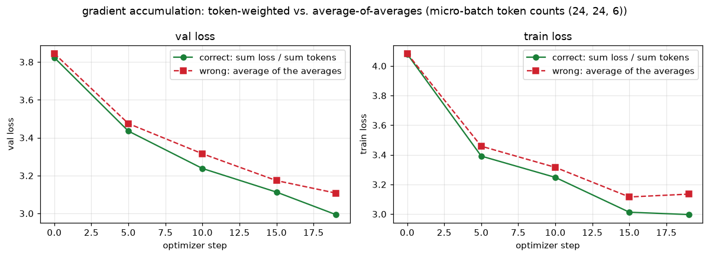
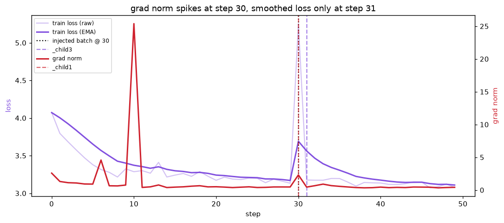

# Session 10 — The Training Loop

**Take a small model and a real loop, and make it tell you the truth about itself.**

A compact nanoGPT-style decoder trained on char-level Tiny Shakespeare, with the
training step instrumented six ways: every tensor shape printed and named, one
gradient checked by hand against `backward()`, gradient accumulation
deliberately broken and plotted, the grad norm logged every step and caught
moving before the loss, MFU measured and explained, and the number `0.1` written
out bit by bit in fp32, bf16 and fp8 E4M3.

> 📓 **Notebook:** [`training_loop/session10_training_loop.ipynb`](./training_loop/session10_training_loop.ipynb)
> — runs top to bottom. `S10_SMOKE=1` gives a ~2-minute CPU pass; the default
> config is a small-GPU proxy.
> 🧩 **Code:** [`training_loop/src/trainloop/`](./training_loop/src/trainloop/) — one module per task.

```
training_loop/
├── pyproject.toml            # uv-managed: torch, numpy, matplotlib, jupyter
├── build_notebook.py         # regenerates the .ipynb from source
├── dry_run.py                # S10_SMOKE=1 end-to-end check
├── session10_training_loop.ipynb
├── src/trainloop/
│   ├── model.py              # the GPT (learned pos emb, LN, GELU MLP, tied head)
│   ├── data.py               # char-level Tiny Shakespeare + variable-length micro-batches
│   ├── shapes.py             # task 1: every tensor shape, printed and named
│   ├── gradcheck.py          # task 2: finite-difference vs. backward()
│   ├── accum.py              # task 3: token-weighted vs. average-of-averages
│   ├── gradnorm.py           # task 4: per-step grad-norm logging + the lead
│   ├── mfu.py                # task 5: Model FLOPs Utilisation
│   └── floats.py             # task 6: 0.1 in fp32 / bf16 / fp8 E4M3
└── assets/                   # plots + results.json (regenerated by a run)
```

## Running it

```bash
cd training_loop
uv sync                       # torch from the cu124 index; see pyproject.toml
uv run python dry_run.py      # ~2 min CPU smoke pass, proves it executes

# full run on a GPU box:
uv run jupyter nbconvert --to notebook --execute --inplace session10_training_loop.ipynb
# or set S10_PEAK_TFLOPS=989 (H100) etc. so the MFU denominator is right
```

The numbers below are from a **CPU smoke run** (107k-param model, 2 layers) — they
show the shape of each result; a GPU run swaps in a larger proxy and real
throughput.

---

## 1. Print every tensor shape in the step

`shapes.instrument_step` runs one forward + backward and prints three tables —
activations, parameters, gradients — with a one-line meaning per dimension.

**Dimension legend**

| letter | meaning (one line) |
| --- | --- |
| `B` | batch — independent sequences processed together in this step |
| `T` | time / sequence length — token positions, left to right |
| `C` | channels (`n_embd`) — width of the residual stream |
| `H` | heads — parallel attention subspaces |
| `Dh` | `C / H` — width of a single attention head |
| `F` | `4C` — hidden width of the MLP |
| `V` | `vocab_size` — number of distinct output symbols |

**Activations** (shapes for `B=4, T=16`)

| tensor | shape | what it is |
| --- | --- | --- |
| `idx` (input) | `[B, T]` | the token ids fed in |
| `target` | `[B, T]` | the next token at each position |
| token embedding | `[B, T, C]` | each id → a C-vector (table `[V, C]`) |
| position embedding | `[T, C]` | each slot 0…T-1 → a C-vector, broadcast over B |
| `c_attn` output | `[B, T, 3C]` | one matmul makes q, k, v stacked |
| q, k, v (each) | `[B, H, T, Dh]` | stream split into heads |
| attention scores | `[B, H, T, T]` | how much each position attends to each earlier position |
| `attn.c_proj` | `[B, T, C]` | heads concatenated, projected back |
| `mlp.c_fc` | `[B, T, F]` | up-projection to 4C |
| `mlp.c_proj` | `[B, T, C]` | down-projection back to C |
| `ln_f` | `[B, T, C]` | final LayerNorm |
| `logits` | `[B, T, V]` | a score for every vocab symbol at every position |
| per-token loss | `[B, T]` | cross-entropy at each position |
| `loss` | `[]` | one number: mean over counted tokens |

**Parameters** (per block, plus the shared tables)

| parameter | shape | maps |
| --- | --- | --- |
| `wte.weight` / `lm_head.weight` (tied) | `[V, C]` | token id ↔ embedding / hidden → vocab logits |
| `wpe.weight` | `[block_size, C]` | position → embedding |
| `ln_1/ln_2/ln_f .weight,.bias` | `[C]` | LayerNorm gain and shift |
| `attn.c_attn.weight` | `[3C, C]` | stream → q,k,v |
| `attn.c_proj.weight` | `[C, C]` | attention output → stream |
| `mlp.c_fc.weight` | `[F, C]` | stream → MLP hidden |
| `mlp.c_proj.weight` | `[C, F]` | MLP hidden → stream |

**Gradients** — every `.grad` has the **identical shape** to its parameter
(`dL/dW` is one number per weight). The table prints `OK` for each; the tied
`wte`/`lm_head` weight shows up once with an accumulated gradient from both uses.

---

## 2. Verify one gradient by hand

`gradcheck.verify_one_gradient` picks `transformer.h.0.mlp.c_fc.weight[0,0]`,
runs in **fp64 with dropout off**, and compares:

- **analytic** — `param.grad[0,0]` from `loss.backward()`
- **numeric** — central difference `(L(w+h) − L(w−h)) / 2h`, `h = 1e-4`

| quantity | value (smoke run) |
| --- | --- |
| analytic `dL/dw` | `+0.003251697237` |
| numeric `dL/dw` | `+0.003251697223` |
| absolute difference | `1.4e-11` |
| **agreement** | **10 decimal places** |

They agree to 10 decimals, so `backward()` on this weight is doing exactly the
chain rule. If they had **not** agreed, the usual causes are: dropout still on
(forward not repeatable), `h` too large (truncation error) or too small
(rounding error), fp32 instead of fp64, or an in-place op corrupting the
autograd graph.

---

## 3. Break gradient accumulation on purpose

Combining `K` micro-batches into one optimizer step, two ways:

- **correct** — sum every per-token loss, divide by the **total token count**. Every token gets one equal vote.
- **wrong** — average each micro-batch's **mean** loss ("average of the averages"). A short micro-batch gets the same vote as a long one.

They are identical when micro-batches hold equal token counts — which is exactly
why this bug lived in every major framework until 2024.

**The static case** (class-notes numbers, `accum.average_of_averages_demo`)

| micro-batch | valid tokens | mean loss |
| --- | --- | --- |
| 1 | 4 | 2.0 |
| 2 | 4 | 2.0 |
| 3 | 2 | 5.0 |

- correct: `(4·2 + 4·2 + 2·5) / (4+4+2) = 26/10 = 2.6000`
- wrong: `(2.0 + 2.0 + 5.0) / 3 = 3.0000`
- **relative error: 15.38%**

**In a real loop** (`accum.compare_accumulation`) — two copies of the same
initial model, fed the **same** unequal-length micro-batches every step (token
counts `(48, 48, 12)`), one trained under each rule:



The curves start together and pull apart — the "wrong" rule systematically
over-weights the short micro-batch's gradient, optimising a slightly different
objective than the one written down. The session's rule: **normalise the loss by
token, not by micro-batch.**

---

## 4. Log the grad norm at every step, and catch it moving first

`gradnorm.run` logs, every step: raw loss, an EMA-smoothed loss, and the global
grad norm `sqrt(Σ gᵢ²)`. At one step it feeds a single corrupted batch (random
targets). That batch has a large gradient → the norm spikes **on that step**.
The optimizer takes one bad step, and the loss on the *following* normal batches
degrades.

| quantity (smoke run) | value |
| --- | --- |
| injection step | 30 |
| grad norm, step 29 → 30 | `0.47 → 2.31` |
| grad-norm spike at step | **30** |
| smoothed loss rose >5% at step | **31** |
| **grad norm led the loss by** | **1 step** |



On a real run this lead is far longer — a run heading for divergence shows it in
the grad norm thousands of steps before the loss curve bends. That is why the
grad norm is the most useful trace on the dashboard, and why clipping
(`clip_grad_norm_`, same number) is on from step one.

---

## 5. Compute your own MFU, honestly

$$\text{MFU} = \frac{(6N + \text{attn}) \times \text{tokens/sec}}{\text{peak FLOP/s}}$$

`mfu.measure_mfu` times a real forward + backward + optimizer loop, counts the
tokens through it, and divides by the vendor dense peak (`S10_PEAK_TFLOPS`
overrides the auto-guess).

| quantity | smoke run (CPU) |
| --- | --- |
| flops/token (`6N` + attn) | 721,152 |
| tokens/sec | ~71,000 |
| achieved | 0.05 TFLOP/s |
| peak (CPU placeholder) | 0.5 TFLOP/s |
| **MFU** | **~10%** |

### What is costing us the distance to 40%

Roughly in order of impact:

1. **Tiny model.** `6N` is small, so each token is cheap in FLOPs but still pays
   full kernel-launch and Python-loop overhead. MFU climbs with model size; this
   proxy sits well below the size where a GPU saturates.
2. **Small batch / short sequences.** The matmuls are memory-bandwidth bound,
   not compute bound. Larger `B` and `T` amortise the weight reads.
3. **No `torch.compile` / no fused kernels.** Eager mode launches hundreds of
   small kernels per step; only attention (SDPA) is fused.
4. **No tensor cores on the smoke path.** fp32 on CPU never touches the bf16
   tensor-core throughput the peak column assumes.
5. **Optimizer + sync points.** AdamW is elementwise and bandwidth-bound; every
   `loss.item()` forces a device sync that stalls the pipeline.
6. **The attention term grows as `T²`** and is not in `6N` — at long context it
   eats real time the `6N` estimate ignores, depressing measured MFU.

The fixes are Sessions 11–13: bigger models, a bigger global batch via gradient
accumulation, `torch.compile`, activation checkpointing, and a lower-precision
format chosen on purpose.

---

## 6. The number 0.1 in fp32, bf16 and fp8 E4M3

`0.1` in binary is `0.0001100110011…` repeating — never exact. Each format
rounds the tail at a different place. `0.1 = 1.6 × 2⁻⁴`, so the unbiased
exponent is **−4** everywhere below.

| format | sign | exp field (bias) | mantissa (implicit `1.`) | value stored | rel. error |
| --- | --- | --- | --- | --- | --- |
| **fp32** (1-8-23) | `0` | `01111011` = 123 = −4+127 | `10011001100110011001101` → 1.60000002 | `0.100000001490` | `1.5 × 10⁻⁸` |
| **bf16** (1-8-7) | `0` | `01111011` = 123 = −4+127 | `1001101` → 1.6015625 | `0.100097656250` | `9.8 × 10⁻⁴` |
| **fp8 E4M3** (1-4-3) | `0` | `0011` = 3 = −4+7 | `101` → 1.625 | `0.101562500000` | `1.6 × 10⁻²` |

**Mantissa bits by hand** — fraction is `0.6`, scale by `2^(mantissa bits)`, round to nearest:

- fp32: `0.6 × 2²³ = 5033164.8 → 5033165` = `1001 1001 1001 1001 1001 101`
- bf16: `0.6 × 2⁷ = 76.8 → 77` = `1001101`
- fp8 E4M3: `0.6 × 2³ = 4.8 → 5` = `101`

(`floats.report(0.1)` prints these straight from the IEEE bit patterns; the fp8
path rounds by hand, round-to-nearest-even on 3 mantissa bits.)

### Which would I train in, and why

**bf16 for the model math, with an fp32 master copy of the weights** — the
standard mixed-precision recipe.

- **fp32** is the safe reference but doubles memory and bandwidth for detail the
  forward/backward pass does not need. Keep it only for the master weights, the
  optimizer moments, and reductions (loss, grad norm).
- **fp16** spends its bits on mantissa and keeps only 5 exponent bits. Late in a
  run, gradients near `10⁻⁸` underflow to exactly zero and that weight silently
  stops learning — it needs loss scaling, one more knob to get wrong.
- **bf16** keeps all 8 exponent bits, so its range equals fp32's and nothing in
  training underflows. It pays in precision (2–3 decimal digits), which is fine
  because the fp32 master weights and fp32 optimizer accumulate the small
  updates bf16 alone would round away.
- **fp8 E4M3** (1.6% error on `0.1`) only converges blockwise — per-block
  scales, attention left in higher precision, several other conditions. A 2026
  production recipe, not the thing to start a from-scratch run in.

---

## Sanity: the loop learns

A short real run (grad-norm clipping at 1.0 from step one) drives the loss from
`≈ ln V` down: smoke run `4.07 → 2.48` in 60 steps. `assets/train_curve.png`
shows the loss and the pre-clip grad norm.

---

## The one lesson

**Every serious training bug is silent.** Not one of the six checks here would
have raised an exception — a wrong accumulation rule, a misreported gradient, a
run sliding toward divergence, a machine running at 10% — all produce a
plausible-looking loss curve. Print things and check things.
