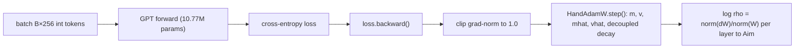
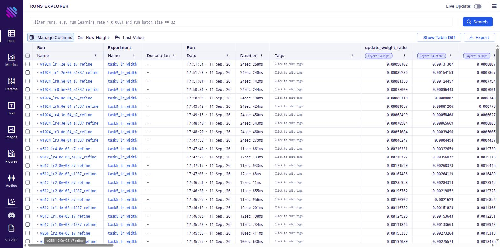
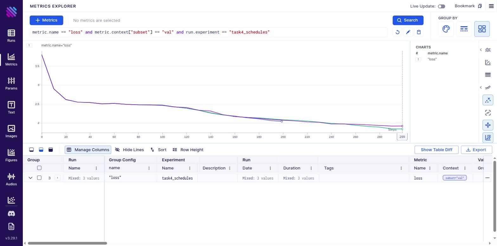
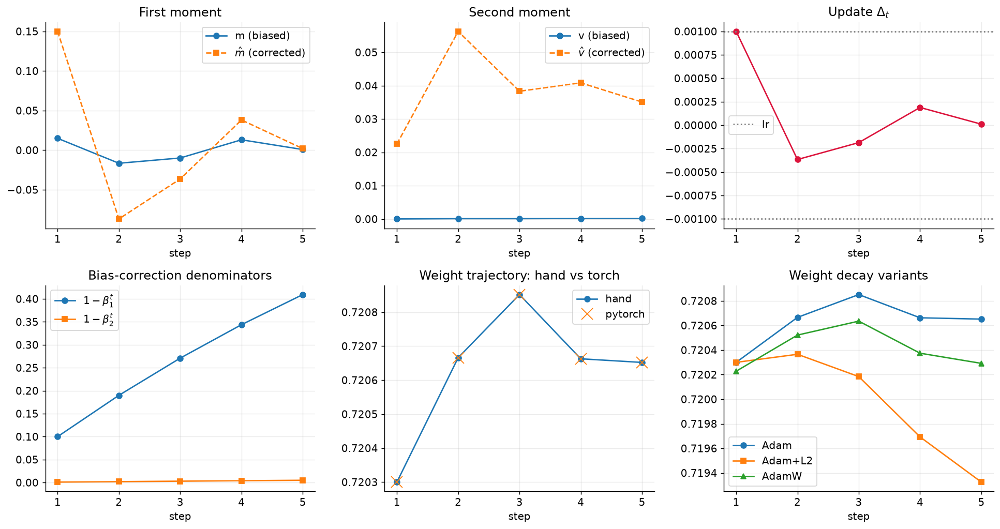
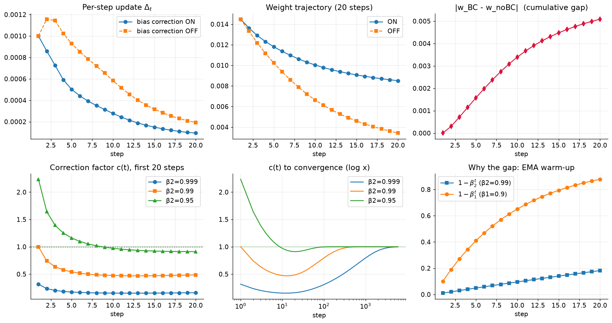
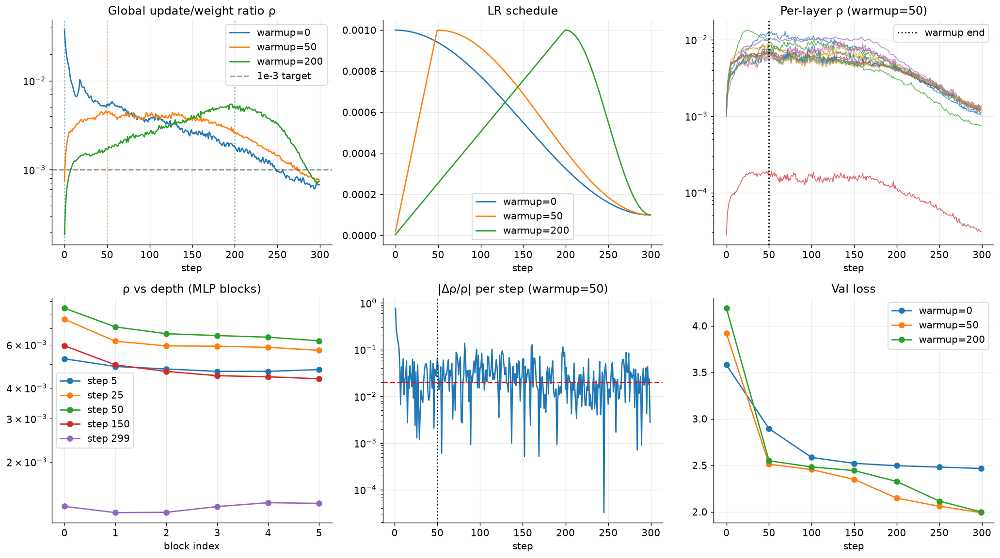
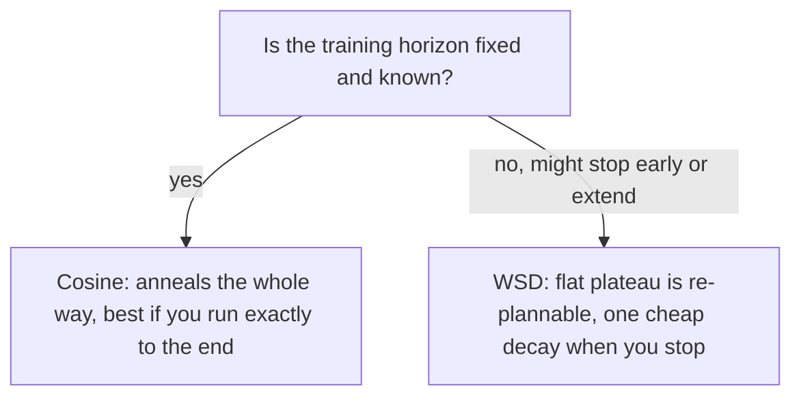
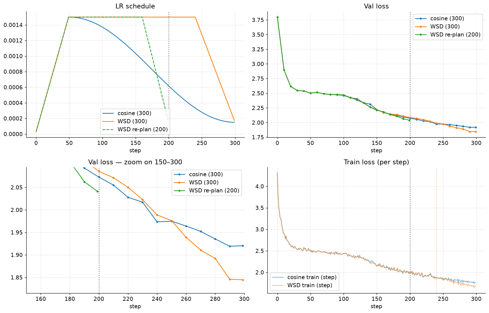
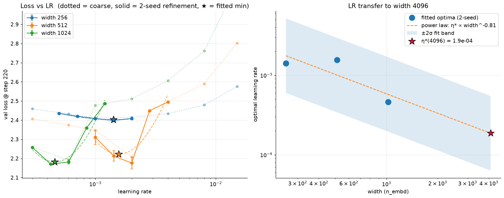
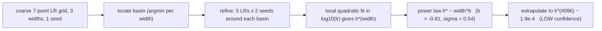

# Session 11 — Optimizers by Hand: Adam, Bias Correction, Warmup, Schedules & LR Transfer

Five self-contained experiments on a **compact nanoGPT-style decoder
(10.77 M params, 6 layers)** trained on **char-level Tiny Shakespeare**, all
tracked in a single [Aim](https://aimstack.io) repo.

> **Status.** All five notebooks are executed end-to-end on an **NVIDIA RTX
> A6000**, with outputs and figures checked in and the full **57-run Aim
> database** (`.aim/`) present in this checkout — plus `results/runs.jsonl`, a
> plain-text mirror of the same 57 runs that *is* committed to git (`.aim/`
> itself is gitignored: a regenerable, ~90 MB binary artifact — recreate it any
> time with `scripts/run_all.py`). Every number, table, chart and screenshot
> below comes straight from that run. `scripts/smoke_test.py` additionally
> verifies every code path on a tiny model in seconds, for anyone who wants to
> sanity-check the code before re-running the real thing.

| # | Question | Notebook | Headline answer |
|---|----------|----------|-----------------|
| 1 | Reproduce Adam by hand, check vs PyTorch | [`01_adam_by_hand.ipynb`](notebooks/01_adam_by_hand.ipynb) | matches `torch.optim` to **< 6e-17** (float64), every intermediate |
| 2 | Bias correction on vs off, first 20 steps | [`02_bias_correction.ipynb`](notebooks/02_bias_correction.ipynb) | stops mattering after **~230 steps** (β₂=0.99); **~76** at β₂=0.95, **~3 900** at β₂=0.999 |
| 3 | Update-to-weight ratio per layer; when does warmup stop changing it | [`03_update_weight_ratio_warmup.ipynb`](notebooks/03_update_weight_ratio_warmup.ipynb) | ρ settles at **~1e-3/layer**; warmup stops changing it **at exactly the warmup length** |
| 4 | Cosine vs WSD, 300 steps, judge at 200 | [`04_cosine_vs_wsd.ipynb`](notebooks/04_cosine_vs_wsd.ipynb) | **keep WSD** — within 0.013 at 200, wins by **0.076** at 300 |
| 5 | LR sweep at width 256/512/1024 → predict width 4096 | [`05_lr_sweep_width.ipynb`](notebooks/05_lr_sweep_width.ipynb) | η\*(4096) ≈ **1.9e-4**, **low confidence** (factor ~3) |

---

## The model

A classic Karpathy `shakespeare-char` decoder — the `bias=True` variant lands
exactly on the assignment's **10.77 M** parameters.

```
GPTConfig(vocab_size=65, block_size=256, n_layer=6, n_head=6, n_embd=384, bias=True)
```

| component | params | share |
|---|---:|---:|
| attention (6 blocks) | 3.54 M | 32.9% |
| MLP (6 blocks) | 7.08 M | 65.7% |
| token embedding / lm-head (tied) | 24 960 | 0.2% |
| position embedding | 98 304 | 0.9% |
| LayerNorm (13×, with bias) | 9 984 | 0.1% |
| **total** | **10.77 M** | |

Data: 1,115,394 characters, 65-symbol vocabulary, 90/10 train/val split.



---

## Repo layout

```
optimizer_experiments/
├── src/s11/
│   ├── model.py      # nanoGPT decoder, width-configurable
│   ├── data.py       # char-level Tiny Shakespeare (auto-downloads)
│   ├── optim.py      # hand Adam/AdamW + cosine / WSD / constant schedules
│   ├── trainer.py    # training loop, Aim tracking, update/weight-ratio logging
│   └── utils.py
├── notebooks/        # 01 … 05, one per task — executed, with outputs and figures
├── scripts/
│   ├── build_notebooks.py   # generates the five notebooks from source (edit here, not the .ipynb)
│   ├── nbbuild.py           # tiny notebook-assembly helper
│   ├── run_all.py           # build + execute all notebooks + print summary
│   ├── smoke_test.py        # fast (~seconds) correctness check, tiny model, no real training
│   └── aim_summary.py       # results/runs.jsonl → summary table + CSV
├── data/                    # tiny_shakespeare.txt (auto-downloaded on first run, git-ignored)
├── results/runs.jsonl       # every training run, durable + machine-independent (57 runs, committed)
├── .aim/                    # Aim repo — 57 runs, full metric histories + hyper-parameters (git-ignored, ~90MB)
└── assets/                  # all figures embedded below, written by the notebooks
```

### Reproduce

```bash
cd optimizer_experiments
uv sync
uv run python scripts/smoke_test.py         # ~seconds — proves the code paths work
uv run python scripts/run_all.py            # rebuild + re-execute all 5 notebooks fresh
uv run python scripts/aim_summary.py        # results/runs.jsonl -> summary table
uv run aim up                               # browse every run at localhost:43800
```

`run_all.py` (re)builds the notebooks from `scripts/build_notebooks.py` and
executes them into a fresh Aim repo. On an **RTX A6000** the whole suite (tasks
1–5, including the 57-run LR sweep) takes **~20 minutes** end-to-end; on a 4 GB
laptop GPU (an earlier verification pass) the same code took ~55 minutes. Scale
further by raising `total_steps` / `batch_size` / the LR grids in the relevant
notebook config cells — nothing else needs to change.

### Aim tracking

Every training run goes through `s11.trainer.train()` → one Aim run
(experiments: `task3_warmup`, `task4_schedules`, `task5_lr_width`; **57 runs**
total). Tracked per run:

| metric | context |
|---|---|
| `loss` | `subset ∈ {train_step, train, val}` |
| `lr`, `grad_norm` | per step |
| `update_weight_ratio` | `layer ∈ {global, L0.attn, L0.mlp, …, layernorm, embedding}` |
| `hp/*`, `summary/*` | hyper-params & final metrics as single-point series |
| full hyper-parameter dict | via Aim's run-attribute store (`run["hparams"]`) |

`trainer.train` also appends a flat JSON record (hyper-parameters + full loss
curve) to `results/runs.jsonl` on every run, independent of the Aim store — a
plain-text, machine-portable backup that `scripts/aim_summary.py` reads to build
the run table, and what this README's numbers are checked against.

**Runs Explorer** — all 57 runs, with the per-layer `update_weight_ratio` columns
(`layer="L4.mlp"`, `layer="L4.attn"`, `layer="L5.mlp"`, …) pulled in live:



**Metrics Explorer** — the three Task 4 val-loss curves (`metric.name=="loss" and
metric.context["subset"]=="val" and run.experiment=="task4_schedules"`); the WSD
curve pulls below cosine only after step ~240 when its decay kicks in:



---

## Task 1 — Reproduce Adam by hand

**Setup:** one weight `w₀ = 0.7213`, five gradients `[0.15, −0.30, 0.05, 0.22, −0.11]`,
`lr = 1e-3`, `β₁ = 0.9`, `β₂ = 0.999`, `ε = 1e-8`.

The update, spelled out:

$$
m_t = \beta_1 m_{t-1} + (1-\beta_1) g_t,\quad
v_t = \beta_2 v_{t-1} + (1-\beta_2) g_t^2,\quad
\hat m_t = \frac{m_t}{1-\beta_1^t},\quad
\hat v_t = \frac{v_t}{1-\beta_2^t},\quad
\Delta_t = \frac{\alpha\,\hat m_t}{\sqrt{\hat v_t}+\epsilon}
$$

### Hand-computed trace

| t | m | v | m̂ | v̂ | step Δₜ | w after |
|--:|--:|--:|--:|--:|--:|--:|
| 1 |  0.015000 | 2.2500e-05 |  0.150000 | 0.022500 |  1.0000e-03 | 0.72030000 |
| 2 | -0.016500 | 1.1248e-04 | -0.086842 | 0.056267 | -3.6610e-04 | 0.72066610 |
| 3 | -0.009850 | 1.1486e-04 | -0.036347 | 0.038327 | -1.8566e-04 | 0.72085176 |
| 4 |  0.013135 | 1.6315e-04 |  0.038194 | 0.040849 |  1.8898e-04 | 0.72066279 |
| 5 |  0.000822 | 1.7509e-04 |  0.002006 | 0.035088 |  1.0709e-05 | 0.72065208 |

*(This task is a pure hand-computation — no training, no GPU dependence — so
these numbers are bit-for-bit identical on every machine it's been run on.)*

### Agreement with PyTorch (float64)

| variant | max &#124;hand − torch&#124; over the whole trace |
|---|---|
| `torch.optim.Adam`, no decay | **5.4e-17** |
| `torch.optim.Adam` + L2 decay (λ=0.1) | **6.9e-18** |
| `torch.optim.AdamW`, decoupled decay (λ=0.1) | **3.5e-18** |



**Findings**

- **Step 1 is a unit step.** The bias-correction factors cancel
  (`m̂₁ = g₁`, `√v̂₁ = |g₁|`), so `Δ₁ ≈ α·sign(g₁)` regardless of gradient
  magnitude — visible in the table (`Δ₁ = 1.0e-3 = lr`).
- **The corrected moments do the work.** For the first steps `v̂ ≫ v`
  (dividing by `1−β₂ᵗ ≈ 1e-3`), which is exactly what bias correction is for.
- **Adam+L2 ≠ AdamW.** With λ = 0.1 the trajectories separate by step 2–3:
  L2-Adam feeds `λw` through the moment estimates (so high-gradient weights decay
  *less*), while AdamW multiplies every weight by `(1 − αλ)`. After 5 steps:
  Adam `0.720652`, Adam+L2 `0.719325`, AdamW `0.720292`.
- **Myth check.** The lecture transcript says *"bias correction is what AdamW is
  doing."* Not quite: **bias correction** (÷ `1−βᵗ`) fixes the zero-init bias of
  the EMAs and is part of *plain Adam*; **AdamW's** distinctive feature is
  *decoupled weight decay*. They're independent — Task 2 isolates bias correction.

---

## Task 2 — Bias correction on vs off

With correction off we use `mₜ, vₜ` directly. The net effect on the update is a
multiplicative factor

$$
c(t) = \frac{\text{corrected step}}{\text{uncorrected step}}
     = \frac{\sqrt{1-\beta_2^{\,t}}}{1-\beta_1^{\,t}} \xrightarrow[t\to\infty]{} 1
$$

`c(t)` is **non-monotonic** for β₂ ≤ 0.99 — it overshoots or undershoots 1, dips,
then climbs back — so "stops mattering" means *enters the band and stays*. Like
Task 1, this table is purely analytic (no training involved) and machine-independent:

| β₂ | within 5% | within 1% | context |
|---|--:|--:|---|
| 0.95  | **42** | **76** | nanoGPT / LLM default |
| 0.99  | **232** | **390** | this repo's training default |
| 0.999 | **2 327** | **3 916** | Adam-paper default |

Horizon ≈ `ln(0.0X) / ln β₂` — set by **β₂ alone** (β₁'s bias is gone by ~step 45).

### On a real weight (`transformer.h.0.mlp.c_fc.weight[0,0]`, β₂ = 0.99)

The first 20 true gradients this weight receives (from a live forward/backward
pass on the RTX A6000), replayed with correction on/off:

| t | c(t) predicted | &#124;step ratio&#124; measured | &#124;w_BC − w_noBC&#124; |
|--:|--:|--:|--:|
| 1  | 1.000 | 1.000 | ~0 |
| 5  | 0.541 | 0.541 | 1.6e-3 |
| 10 | 0.475 | 0.475 | 3.4e-3 |
| 20 | 0.486 | 0.486 | 5.1e-3 |

After 20 steps the two weights differ by **5.1e-3 — about 73% of how far the
weight has moved at all** — because at β₂ = 0.99 the correction factor is still
`c(20) = 0.49`, nowhere near 1. (The exact gradients — and so this gap — depend
on the model's random init and the data order, which is why this row differs
slightly run to run; the *predicted* `c(t)` column and the horizon table above do
not.)



**Findings**

- **"Bias correction off" is not simply a warmup.** The step-1 multiplier
  `(1−β₁)/√(1−β₂)` is `0.32` at β₂=0.999 (smaller step), exactly `1.0` at
  β₂=0.99, and `2.24` at β₂=0.95 (*larger* step). Its sign depends on β₂.
- After ~10–15 steps `c(t)` dips **below 1** (the m-EMA has caught up, the v-EMA
  hasn't → `√v̂` too small → uncorrected step too big), then recovers over
  hundreds–thousands of steps.
- **Net practical impact on a multi-thousand-step run: negligible** — it
  self-heals well inside a normal warmup — but it is free and removes a confound,
  so leave it on.

---

## Task 3 — Update-to-weight ratio per layer, and warmup

$$
\rho(W,t) = \frac{\lVert \Delta W_t\rVert_{\text{RMS}}}{\lVert W_t\rVert_{\text{RMS}}}
$$

measured on the **realised** update (after clip + decay), bucketed per layer.
Three 300-step runs, cosine schedule, `warmup ∈ {0, 50, 200}`.

### Per-layer ρ (warmup = 50)

| layer | ρ @ 5 | ρ @ 50 (peak) | ρ @ 150 | ρ @ 299 |
|---|--:|--:|--:|--:|
| L0.attn | 3.9e-3 | 1.2e-2 | 8.2e-3 | 1.0e-3 |
| L0.mlp  | 5.3e-3 | 8.4e-3 | 5.9e-3 | 1.3e-3 |
| L3.mlp  | 4.7e-3 | 6.5e-3 | 4.5e-3 | 1.3e-3 |
| L5.mlp  | 4.8e-3 | 6.2e-3 | 4.4e-3 | 1.4e-3 |
| token embedding | 4.4e-3 | 9.3e-3 | 4.8e-3 | 7.5e-4 |
| **LayerNorm** | 8.8e-5 | 1.7e-4 | 1.5e-4 | **3.1e-5** |
| position embedding | 2.8e-3 | 1.0e-2 | 1.0e-2 | 1.2e-3 |

Global ρ @ 299 = **7.7e-4** — right on the folklore **1e-3** target. LayerNorm
gains run **~25× colder** than the matmul blocks.

### When does warmup stop changing ρ?

Because weight norms barely move in 300 steps, **ρ ≈ ηₜ × const** — warmup
affects ρ *only* through the LR ramp. So:

| warmup | argmax ρ (step) | ρ peak | final val loss | warmup length |
|--:|--:|--:|--:|--:|
| 0   | **0**   | 3.7e-2 | 2.467 | 0 |
| 50  | **49**  | 4.6e-3 | 1.992 | 50 |
| 200 | **195** | 5.5e-3 | 2.000 | 200 |

**argmax(ρ) = the warmup length**, to within a handful of steps. Before it,
warmup pushes ρ up along the ramp; after it, cosine decay pulls ρ down. Dividing
the LR out (`ρ/η`) leaves only a short opening transient (grad-clip firing on
steps 0–3, gnorm 16 → <1; `v̂` still warming) that lasts ~14–55 steps and is
**identical across warmups** — not a warmup effect.



**Findings**

- **Reported step: the warmup length itself.** warmup ∈ {0, 50, 200} stops
  changing ρ at step ≈ {0, 50, ~195–200}.
- Per-layer ρ converges to **1.0–1.4e-3** for every attention/MLP block;
  depth barely matters (spread under 1.3×).
- **Skipping warmup hurt a lot here:** `warmup=0` finished at val **2.47** vs
  **1.99–2.00** for `warmup ∈ {50, 200}` — grad-clip shock on steps 0–3 *and* a
  lower average LR (cosine starts decaying from step 0). Past "enough" warmup,
  the exact value barely matters (`50` and `200` finish within 0.008 of each
  other).

---

## Task 4 — Cosine vs WSD, 300 steps, judged at 200

Same model, `warmup = 50`, `base_lr = 1.5e-3`. Cosine decays to `0.1·base_lr`
over all 300 steps; WSD holds `base_lr` flat then decays linearly over the last
20% (steps 240–300). A third run re-plans WSD to a 200-step budget.



| checkpoint | val loss | LR there |
|---|--:|--:|
| cosine, stop at 200 | **2.073** | 6.0e-4 |
| WSD (300-plan), stop at 200 | 2.086 | 1.5e-3 (still on plateau) |
| **WSD re-planned to a 200 budget** | **2.041** | decayed 160→200 |
| cosine, full 300 | 1.920 | |
| **WSD, full 300** | **1.845** | |



**Which model would I keep? — WSD.**

- Frozen mid-plan at step 200, cosine (2.073) beats plateau-WSD (2.086) by a thin
  **0.013** — that's the "you stopped me mid-plateau" penalty.
- Told up front to stop at 200, WSD decays properly and its checkpoint (**2.041**)
  *beats* cosine-at-200 by 0.032 — higher average LR, still got its cooldown.
- At the full 300-step horizon **WSD wins outright (1.845 vs 1.920, −0.076)**.
- **Decision:** keep the **WSD full-300** checkpoint. WSD gives up essentially
  nothing versus cosine and removes the "commit to the horizon before you start"
  constraint. Only if forced to stop at exactly step 200 with no re-plan would I
  keep cosine, and only by 0.013.

---

## Task 5 — LR sweep across width → predict width 4096

**Method (per the assignment's "tune both sides" warning):** a **coarse** 7-point
LR grid at each width (1 seed, 220 steps) to find the basin, then a **2-seed
5-point refinement** bracketing each basin, then a local quadratic fit in
`log₁₀η`, then a power-law extrapolation to width 4096. 57 runs, all in Aim,
~14 minutes end-to-end on an RTX A6000. `n_head=8`, cosine, warmup 40, `wd=0.1`,
`β₂=0.99`, batch 16.

### The three minima (2-seed refinement)

| width | params | fitted η\* | grid-best η\* | val loss @ 220 | 2-seed spread near η\* |
|---|--:|--:|--:|--:|--:|
| 256  | 4.82 M  | **1.4e-3** | 1.4e-3 | 2.40 | ±0.002–0.006 |
| 512  | 19.1 M  | **1.6e-3** | 2.0e-3 | 2.18–2.22 | **±0.03** |
| 1024 | 75.9 M  | **5.0e-4** | 4.3e-4 | 2.17–2.18 | ±0.004 |



*Left:* dotted = coarse grid, solid + error bars = 2-seed refinement, ★ = fitted
minimum. *Right:* the three optima on log-log axes, the power-law fit, its ±2σ
band, and the extrapolated point at width 4096.

### The trend and the prediction

- The optimum is **flat from width 256 → 512** (~`1.4–1.6e-3`), then **drops
  sharply at 1024** (~`5e-4`).
- Power-law fit `η* ∝ width^b` → **b = −0.81**, but with a **large residual
  σ ≈ 0.54** (in log-LR) — because 256 and 512 barely differ, the slope is
  carried almost entirely by the 1024 point. SP theory predicts `b = −1` for
  matmul params; the non-scaling embedding/LayerNorm params pull it toward 0.
- **Extrapolation to width 4096: η\*(4096) ≈ `1.9e-4`** (endpoint-only bracket
  `1.5e-4`; ±2σ band `6.4e-5 … 5.5e-4`). The moving segment alone (512→1024)
  points as low as `5e-5`.

**Value I would use at width 4096: `2e-4`**, as the *center of a 3-point
confirmation sweep* `{1e-4, 2e-4, 4e-4}` at the real training length.

**Confidence: LOW** — factor of ~3. Reasons: (1) only 3 width points, σ≈0.54,
slope set by one point; (2) 220-step runs favour a higher LR than a long run
would, so the true 4096 optimum is likely *below* the extrapolation; (3)
extrapolating 2 octaves from a 2-octave measurement; (4) batch size / warmup /
weight decay / β₂ were all frozen and would themselves want retuning at 4096.
**Under muP** the width-1024 optimum (`5e-4`) would transfer to 4096 directly and
none of this extrapolation would be needed.



---

## What I would carry forward

1. **Adam is `sign(g)` early, EMA-smoothed later.** The unit first step is why
   warmup and grad-clip matter most in the first handful of steps.
2. **Bias correction is a β₂-scoped early-training correction** — real but
   short-lived; keep it, don't worry about it.
3. **Update-to-weight ratio ≈ 1e-3** is a genuine, layer-stable operating point;
   watching it per-layer is a cheap divergence early-warning.
4. **WSD ≥ cosine** whenever the horizon isn't nailed down, at no measured cost
   when it is.
5. **LR does not transfer for free under standard parametrization** — it drifts
   with width, and extrapolating it two octaves is a low-confidence move. muP is
   the fix if width is going to keep changing.

---

<sub>Generated for ERA V5 Session 11. Model: 10.77 M nanoGPT, char-level Tiny
Shakespeare. Tracking: Aim (57 runs). Env: `uv`, PyTorch 2.6 + CUDA 12.4, NVIDIA
RTX A6000.</sub>
