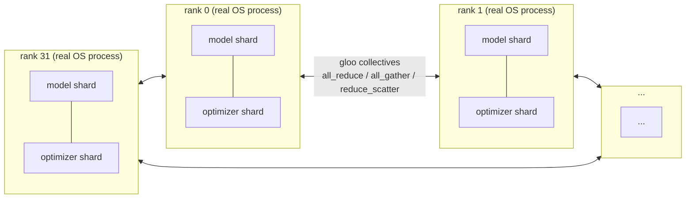
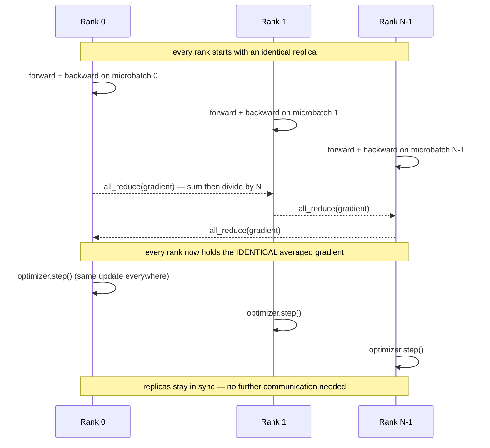
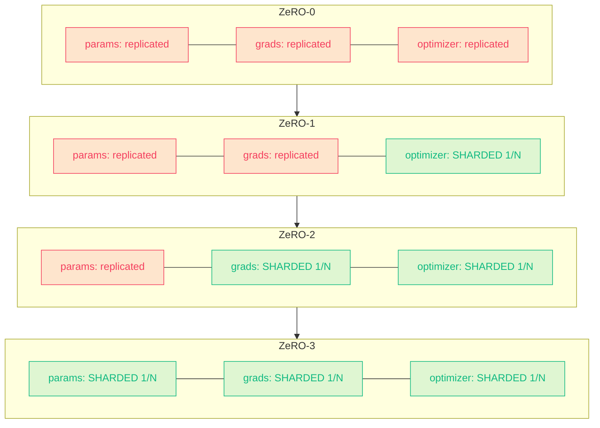
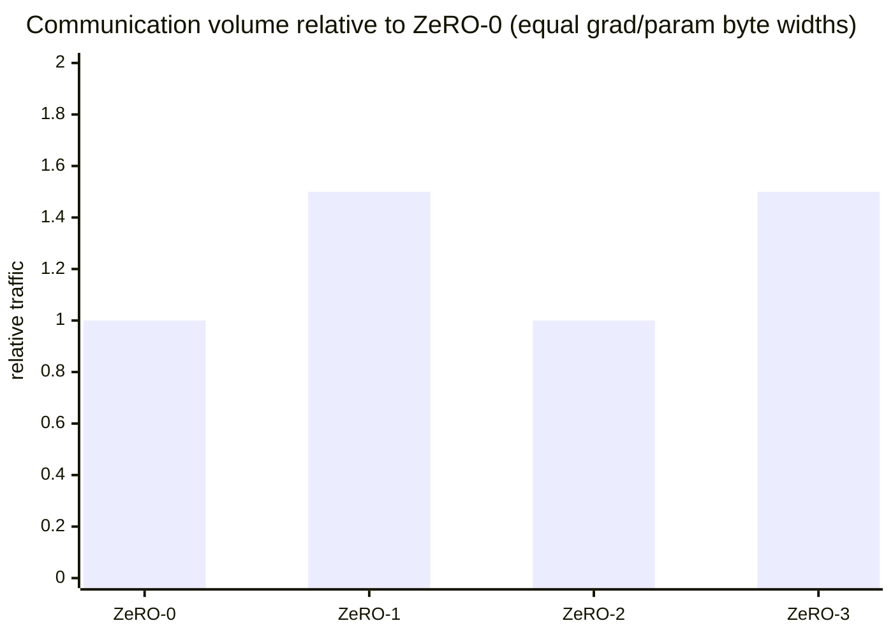
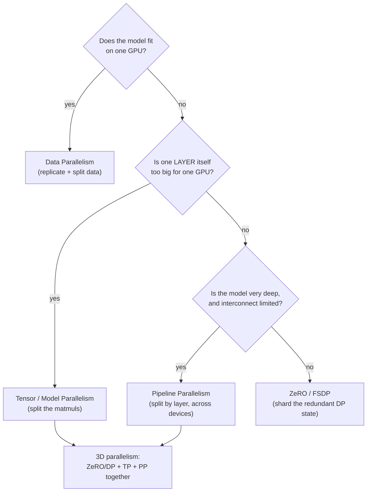
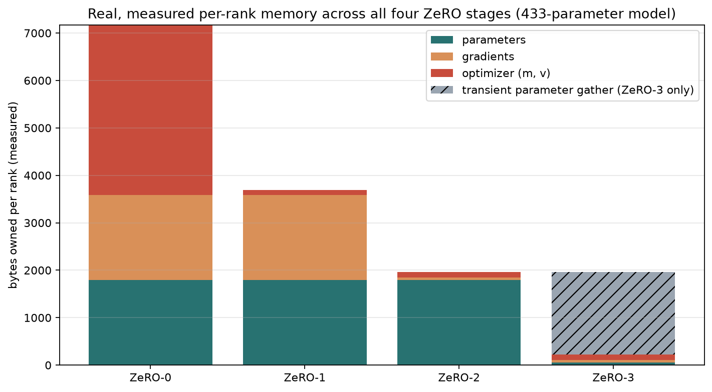
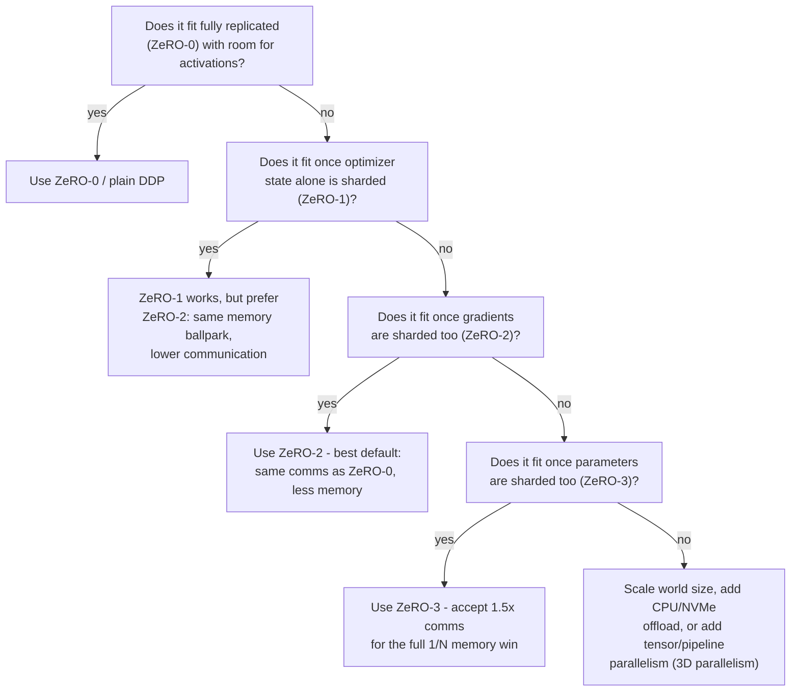

# 32-Process ZeRO Parallelism Lab (CPU only, real `torch.distributed`)

**GitHub repository:**
[RaviNaik/ERA — session 12 parallelization experiments](https://github.com/RaviNaik/ERA/tree/main/v5/session12/parallelization_experiments)

This project is my executable explanation of **ordinary data parallelism
(ZeRO-0), ZeRO-1, ZeRO-2, and ZeRO-3**. There is no GPU anywhere in this
project. The 32 "ranks" are 32 genuine operating-system processes that join a
real `torch.distributed` process group (backend: `gloo`) and exchange real
tensors over real collectives — `all_reduce`, `all_gather`, and a manual
`reduce_scatter` (Gloo does not implement it; see below). Everything reported
— parameter bytes, gradient bytes, optimizer bytes, data splits — is measured
from real tensors those 32 processes actually held, not simulated in a
single-process `for` loop and not assumed from a formula.

An analytical estimator is also included, but only to extrapolate *beyond*
what these 32 real CPU processes can hold in memory (e.g. a hypothetical
1B-parameter model) — and the notebook proves, by direct comparison, that the
estimator's formula reproduces the real measured numbers exactly before it is
trusted for anything bigger.

A companion dashboard walks through all of this interactively:
[`../webapp/index.html`](../webapp/index.html).

## Contents

1. [What I understand](#what-i-understand) — data parallelism, then ZeRO stage by stage
2. [The parallelism landscape](#the-parallelism-landscape) — DP vs. tensor vs. pipeline vs. ZeRO
3. [What each stage fixes — and what it breaks](#what-each-stage-fixes--and-what-it-breaks)
4. [Real results](#real-results-32-genuine-cpu-processes) — measured, not estimated
5. [Choosing a stage: decision guide](#choosing-a-stage-decision-guide) — checklist + 6 worked scenarios
6. [Run locally](#run-locally-cpu-only--no-gpu-no-cloud-nothing-to-configure)
7. [Why Gloo, and why `reduce_scatter` is hand-built](#why-gloo-instead-of-nccl-and-why-reduce_scatter-is-hand-built)
8. [Important boundaries](#important-boundaries) · [Layout](#layout)


*32 genuine processes, one `torch.distributed` process group, real collectives — not a Python loop pretending to be 32 workers.*

## What I understand

Data parallelism replicates the model and optimizer on every rank. Every rank
processes a different microbatch; averaging their gradients (via all-reduce)
is mathematically equivalent to training on the combined global batch. This
improves throughput, but plain data parallelism does not reduce per-rank
model-state memory.



Measured directly in this project (`zero_lab.demo.virtual_data_parallel_step`,
32 microbatches): averaging 32 independently-computed gradients reproduces the
single global-batch gradient to within **4.5e-8** — float32 noise, not an
approximation.

ZeRO removes that replication one state category at a time:

| Mode | Parameters | Gradients | Optimizer state (Adam m, v) |
|---|---|---|---|
| ZeRO-0 | replicated | replicated | replicated |
| ZeRO-1 | replicated | replicated | sharded |
| ZeRO-2 | replicated | sharded | sharded |
| ZeRO-3 | sharded | sharded | sharded |

Every tensor in this project's real run is plain `float32` — no faked
half-precision buffers. Adam's per-parameter footprint is then exactly
4 (parameter) + 4 (gradient) + 4 (first moment) + 4 (second moment) = **16
bytes**, replicated on every rank at ZeRO-0 — the same total the assignment's
usual mixed-precision assumption uses, reached here with tensors that are
actually allocated and actually measured. With $P$ parameters and $N$ ranks,
persistent state bytes per rank are:

$$
M_0=16P,\qquad
M_1=4P+\frac{12P}{N},\qquad
M_2=2P+\frac{14P}{N},\qquad
M_3=\frac{16P}{N}.
$$

At $N=32$, ZeRO-3 stores only $0.5P$ bytes of persistent state per rank — a
32-fold reduction, **measured** on this project's 433-parameter demo model
(7168 → 224 bytes/rank, exactly 32x). That is not the complete peak: ZeRO-3
transiently all-gathers the non-owned shards of the parameter vector before
every forward pass, and every stage still pays for activations, allocator
overhead, and communication buffers on top of this table.


*Progressive sharding: each stage shards exactly one more state category than the last. Compute (forward/backward arithmetic) never changes — only where state lives.*

**Communication is not "more sharding = more traffic" in a simple line.**
Measured (via real collective calls, cross-checked against a ring-collective
volume formula) at equal parameter/gradient byte widths:

- **ZeRO-0:** gradient all-reduce only — baseline, call it $1.0\times$.
- **ZeRO-1:** gradients are *still* fully all-reduced (optimizer state alone is
  sharded), plus a new all-gather to redistribute the piecewise-updated
  parameters — **$1.5\times$ baseline. More traffic than plain DP, not less.**
- **ZeRO-2:** gradients are reduce-scattered instead of all-reduced, which
  exactly pays for ZeRO-1's extra all-gather — back down to $1.0\times$
  baseline.
- **ZeRO-3:** + one more all-gather to reconstruct the full parameter before
  compute — **$1.5\times$ baseline**, same ratio as ZeRO-1, for a different
  reason.

**A caveat on the ZeRO-1 number.** $1.5\times$ is not an inherent property of
"shard only the optimizer state" — it is what you get from the *direct*
implementation this project builds (full gradient all-reduce, then all-gather
the piecewise-updated parameter shards). The ZeRO paper's own communication
analysis only derives the $1.0\times$ ("no additional communication") result
for Pos+g (ZeRO-2), where gradient sharding lets the gradient step itself use
a reduce-scatter; DeepSpeed's original ZeRO-1 implementation used the same
all-reduce this project does, and measured the same $1.5\times$
([DeepSpeed, "ZeRO stage 1 with reduced communication," 2020](https://www.deepspeed.ai/2020/03/17/reduce-scatter.html)),
before a later "partition-aware" patch brought stage 1 down to
$1.0\times$ by reduce-scattering gradients the same way stage 2 does. This
project intentionally models the original, more commonly cited $1.5\times$
behavior — it is real and documented, just not the only correct answer for
"ZeRO-1."

ZeRO does not change the forward/backward arithmetic — every stage still
computes the identical loss on the identical global batch. It only changes
*where state lives* and *what has to move* to keep every rank's copy correct.
Wall-clock step time additionally depends on latency, bandwidth, overlap,
bucket sizes, topology, and load balance — none of which a CPU/Gloo run can
speak to, so this project reports communication *volume*, not a runtime claim.



## The Parallelism Landscape

ZeRO is one point in a wider space of ways to spread a model across devices.
They are not competitors — real large-scale training usually combines them.



| Approach | What it shards | Typical scope | Strength | Weakness |
|---|---|---|---|---|
| **Data Parallelism (DP)** | nothing in the model — only the dataset | any cluster size | simplest to implement; scales throughput | memory per GPU never improves |
| **Tensor / Model Parallelism (TP)** | individual weight matrices (row/col splits) | usually inside one node (needs NVLink) | shrinks a single oversized layer | high-frequency, latency-sensitive communication every layer |
| **Pipeline Parallelism (PP)** | contiguous groups of layers | across nodes | tolerates slower interconnect than TP | pipeline bubbles (idle time) without careful microbatching |
| **ZeRO (this project) / FSDP** | optimizer state → gradients → parameters, progressively | same scope as DP | keeps DP's simple training loop; near-linear memory reduction | more sharding = more communication (measured: up to 1.5x) |

In practice, frontier-scale training combines all of them: ZeRO/FSDP for
data-parallel memory sharding, tensor parallelism inside a node (fast NVLink),
and pipeline parallelism across nodes — often called **3D parallelism**.

## What Each Stage Fixes — and What It Breaks

| Stage | Problem it fixes (vs. the previous stage) | New problem it introduces |
|---|---|---|
| **ZeRO-0** (baseline) | — | No memory scaling at all: every GPU needs the full 16 bytes/parameter regardless of cluster size. |
| **ZeRO-1** | Shards the single biggest category — optimizer state (12 of 16 bytes/param in the mixed-precision count) | Counter-intuitively **increases** communication to 1.5x baseline (a new all-gather to redistribute piecewise-updated parameter shards) for a partial memory win. |
| **ZeRO-2** | Shards gradients too — and this measurably **pays back** ZeRO-1's extra traffic, returning communication to 1.0x baseline | Parameters are still fully replicated — the largest remaining category is untouched. |
| **ZeRO-3** | Shards parameters too — the only stage where persistent memory hits the ideal $1/N$ | Back up to 1.5x communication (the full parameter vector is gathered *and freed* once for forward and again for backward, since it can't stay resident at 1/N memory), plus a real, measured transient full-parameter reconstruction cost every step. |
| **Beyond ZeRO-3** (not built here) | ZeRO-Infinity: offload sharded state to CPU RAM / NVMe when even $16P/N$ doesn't fit | Slower data movement (PCIe/NVMe instead of GPU memory); usually a last resort after scaling world size and combining with TP/PP. |

## Real Results (32 genuine CPU processes)

Model: `DemoMLP`, 433 parameters (padded to 448 for even 32-way division),
plain `float32`, `world_size=32`, 2 samples/rank (64 total).

**Memory owned per rank, measured (not estimated):**

| Stage | Parameters | Gradients | Optimizer | Transient gather | Persistent total |
|---|---:|---:|---:|---:|---:|
| ZeRO-0 | 1792 B | 1792 B | 3584 B | — | **7168 B** |
| ZeRO-1 | 1792 B | 1792 B | 112 B | — | **3696 B** |
| ZeRO-2 | 1792 B | 56 B | 112 B | — | **1960 B** |
| ZeRO-3 | 56 B | 56 B | 112 B | 1736 B | **224 B** |

$7168 / 224 = 32.0\times$ — an exact 32-fold reduction, measured, cross-checked
bit-for-bit against the closed-form formula (`estimate_stage`) once padding is
accounted for.

**Correctness — every stage vs. a plain, non-distributed reference step:**

| Stage | max abs(distributed − reference) |
|---|---|
| ZeRO-0 | 2.980e-08 |
| ZeRO-1 | 2.980e-08 |
| ZeRO-2 | 4.470e-08 |
| ZeRO-3 | 4.470e-08 |

**Communication volume relative to ZeRO-0:** 1.0x, 1.5x, 1.0x, 1.5x (ZeRO-0
through ZeRO-3) — see the `xychart` above; the exact reasoning for each ratio
is in the table two sections up.



## Choosing a Stage: Decision Guide



**Checklist, in order:**

1. Does the model fit fully replicated (ZeRO-0) on one GPU, with room for
   activations? → Use ZeRO-0 / plain DDP — simplest, cheapest to communicate.
2. Does it fit once only the optimizer state is sharded (ZeRO-1)? → Prefer
   ZeRO-2 instead unless you specifically need gradients to stay replicated.
3. Does it fit once gradients are sharded too (ZeRO-2)? → Use ZeRO-2 — same
   communication volume as plain DP, meaningfully less memory than ZeRO-1.
4. Still doesn't fit? → Use ZeRO-3 — accept the 1.5x communication and the
   transient parameter gather for the full $1/N$ memory reduction.
5. Still doesn't fit even at ZeRO-3? → Add CPU/NVMe offload (ZeRO-Infinity),
   scale world size, or combine with tensor/pipeline parallelism.
6. Is the collective group itself huge (100s of GPUs)? → Communication, not
   memory, is now the bottleneck — combine ZeRO with TP (intra-node) and PP
   (inter-node).

**Worked scenarios** (mixed-precision Adam: 16 bytes/parameter fully
replicated — $M_0=16P$, $M_1=4P+12P/N$, $M_2=2P+14P/N$, $M_3=16P/N$):

| Scenario | Numbers | Recommendation |
|---|---|---|
| 125M model, 1×16GB GPU | $M_0 = 16\times0.125\text{B} = 2.0$GB — fits easily | **ZeRO-0.** Adding ZeRO here only adds communication for no memory benefit. |
| 1.3B model, 8×16GB GPUs | $M_0=20.8$GB (too big) · $M_1=4\times1.3+12\times1.3/8=7.15$GB | **ZeRO-1 or ZeRO-2.** Plain DP never shards state, so no GPU count fixes it — sharding the optimizer state alone is already enough. |
| 7B model, 8×24GB GPUs | $M_1=38.5$GB · $M_2=26.25$GB · $M_3=16\times7/8=14$GB | **ZeRO-3.** Both ZeRO-1 and ZeRO-2 exceed 24GB before activations are even counted. |
| 70B model, 8×80GB GPUs (1 node) | $M_3=16\times70/8=140$GB — exceeds 80GB even at the best stage | **Scale world size or add offload/TP.** E.g. $N=64$ (8 nodes): $16\times70/64\approx17.5$GB, fits. |
| 175B model, 512 GPUs | $M_3=16\times175/512\approx5.5$GB/GPU — memory is no longer the bottleneck | **ZeRO-3 + TP + PP (3D parallelism).** A 512-way collective is bandwidth/latency-bound, not memory-bound. |
| Any model that already fits, "just in case" ZeRO-3 | ZeRO-0 already fits with headroom | **Don't.** Measured 1.5x communication plus a real transient gather buy nothing here. |

The companion webapp's [interactive calculator](../webapp/index.html#calculator)
lets you plug in your own model size, GPU memory, world size, and precision to
get a live recommendation using these exact formulas.

## Run locally (CPU only — no GPU, no cloud, nothing to configure)

```bash
cd v5/session12/parallelization_experiments
uv sync
uv run pytest -q                           # unit tests + a 4-process ZeRO suite
uv run jupyter nbconvert --to notebook --execute --inplace \
    notebooks/zero_parallelism_lab.ipynb   # ~45s: the real 32-process run
uv run jupyter lab notebooks/zero_parallelism_lab.ipynb
```

The notebook itself defaults to the full 32 processes per stage
and takes under a minute end-to-end on this machine.

## Why Gloo instead of NCCL, and why `reduce_scatter` is hand-built

`torch.distributed`'s `gloo` backend is the CPU-only collective backend (NCCL
requires GPUs). While building ZeRO-2/3 here, `dist.reduce_scatter` raised
`RuntimeError: ProcessGroupGloo does not support reduce_scatter` on this
machine — Gloo simply does not implement it. `src/zero_lab/distributed_zero.py`
reconstructs it from its definition: one `dist.reduce(shard_i, dst=i)` call per
shard `i` (which Gloo does support), which provably produces the same result a
native reduce-scatter would, and is tested against a single-process reference.

## Important boundaries

- All 32 "ranks" are real, separate OS processes (verified: distinct PIDs),
  not a Python loop pretending to be 32 workers.
- Every reported byte count for the small demo model is **measured**, read
  directly from real tensors after a real distributed step — not estimated.
- The analytical formula (`zero_lab.simulator`) is used only to extrapolate to
  model sizes this machine cannot instantiate; the notebook proves it matches
  the measured numbers exactly before relying on it for that extrapolation.
- Communication numbers are algorithmic ring-collective volume computed from
  the real tensor shapes used — Gloo does not expose a byte counter, and CPU
  wall-clock time is not a stand-in for GPU/NCCL performance.
- Activation memory is supplied separately because ZeRO does not shard it.
- A real performance claim (throughput, overlap, scaling efficiency) requires
  profiling an actual multi-GPU DeepSpeed/FSDP run; this lab demonstrates the
  sharding mechanism and its exact memory/communication trade-offs, not GPU
  wall-clock performance.

## Layout

```text
src/zero_lab/
  demo.py               tiny model + single-process conceptual warm-up
  distributed_zero.py   REAL torch.distributed (gloo) ZeRO-0..3 implementation
  simulator.py          analytical formula, cross-checked against the real run
notebooks/              submission notebook (32 real processes per stage)
tests/                   accounting, reconstruction, and distributed-run invariants
assets/                  figures produced by the notebook
```