# Session 13: Reversible LLMs: memory, speed and batch size

A 20.1M-parameter GPT trained on **50M WikiText-103 tokens** three ways: a standard transformer, a
reversible **midpoint** network, and a reversible **Euler** (symplectic) network, following
[*Reversing Large Language Models for Efficient Training and Fine-Tuning*](https://arxiv.org/html/2512.02056v2).
The winning reversible variant was then trained at **2x, 4x and 8x** the batch size. All runs were on one
**NVIDIA RTX A6000 (48 GB)**.

**🌐 Interactive write-up: [ravinaik.github.io/ERA/v5/session13/webapp](https://ravinaik.github.io/ERA/v5/session13/webapp/)** ·
📓 [Executed notebook](notebooks/reversible_llm.ipynb) · 📊 Aim experiment `session13_reversible_llm`

---

## Contents

1. [Results at a glance](#results-at-a-glance)
2. [The idea: why reversible layers save memory](#the-idea-why-reversible-layers-save-memory)
3. [Getting the implementation right](#getting-the-implementation-right) (incl. numerical verification)
4. [Setup](#setup): model, FLOPs, protocol, LR schedules, local sweep, choosing `x`
5. [Experiments 1-3: the architecture race](#experiments-1-3-the-architecture-race)
   · [Exp 1 Baseline](#experiment-1-baseline-batch-128) · [Exp 2 Midpoint](#experiment-2-reversible-midpoint-batch-128) · [Exp 3 Euler](#experiment-3-reversible-euler-batch-128)
6. [Memory](#memory)
7. [Speed](#speed)
8. [Choosing the variant](#choosing-the-variant)
9. [Experiments 4-6: batch scaling](#experiments-4-6-batch-scaling)
   · [Exp 4 (2x)](#experiment-4-euler-batch-256-2x) · [Exp 5 (4x)](#experiment-5-euler-batch-512-4x) · [Exp 6 (8x)](#experiment-6-euler-batch-1024-8x)
10. [The maximum batch](#the-maximum-batch)
11. [Complete results: every metric, every curve](#complete-results-every-metric-every-curve)
12. [Conclusions and recommendations](#conclusions-and-recommendations)
13. [Experiment tracking: Aim, logs, JSON](#experiment-tracking-aim-logs-json)
14. [Reproduce, outputs and project layout](#reproduce)

---

## Results at a glance

| # | Run | Batch | Steps | Val loss ↓ | Val ppl | Val acc | Tokens/s | MFU | Peak memory | Stored act. / seq | Wall clock |
|---|---|---:|---:|---:|---:|---:|---:|---:|---:|---:|---:|
| 1 | Baseline | 128 | 763 | 4.828 | 124.9 | 26.75% | **154.8k** | **13.4%** | 9.45 GB | 41.8 MB | **5.9 min** |
| 2 | Reversible midpoint | 128 | 763 | 4.842 | 126.7 | 26.46% | 126.4k | 10.9% | **4.61 GB** | **3.0 MB** | 7.1 min |
| 3 | **Reversible Euler 🏆** | 128 | 763 | **4.774** | **118.4** | **27.22%** | 115.0k | 9.9% | **4.61 GB** | **3.0 MB** | 7.7 min |
| 4 | Euler | 256 | 382 | 5.224 | 185.7 | 23.40% | 120.4k | 10.4% | 5.04 GB | 3.0 MB | 7.3 min |
| 5 | Euler | 512 | 191 | 6.175 | 480.5 | 16.80% | 121.5k | 10.5% | 8.34 GB | 3.0 MB | 7.2 min |
| 6 | Euler | 1024 | 96 | 6.746 | 850.8 | 12.22% | 122.6k | 10.6% | 16.36 GB | 3.0 MB | 7.2 min |

<sub>Val = the full WikiText-103 validation split (249k tokens). Peak memory = the largest per-step `max_memory_allocated`. Stored activations = the memory autograd keeps from forward to backward, per 512-token sequence. MFU is computed against the A6000's 154.8 TFLOP/s bf16 peak. GB = 1024³ bytes.</sub>

**Key findings**

1. **Reversibility halves peak memory and cuts stored activations 14x** (9.45 → 4.61 GB; 41.8 → 3.0 MB per sequence). Stored activations stay flat in depth: the baseline adds 37.7 MB per layer, the reversible stacks add nothing.
2. **Euler produced the best model of the six** (4.774 vs the baseline's 4.828). It starts slower, overtakes the baseline at ~10M tokens, and reaches the baseline's final loss with **15% fewer tokens**. Midpoint matches the baseline (+0.014).
3. **The price is throughput:** −18% (midpoint) and −26% (Euler). About half of that is exact fp64 reversal on a GPU with slow fp64. **Per unit of wall-clock time the baseline still wins.**
4. **The maximum batch is 2.8x larger** (896 → 2528). Batch 1024, where the baseline runs out of memory, trains with Euler in 16.4 GB.
5. **Larger batches hurt at a fixed token budget:** the loss rose from 4.77 to 6.75 at 8x, while throughput rose only 6.6%.
6. **Exact reversal is essential:** reconstruction error was **0** in all four reversible runs. Plain fp32 streams on sharpened weights gave gradient cosines of only 0.50-0.63.

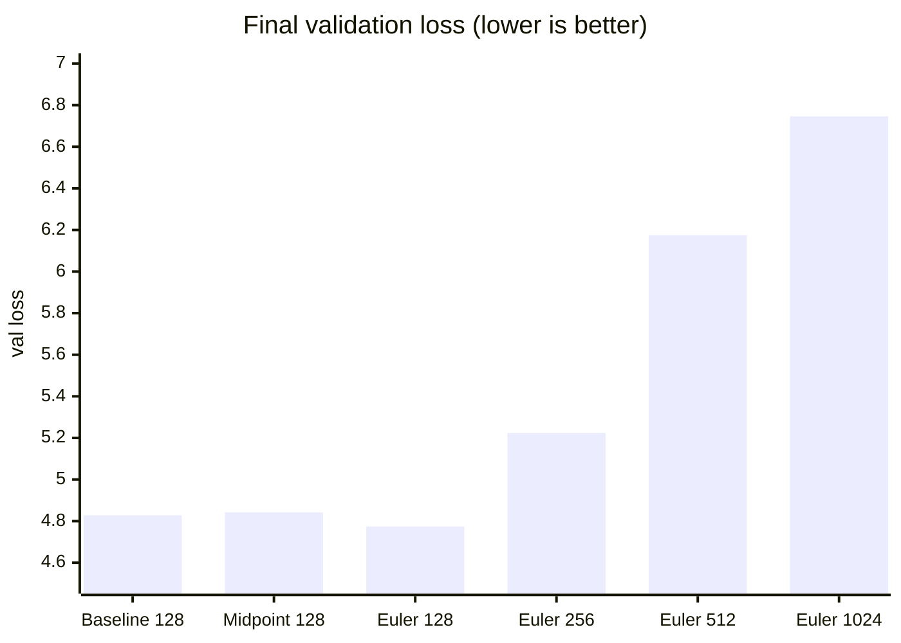
```mermaid
xychart-beta
    title "Final validation loss (lower is better)"
    x-axis ["Baseline 128", "Midpoint 128", "Euler 128", "Euler 256", "Euler 512", "Euler 1024"]
    y-axis "val loss" 4.5 --> 7
    bar [4.828, 4.842, 4.774, 5.224, 6.175, 6.746]
```

---

## The idea: why reversible layers save memory

Backprop needs every layer's input. A standard residual network therefore **stores the activations of all
L layers**, so memory is O(L · batch · seq · d). If every layer is **invertible**, its input can be
recomputed from its output during backward. Only the final state is stored, so memory is **O(1) in depth**.
The cost is one extra forward pass of the backbone.

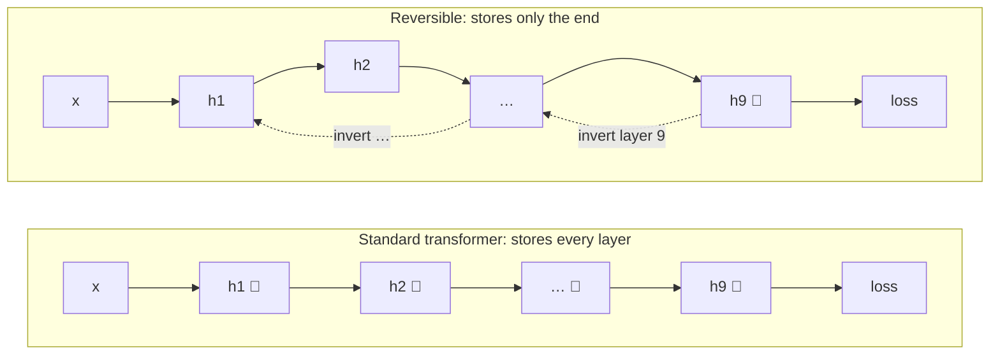
```mermaid
flowchart LR
    subgraph STD["Standard transformer: stores every layer"]
        direction LR
        a0["x"] --> a1["h1 💾"] --> a2["h2 💾"] --> a3["… 💾"] --> a9["h9 💾"] --> aL["loss"]
    end
    subgraph REV["Reversible: stores only the end"]
        direction LR
        b0["x"] --> b1["h1"] --> b2["h2"] --> b3["…"] --> b9["h9 💾"] --> bL["loss"]
        b9 -. "invert layer 9" .-> b3
        b3 -. "invert …" .-> b1
    end
```

### The two schemes (paper eqs. 4-5 and 8-9)

| | Midpoint (leapfrog over depth) | Euler / Hamiltonian (two streams) |
|---|---|---|
| Forward | $p^{\ell+1} = p^{\ell-1} + 2h\, f_\ell(p^{\ell})$ | $q^{\ell} = q^{\ell-1} + \mathrm{Attn}_\ell(\mathrm{LN}_1 p^{\ell-1})$ <br> $p^{\ell} = p^{\ell-1} + \mathrm{MLP}_\ell(\mathrm{LN}_2 q^{\ell})$ |
| Inverse | $p^{\ell-1} = p^{\ell+1} - 2h\, f_\ell(p^{\ell})$ | $p^{\ell-1} = p^{\ell} - \mathrm{MLP}_\ell(\mathrm{LN}_2 q^{\ell})$ <br> $q^{\ell-1} = q^{\ell} - \mathrm{Attn}_\ell(\mathrm{LN}_1 p^{\ell-1})$ |
| Sub-layer | $f_\ell(p) = \mathrm{Attn}(\mathrm{LN}_1 p) + \mathrm{MLP}(\mathrm{LN}_2(p + \mathrm{Attn}(\mathrm{LN}_1 p)))$, the residual branch of a pre-LN block | attention and MLP act on *different* streams |
| Init / readout | $p^{-1} = p^{0} = x$; output $p^{L}$ | $q^0 = p^0 = x/\sqrt2$; output $(q^L + p^L)/\sqrt2$ |
| Here | $h = 0.25$ (best of {1/9, 0.25, 0.5} in a local sweep) | $a = b = 1$ |
| Stability | only *marginally* stable (paper Sec. 3) | symplectic (volume-preserving) |

Both variants have exactly the baseline's **20,105,216 parameters**. Only the wiring across depth changes.

### One training step through a reversible stack

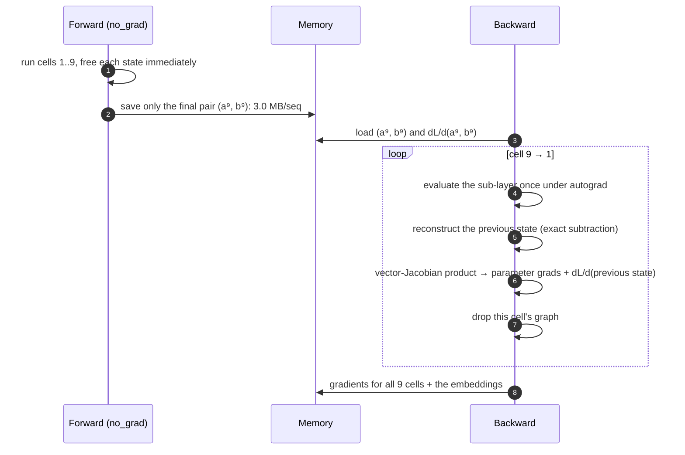
```mermaid
sequenceDiagram
    autonumber
    participant F as Forward (no_grad)
    participant M as Memory
    participant B as Backward
    F->>F: run cells 1..9, free each state immediately
    F->>M: save only the final pair (a⁹, b⁹): 3.0 MB/seq
    B->>M: load (a⁹, b⁹) and dL/d(a⁹, b⁹)
    loop cell 9 → 1
        B->>B: evaluate the sub-layer once under autograd
        B->>B: reconstruct the previous state (exact subtraction)
        B->>B: vector-Jacobian product → parameter grads + dL/d(previous state)
        B->>B: drop this cell's graph
    end
    B->>M: gradients for all 9 cells + the embeddings
```

---

## Getting the implementation right

The first implementation saved almost no memory and trained on subtly wrong gradients. Four fixes, all
covered by `tests/test_reversible.py` (21 tests), made the savings real and the gradients exact:

| # | Problem found | Fix | Effect |
|---|---|---|---|
| 1 | One `autograd.Function` **per layer**, each calling `save_for_backward`, so every layer's output stayed alive until backward | a single Function spanning the **whole stack** | stored activations flat in depth (74 MB from 3 to 24 layers) |
| 2 | Backward ran `inverse()` **and then** re-ran `step()` under autograd: 2 extra forwards per layer | RevNet-style `backward_step`: one sub-layer evaluation both reconstructs and differentiates | reversible step 304 → 178 ms in local tests (−42%) |
| 3 | PyTorch runs backward **outside autocast**, so the reconstruction ran in fp32 while the forward had used bf16 | `torch.amp.custom_fwd/custom_bwd` | same precision in both passes |
| 4 | Floating point is not exactly invertible, $(x+u)-u \neq x$, and bf16 rounding flips amplify the error layer by layer | residual streams in **float64**, every update rounded to a fixed $2^{-30}$ grid, so every add and subtract is exact (the fixed-point idea of MacKay et al., 2018) | reconstruction error **exactly 0** |

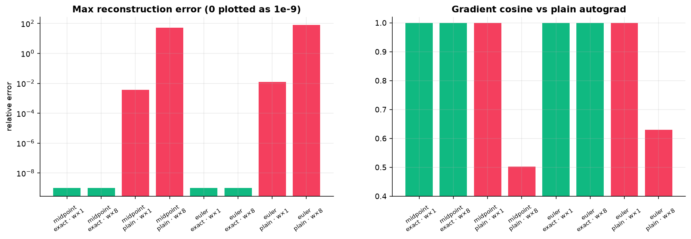

Measured on the A6000 in the notebook's Section 4.4. With exact streams, reconstruction error is 0 and
gradients match autograd (cosine ≥ 0.99995). With plain fp32 streams on 8x-sharpened, "trained-like"
weights, the reconstructed states are off by **51-78x their own size** and the gradient cosine drops to
**0.50 (midpoint) and 0.63 (Euler)**.

#### Numerical verification (notebook Section 4.4)

**float64 on CPU: reversible gradients vs plain autograd for the same weights.** Both must agree to machine precision:

| variant | precision | max reconstruction rel. error | grad cosine vs autograd | grad rel. error vs autograd |
|---|---|---|---|---|
| midpoint | float64 / CPU | 0 | 1 | 1.94e-18 |
| euler | float64 / CPU | 0 | 1 | 0 |

**bf16 autocast on the A6000, real model width.** Exact fixed-point streams vs plain fp32 streams, at initialisation (weight scale 1) and with 8x-sharpened weights:

| variant | streams | weight scale | max_rel_error | input_rel_error | grad_cosine | grad_rel_error |
|---|---|---|---|---|---|---|
| midpoint | exact fp64 fixed-point | 1 | 0 | 0 | 1 | 0.000877 |
| midpoint | exact fp64 fixed-point | 8 | 0 | 0 | 1 | 0.0099 |
| midpoint | plain fp32 | 1 | 0.0037 | 0.0037 | 1 | 0.0015 |
| midpoint | plain fp32 | 8 | 50.9783 | 50.9783 | 0.5017 | 0.9326 |
| euler | exact fp64 fixed-point | 1 | 0 | 0 | 1 | 3e-06 |
| euler | exact fp64 fixed-point | 8 | 0 | 0 | 1 | 0.0072 |
| euler | plain fp32 | 1 | 0.0125 | 0.0125 | 1 | 0.0019 |
| euler | plain fp32 | 8 | 77.7252 | 77.7252 | 0.6297 | 0.7986 |

**Cost of exactness: one training step at batch 128**

| variant | streams | step ms | tokens/s | peak MB |
|---|---|---|---|---|
| midpoint | exact fp64 | 482.9 | 135,706 | 4,698.3 |
| midpoint | plain fp32 | 426.4 | 153,679 | 4,506.3 |
| euler | exact fp64 | 531.3 | 123,342 | 4,698.3 |
| euler | plain fp32 | 421 | 155,652 | 4,570.3 |
| baseline | – | 388.2 | 168,841 | 9,653.5 |

The loss was also rebuilt as a **fused, chunked lm_head + cross-entropy** (`src/revllm/loss.py`). It never
materializes the 50,257-wide logits tensor for all tokens, and it computes the vocab projection's gradient
in the same pass, so that 58% of the model's FLOPs is never recomputed. The same loss is used for every
variant.

---

## Setup

| Model | | Data | | Training | |
|---|---|---|---|---|---|
| Parameters | 20,105,216 | Dataset | WikiText-103 raw | Optimizer | AdamW (fused), β=(0.9, 0.95), wd 0.1 |
| Layers × width × heads | 9 × 256 × 8 | Tokenizer | GPT-2 BPE (50,257) | Peak LR at x | 1e-3 |
| Context | 512 | Train split | 119.1M tokens | Schedule | 5% warmup → cosine to 10% |
| Embeddings | tied (64% of params) | Budget | 50M tokens (0.42 epochs) | LR at 2x/4x/8x | × √(batch / 128), cap 3e-3 |
| Midpoint h | 0.25 | Periodic eval | every 2.5M tokens, fixed windows | Precision | bf16 autocast, fp32 master weights |
| Reversal | exact (fp64 grid) | Final eval | full val split (249k tokens) | Seed / grad clip | 1337 / 1.0 |

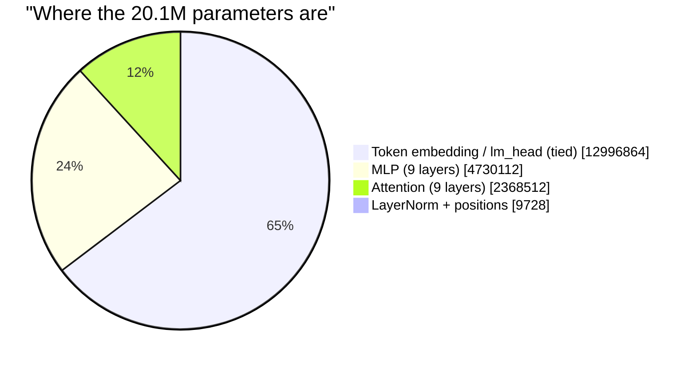
```mermaid
pie showData
    title "Where the 20.1M parameters are"
    "Token embedding / lm_head (tied)" : 12996864
    "MLP (9 layers)" : 4730112
    "Attention (9 layers)" : 2368512
    "LayerNorm + positions" : 9728
```

**Parameter breakdown (notebook Section 3)**: identical for all three variants:

|   | baseline | midpoint | euler |
|---|---|---|---|
| embedding | 12,996,864 | 12,996,864 | 12,996,864 |
| attention | 2,368,512 | 2,368,512 | 2,368,512 |
| mlp | 4,730,112 | 4,730,112 | 4,730,112 |
| norm | 9,728 | 9,728 | 9,728 |
| other | 0 | 0 | 0 |
| total | 20,105,216 | 20,105,216 | 20,105,216 |

**FLOPs per trained token.** *Model* FLOPs (≈ 3 × forward) are the useful work, the same for every variant, and are what MFU is computed from. *Hardware* FLOPs add the reversible recompute: one extra backbone forward, but never the lm_head (the fused loss computes its gradient in the forward pass), so the overhead is **14%**, not 33%:

|   | baseline | midpoint | euler |
|---|---|---|---|
| forward MFLOP/token | 44.606 | 44.606 | 44.606 |
| model (6N-style) MFLOP/token | 133.8 | 133.8 | 133.8 |
| hardware MFLOP/token (incl. recompute) | 133.8 | 152.7 | 152.7 |
| recompute overhead | 0 | 0.141 | 0.141 |
| lm_head share of forward | 0.577 | 0.577 | 0.577 |

**Per-experiment LR schedules** (warmup = 5% of steps, minimum 10; eval every 2.5M tokens):

| label | batch | steps | warmup | peak_lr | eval every (steps) |
|---|---|---|---|---|---|
| x | 128 | 763 | 38 | 0.001 | 38 |
| 2x | 256 | 382 | 19 | 0.0014 | 19 |
| 4x | 512 | 191 | 10 | 0.002 | 10 |
| 8x | 1,024 | 96 | 10 | 0.0028 | 5 |

**Preliminary local sweep behind the LR and h choices**, on the development machine (RTX 500 Ada 4 GB, WikiText-2, batch 16, 2M tokens, one seed). These numbers only justify the settings; they are not results of the assignment.

| Run | Streams | Final val loss | Tokens/s | Reconstruction drift | Grad rel. error |
|---|---|---:|---:|---:|---:|
| baseline, lr 3e-4 | – | 6.573 | 32.1k | – | – |
| **baseline, lr 1e-3** | – | **6.266** | 32.0k | – | – |
| midpoint h = 1/9 (previous default) | fp32 | 6.289 | 29.0k | 0.023 | 0.16% |
| midpoint h = 0.25 | fp32 | 6.260 | 28.8k | 0.084 | 0.25% |
| midpoint h = 0.5 | fp32 | 6.271 | 29.1k | 0.253 | 0.41% |
| Euler | fp32 | 6.300 | 29.4k | 0.112 | 1.98% |
| **midpoint h = 0.25** | **exact fp64** | **6.261** | 24.8k | **0** | 0.00% |
| midpoint h = 0.5 | exact fp64 | 6.270 | 24.8k | 0 | 0.04% |
| Euler | exact fp64 | 6.304 | 21.8k | 0 | 0.06% |

### Choosing `x = 128`

`x` had to (1) fit the baseline, (2) let *both* reversible variants fit `8x`, and (3) leave enough optimizer
steps at `8x`. The notebook probed real training steps (forward, backward and AdamW) on the A6000:

| Batch | Baseline peak | Midpoint peak | Euler peak | Stored act. / seq (base / rev) | Probe tokens/s (base / Euler) | Role |
|---:|---:|---:|---:|---:|---:|---|
| 64 | 6.79 GB | 4.37 GB | 4.37 GB | 41.9 / 3.0 MB | 157.9k / 119.2k | x/2 |
| **128** | **9.43 GB** | **4.59 GB** | **4.59 GB** | 41.8 / 3.0 MB | 168.5k / 122.3k | **x** (exp 1-3) |
| 256 | 14.70 GB | 5.03 GB | 5.03 GB | 41.8 / 3.0 MB | 170.2k / 123.6k | 2x (exp 4) |
| 512 | 25.26 GB | 8.70 GB | 8.32 GB | 41.7 / 3.0 MB | 170.0k / 123.4k | 4x (exp 5) |
| 1024 | **OOM** | 17.09 GB | 16.34 GB | — / 3.0 MB | — / 123.9k | 8x (exp 6) |

<details><summary><b>Raw probe tables from the notebook</b> (peak MB, stored MB per sequence, tokens/s)</summary>

Peak memory per training step (MB), OOM = does not fit:

| batch_size | baseline | midpoint | euler |
|---|---|---|---|
| 64 | 6,951 | 4,474 | 4,474 |
| 128 | 9,653 | 4,698 | 4,698 |
| 256 | 15,057 | 5,147 | 5,147 |
| 512 | 25,865 | 8,908 | 8,524 |
| 1,024 | OOM | 17,498 | 16,728 |

Activations stored for backward, per sequence (MB):

| batch_size | baseline | midpoint | euler |
|---|---|---|---|
| 64 | 41.93 | 3 | 3 |
| 128 | 41.82 | 3 | 3 |
| 256 | 41.77 | 3 | 3 |
| 512 | 41.74 | 3 | 3 |
| 1,024 | OOM | 3 | 3 |

Probe throughput (tokens/s, median of 2 steps):

| batch_size | baseline | midpoint | euler |
|---|---|---|---|
| 64 | 157,883 | 131,600 | 119,152 |
| 128 | 168,514 | 135,027 | 122,273 |
| 256 | 170,196 | 136,450 | 123,590 |
| 512 | 170,027 | 136,262 | 123,404 |
| 1,024 | OOM | 136,609 | 123,856 |

</details>

Checks the notebook asserts before training, and the resulting step counts:

|   | result |
|---|---|
| baseline fits x=128 | ✅ |
| midpoint fits 8x=1024 | ✅ |
| euler fits 8x=1024 | ✅ |
| baseline fits 8x=1024 (expected False on 40 GB) | ❌ |

| experiment | batch | tokens/step | optimizer steps |
|---|---|---|---|
| 1-3 (x) | 128 | 65,536 | 763 |
| 4 (2x) | 256 | 131,072 | 382 |
| 5 (4x) | 512 | 262,144 | 191 |
| 6 (8x) | 1,024 | 524,288 | 96 |

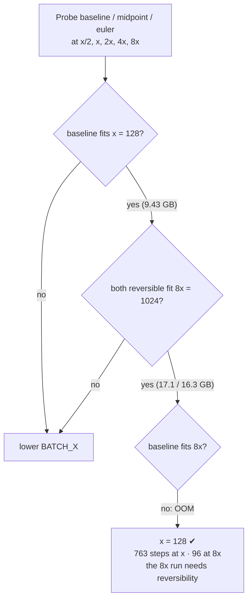
```mermaid
flowchart TD
    A["Probe baseline / midpoint / euler<br/>at x/2, x, 2x, 4x, 8x"] --> B{"baseline fits x = 128?"}
    B -- "yes (9.43 GB)" --> C{"both reversible fit 8x = 1024?"}
    B -- no --> Z["lower BATCH_X"]
    C -- "yes (17.1 / 16.3 GB)" --> D{"baseline fits 8x?"}
    C -- no --> Z
    D -- "no: OOM" --> E["x = 128 ✔<br/>763 steps at x · 96 at 8x<br/>the 8x run needs reversibility"]
```

---

## Experiments 1-3: the architecture race

Same data order, LR schedule, batch 128 and 50M tokens; only the depth recurrence differs.

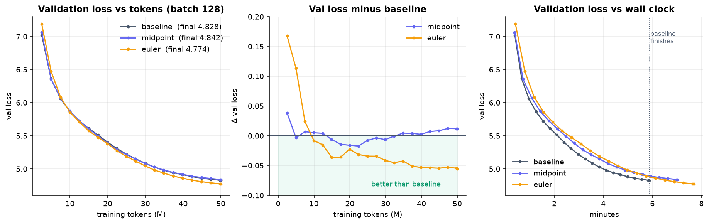

**Validation loss every 2.5M tokens: midpoint and Euler relative to the baseline**

| Tokens (M) | Baseline | Midpoint Δ | Euler Δ | Leader |
|---:|---:|---:|---:|---|
| 2.5 | 7.021 | +0.038 | +0.168 | baseline |
| 5 | 6.358 | -0.003 | +0.113 | midpoint |
| 7.5 | 6.060 | +0.007 | +0.024 | baseline |
| 10 | 5.864 | +0.005 | -0.008 | Euler |
| 12.5 | 5.722 | +0.004 | -0.016 | Euler |
| 15 | 5.609 | -0.006 | -0.036 | Euler |
| 17.5 | 5.508 | -0.014 | -0.035 | Euler |
| 20 | 5.401 | -0.016 | -0.023 | Euler |
| 22.5 | 5.305 | -0.017 | -0.031 | Euler |
| 25 | 5.221 | -0.008 | -0.034 | Euler |
| 27.5 | 5.150 | -0.004 | -0.035 | Euler |
| 30 | 5.084 | -0.006 | -0.041 | Euler |
| 32.5 | 5.025 | -0.000 | -0.045 | Euler |
| 35 | 4.977 | +0.004 | -0.043 | Euler |
| 37.5 | 4.940 | +0.004 | -0.051 | Euler |
| 40 | 4.912 | +0.003 | -0.053 | Euler |
| 42.5 | 4.882 | +0.007 | -0.054 | Euler |
| 45 | 4.860 | +0.009 | -0.054 | Euler |
| 47.5 | 4.842 | +0.012 | -0.053 | Euler |
| 50 | 4.827 | +0.012 | -0.055 | Euler |

<sub>Periodic eval on a fixed 65k-token validation subset. The headline numbers elsewhere use the full 249k-token split (Euler −0.053).</sub>

The notebook's own side-by-side plots (val loss vs tokens and vs wall clock, peak memory, throughput):

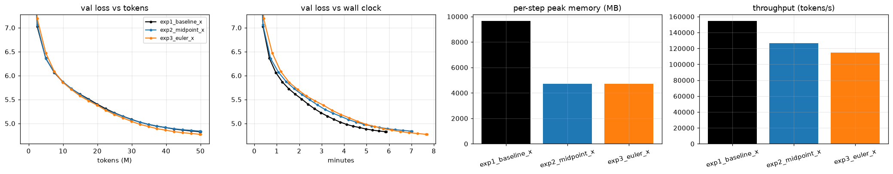

> **Architecture comparison at the same batch size (128):**
>
> | | baseline | midpoint | Euler |
> |---|---|---|---|
> | final val loss | 4.8279 | 4.8420 (+0.0141) | 4.7745 (-0.0534) |
> | val accuracy | 26.75% | 26.46% | 27.22% |
> | tokens/s | 154,834 | 126,371 (-18.4%) | 115,041 (-25.7%) |
> | backward ms | 66.6 | 138.6 | 169.8 |
> | per-step peak MB | 9,672 | 4,716 (-51.2%) | 4,716 (-51.2%) |
> | saved activations MB/seq | 41.82 | 3.00 | 3.00 |
> | reconstruction drift | - | 0.00e+00 | 0.00e+00 |
>
> The per-step peak falls less than saved activations do because the peak also contains
> the transient (chunk x vocab) fused-loss buffers and one layer's worth of recomputation
> during backward. Those are constant or O(1) in depth, but they do not disappear.

Each experiment below has the notebook's **8-panel dashboard** (loss vs tokens, next-token accuracy, learning
rate, gradient norm, throughput, step-time breakdown, memory timeline, per-step peak memory; the dashed line
is the reference run), the notebook's **generated findings**, and the interpretation.

### Experiment 1: Baseline, batch 128

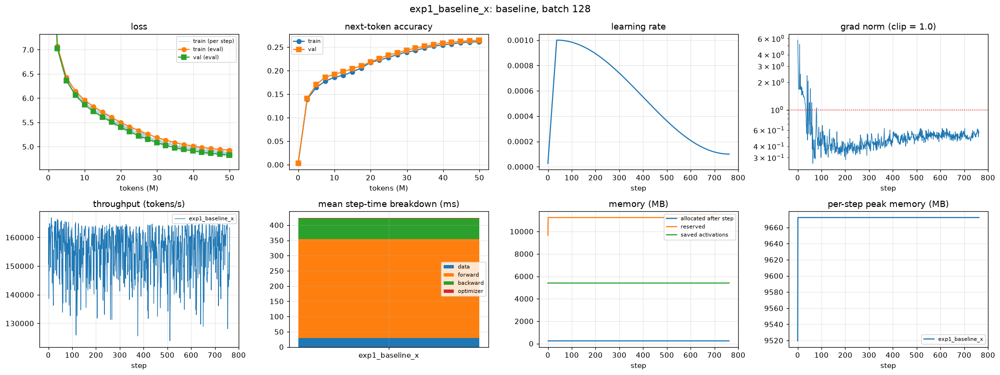

> **Notebook-generated findings (`exp1_baseline_x`)**
>
> - **Quality:** final val loss **4.8279** (perplexity 124.9), val accuracy **26.75%**; train loss 4.8715, generalization gap -0.0437.
> - **Convergence** (recomputed over the last 2.5M tokens): val loss fell 0.016 and was still improving, so the run is budget-limited.
> - **Speed:** 154,834 tokens/s (p10-p90: 142,789 to 163,992); step 424.6 ms = data 29.3 + forward 325.4 + backward 66.6 + optimizer 2.6 ms; wall clock 5.9 min. (Forward includes the fused lm_head gradient, see Section 3.)
> - **Compute:** 20.7 model TFLOP/s (20.7 hardware TFLOP/s incl. recompute); MFU **13.4%**, HFU 13.4%; 6.69 PFLOP total.
> - **Memory:** per-step peak **9,672 MB** (19.9% of the GPU); static 251 MB (params 78 + AdamW 155); activations saved for backward **5,402 MB** (of which 49 MB is the batch-independent fused-loss weight-gradient buffer) = **41.82 MB per sequence**.
> - **Optimization:** 763 steps, peak LR 1.00e-03, mean grad norm 0.554 (max 5.76), clipped on 5.5% of steps.

**Interpretation.** Val loss **4.828** (perplexity 124.9, accuracy 26.75%), still falling at the end, so the model
is budget-limited (~2.5 tokens per parameter). Val loss sits 0.044 *below* train loss: at 0.42 epochs nothing
is memorized, and the validation text is slightly easier. MFU is only 13.4% because 77% of each step is the
"forward" phase, which contains the bandwidth-bound 50k-way softmax and its gradient. Data loading takes another
7%. Peak memory is 9.45 GB, 5.28 GB of it stored activations, while parameters and AdamW state are only 0.25 GB:
at this scale **activations are the memory problem**. 41 of the 42 clipped steps fall in the first 80 steps (warmup).

### Experiment 2: Reversible midpoint, batch 128

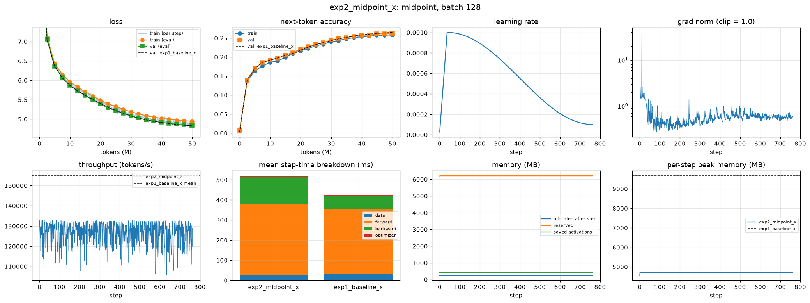

> **Notebook-generated findings (`exp2_midpoint_x`)**
>
> - **Quality:** final val loss **4.8420** (perplexity 126.7), val accuracy **26.46%**; train loss 4.8855, generalization gap -0.0435.
> - **Convergence** (recomputed over the last 2.5M tokens): val loss fell 0.016 and was still improving, so the run is budget-limited.
> - **Speed:** 126,371 tokens/s (p10-p90: 118,757 to 132,271); step 519.6 ms = data 28.2 + forward 349.6 + backward 138.6 + optimizer 2.6 ms; wall clock 7.1 min. (Forward includes the fused lm_head gradient, see Section 3.)
> - **Compute:** 16.9 model TFLOP/s (19.3 hardware TFLOP/s incl. recompute); MFU **10.9%**, HFU 12.5%; 6.69 PFLOP total.
> - **Memory:** per-step peak **4,716 MB** (9.7% of the GPU); static 250 MB (params 78 + AdamW 154); activations saved for backward **434 MB** (of which 49 MB is the batch-independent fused-loss weight-gradient buffer) = **3.00 MB per sequence**.
> - **Optimization:** 763 steps, peak LR 1.00e-03, mean grad norm 0.658 (max 39.85), clipped on 5.8% of steps.
> - **Reversibility (trained weights, bf16):** max reconstruction drift 0.00e+00 (at the input: 0.00e+00); gradient vs plain autograd: cosine 1.000000, relative error 8.83e-04.
>
> **Compared to `exp1_baseline_x`:** val loss +0.0141 (+0.29%), val accuracy -0.29 pts, throughput **-18.4%**, wall clock +19.6%, per-step peak memory **-51.2%**, activation memory per sequence **13.9x smaller**

**Interpretation.** Val loss **4.842 (+0.014)**. It tracked the baseline within ±0.02 for the whole run: slightly ahead
from 15-25M tokens, slightly behind at the end, in line with the paper's "within ~0.01" for midpoint. Throughput
was 126.4k tokens/s (−18.4%): backward took 139 ms instead of 67 ms, and the float64 streams add ~7% to forward.
Peak memory was **4.61 GB (−51%)** and flat for the whole run, reconstruction error 0, gradient cosine against
autograd 0.9999996.

### Experiment 3: Reversible Euler, batch 128

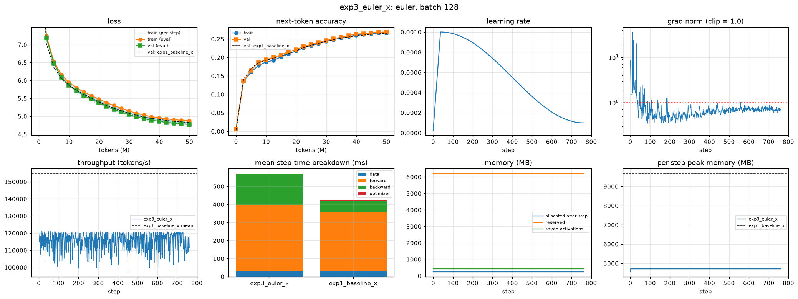

> **Notebook-generated findings (`exp3_euler_x`)**
>
> - **Quality:** final val loss **4.7745** (perplexity 118.4), val accuracy **27.22%**; train loss 4.8169, generalization gap -0.0424.
> - **Convergence** (recomputed over the last 2.5M tokens): val loss fell 0.018 and was still improving, so the run is budget-limited.
> - **Speed:** 115,041 tokens/s (p10-p90: 108,212 to 120,440); step 570.8 ms = data 30.7 + forward 367.1 + backward 169.8 + optimizer 2.5 ms; wall clock 7.7 min. (Forward includes the fused lm_head gradient, see Section 3.)
> - **Compute:** 15.4 model TFLOP/s (17.6 hardware TFLOP/s incl. recompute); MFU **9.9%**, HFU 11.3%; 6.69 PFLOP total.
> - **Memory:** per-step peak **4,716 MB** (9.7% of the GPU); static 250 MB (params 78 + AdamW 154); activations saved for backward **434 MB** (of which 49 MB is the batch-independent fused-loss weight-gradient buffer) = **3.00 MB per sequence**.
> - **Optimization:** 763 steps, peak LR 1.00e-03, mean grad norm 0.819 (max 36.47), clipped on 7.3% of steps.
> - **Reversibility (trained weights, bf16):** max reconstruction drift 0.00e+00 (at the input: 0.00e+00); gradient vs plain autograd: cosine 1.000000, relative error 4.49e-04.
>
> **Compared to `exp1_baseline_x`:** val loss -0.0534 (-1.11%), val accuracy +0.47 pts, throughput **-25.7%**, wall clock +31.0%, per-step peak memory **-51.2%**, activation memory per sequence **13.9x smaller**

**Interpretation.** Val loss **4.774 (−0.053)**, the best of all six runs. It was behind early (+0.17 at 2.5M tokens),
**crossed the baseline at ~10M tokens** and widened its lead to the end, reaching the baseline's final loss after
42.5M tokens (15% fewer). It ran at 115.0k tokens/s (−25.7%), the slowest, because backward reconstructs two
sub-layer updates per layer and exact quantization costs it more. Memory was identical to midpoint. Its gradients
were somewhat noisier (mean norm 0.82 vs 0.55, 7.3% of steps clipped, 48 of 56 in the first 76 steps), with no
divergences.

> **Why might Euler learn better?** The two-stream update carries *two* 256-wide residual states through the
> depth at no parameter cost, and attention and MLP read different streams: a wider residual "memory". This
> is a hypothesis. With one seed a 0.053 gap is suggestive but not proven, and at a tiny local scale Euler
> was 0.034 *worse*, so the advantage appears with more training.

---

## Memory

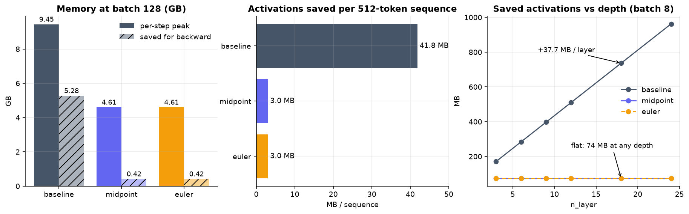

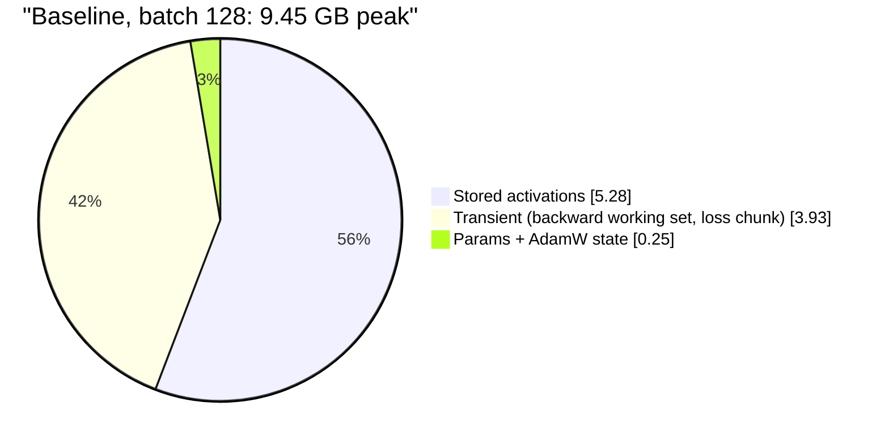
```mermaid
pie showData
    title "Baseline, batch 128: 9.45 GB peak"
    "Stored activations" : 5.28
    "Transient (backward working set, loss chunk)" : 3.93
    "Params + AdamW state" : 0.25
```

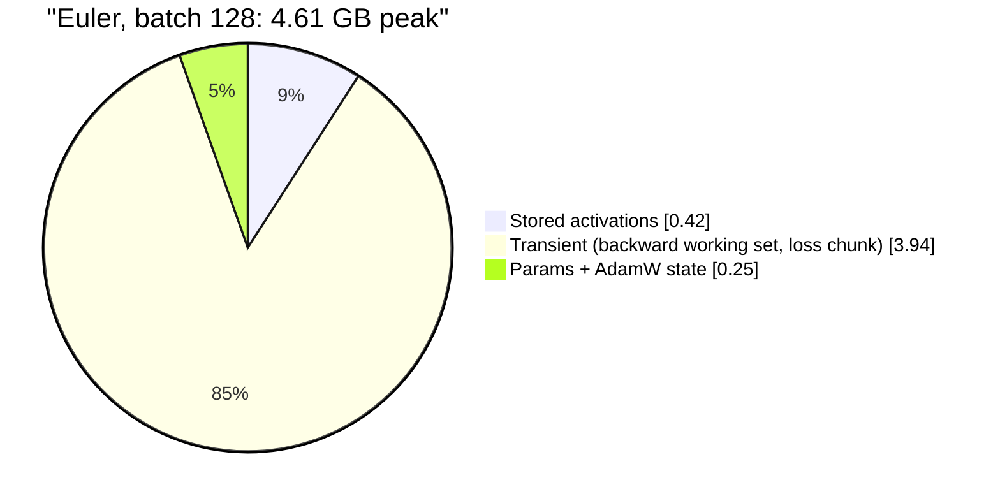
```mermaid
pie showData
    title "Euler, batch 128: 4.61 GB peak"
    "Stored activations" : 0.42
    "Transient (backward working set, loss chunk)" : 3.94
    "Params + AdamW state" : 0.25
```

**Stored activations vs depth (notebook Section 4.5, batch 8, MB):**

| n_layer | baseline | midpoint | euler |
|---|---|---|---|
| 3 | 171.1 | 74 | 74 |
| 6 | 284.2 | 74 | 74 |
| 9 | 397.2 | 74 | 74 |
| 12 | 510.3 | 74 | 74 |
| 18 | 736.4 | 74 | 74 |
| 24 | 962.5 | 74 | 74 |

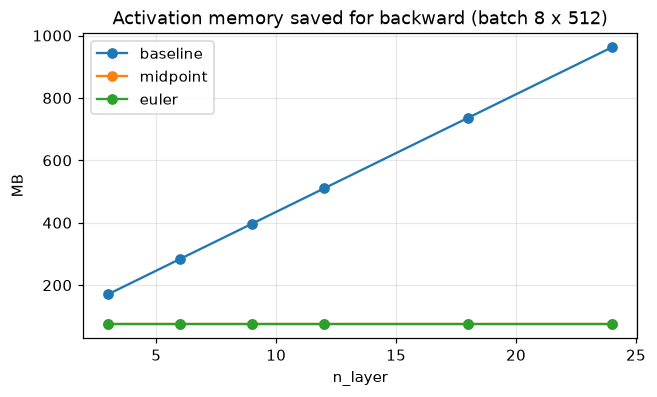

> **Marginal activation memory per extra layer** (batch 8): baseline: **37.7 MB/layer**, midpoint: **0.0 MB/layer**, euler: **0.0 MB/layer**

* **Stored activations: 41.8 → 3.0 MB per sequence (14x).** What remains is the final pair of float64 streams plus the fused-loss gradient buffers.
* **Flat in depth.** At batch 8, the baseline stores 171 MB at 3 layers and 963 MB at 24 (+37.7 MB per layer). Both reversible stacks store 74 MB at every depth. This is the paper's central claim, measured directly.
* **Peak memory falls less (−51%) than stored activations (−92%),** because the transient part is untouched: one layer's reconstruction working set, the float64 streams and their gradients, and the loss chunk.

---

## Speed

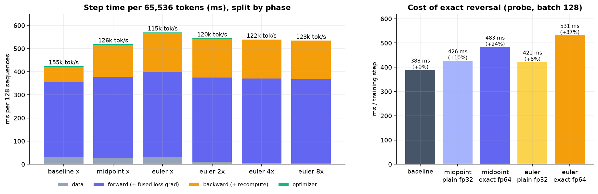

| | Baseline | Midpoint | Euler |
|---|---:|---:|---:|
| Tokens/s | **154.8k** | 126.4k (−18.4%) | 115.0k (−25.7%) |
| Step time (ms) = data + forward + backward + optimizer | 425 = 29 + 325 + 67 + 3 | 520 = 28 + 350 + 139 + 3 | 571 = 31 + 367 + 170 + 3 |
| MFU / HFU | 13.4% / 13.4% | 10.9% / 12.5% | 9.9% / 11.3% |
| Predicted extra FLOPs (recompute) | — | +14% | +14% |
| Probe step: plain fp32 streams → exact fp64 | 388 ms | 426 → 483 ms (+13%) | 421 → 531 ms (+26%) |

* The measured slowdown (18-26%) exceeds the 14% FLOP overhead because **exactness is expensive on this GPU**. The A6000 runs fp64 at 1/32 of its fp32 rate, and Euler quantizes two updates per layer. With plain fp32 streams, reversal costs only **8-10%**, but it drifts (see above).
* **MFU is low for every variant** because the model is dominated by its vocabulary head: the 50,257-way projection is 58% of the FLOPs and its softmax is memory-bandwidth-bound. Data loading takes another ~7% of each step at batch 128.

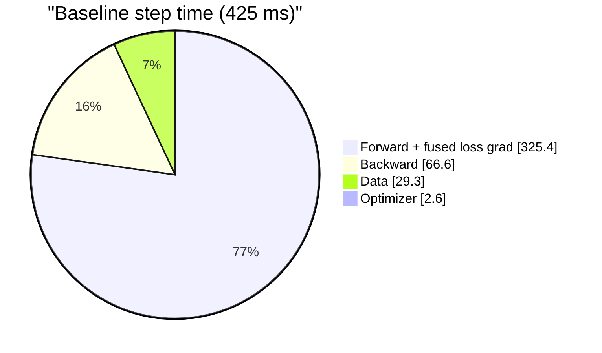
```mermaid
pie showData
    title "Baseline step time (425 ms)"
    "Forward + fused loss grad" : 325.4
    "Backward" : 66.6
    "Data" : 29.3
    "Optimizer" : 2.6
```

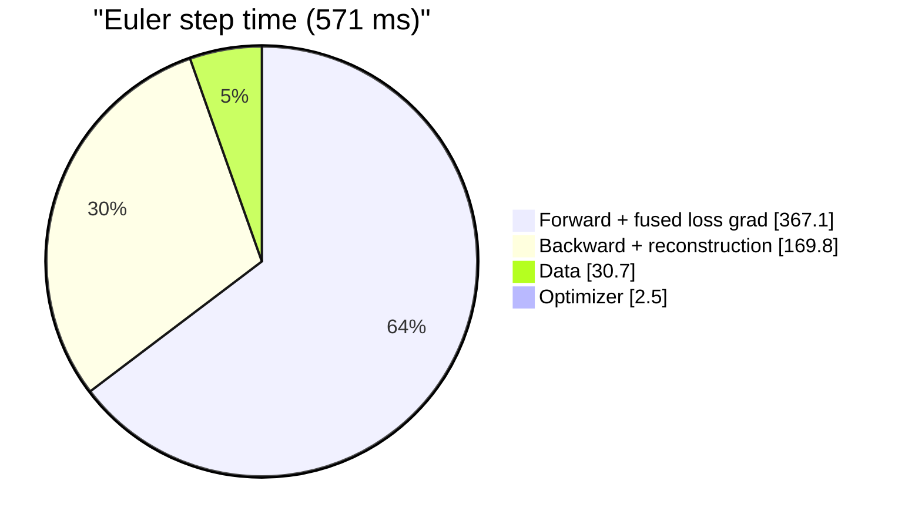
```mermaid
pie showData
    title "Euler step time (571 ms)"
    "Forward + fused loss grad" : 367.1
    "Backward + reconstruction" : 169.8
    "Data" : 30.7
    "Optimizer" : 2.5
```

---

## Choosing the variant

The rule was fixed before the runs: discard failed runs or wrong gradients, pick the lowest final val loss,
and prefer throughput if the two are within 1%.

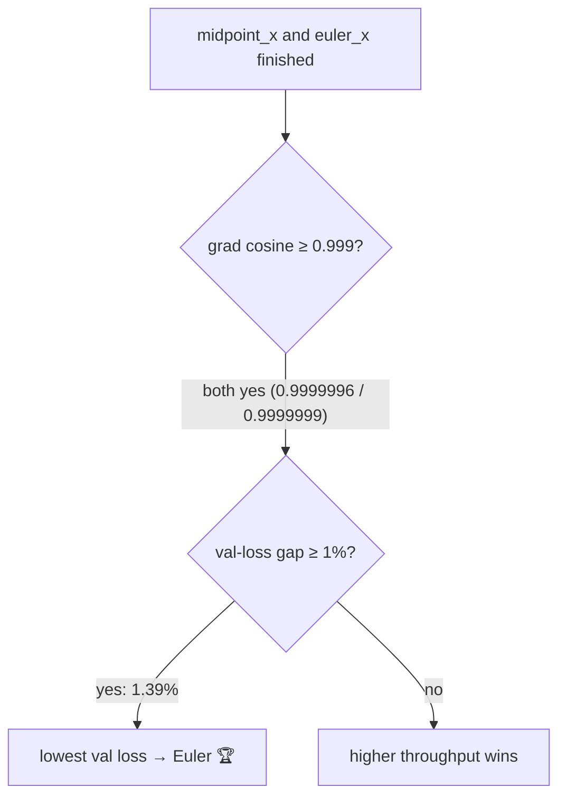
```mermaid
flowchart TD
    S["midpoint_x and euler_x finished"] --> G{"grad cosine ≥ 0.999?"}
    G -- "both yes (0.9999996 / 0.9999999)" --> L{"val-loss gap ≥ 1%?"}
    L -- "yes: 1.39%" --> W["lowest val loss → Euler 🏆"]
    L -- "no" --> T["higher throughput wins"]
```

| Criterion | Midpoint | Euler | Better |
|---|---:|---:|---|
| Final val loss | 4.842 | **4.774** | Euler |
| Val accuracy | 26.46% | **27.22%** | Euler |
| Throughput | **126.4k tok/s** | 115.0k tok/s | Midpoint (+10%) |
| Wall clock (50M tokens) | **7.1 min** | 7.7 min | Midpoint |
| Val loss at 5.9 min (when the baseline finishes, at 4.828) | 4.895 | **4.882** | Euler, narrowly |
| Peak memory / stored activations | 4.61 GB / 3.0 MB | 4.61 GB / 3.0 MB | tie |
| Reconstruction error / grad cosine | 0 / 0.9999996 | 0 / 0.9999999 | tie |

> ## Selected variant: **`euler`** (lower final val loss (gap 1.39% >= 1%))

**Euler** wins on loss per token and stays slightly ahead of midpoint even per unit of time. **Neither
reversible model beats the baseline per unit of wall-clock time on this GPU.** Reversibility buys memory, not speed.

---

## Experiments 4-6: batch scaling

The same 50M tokens each, so every doubling of the batch halves the optimizer steps (763 → 382 → 191 → 96).
The LR is sqrt-scaled (1e-3 → 1.41e-3 → 2e-3 → 2.83e-3).

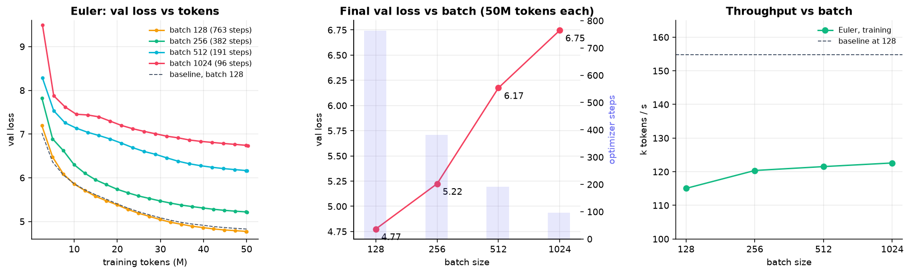

The notebook's scaling panel (val loss vs tokens, final val loss, throughput and peak memory vs batch, with the baseline's probe memory for reference):

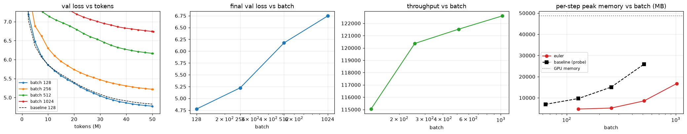

| batch | steps | val loss | val acc | tokens/s | peak MB | wall clock (min) |
|---|---|---|---|---|---|---|
| 128 | 763 | 4.7745 | 27.22% | 115,041 | 4,716 | 7.7 |
| 256 | 382 | 5.2241 | 23.40% | 120,364 | 5,166 | 7.3 |
| 512 | 191 | 6.1749 | 16.80% | 121,520 | 8,544 | 7.2 |
| 1024 | 96 | 6.7462 | 12.22% | 122,599 | 16,750 | 7.2 |
|  |
| From `x` to `8x`: throughput **+6.6%**, peak memory **+255.2%** (16.4 GB), val loss **+1.9718** with 7x fewer optimizer steps. Relative to the **baseline at x**, `8x` uses +73.2% peak memory for 8x the batch. |

### Experiment 4: Euler, batch 256 (2x)

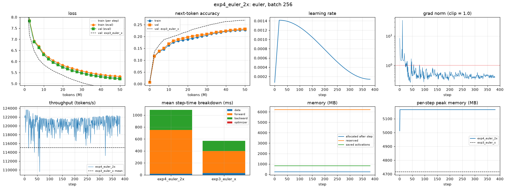

> **Notebook-generated findings (`exp4_euler_2x`)**
>
> - **Quality:** final val loss **5.2241** (perplexity 185.7), val accuracy **23.40%**; train loss 5.2663, generalization gap -0.0422.
> - **Convergence** (recomputed over the last 2.5M tokens): val loss fell 0.018 and was still improving, so the run is budget-limited.
> - **Speed:** 120,364 tokens/s (p10-p90: 118,376 to 122,042); step 1089.2 ms = data 19.5 + forward 731.4 + backward 335.2 + optimizer 2.6 ms; wall clock 7.3 min. (Forward includes the fused lm_head gradient, see Section 3.)
> - **Compute:** 16.1 model TFLOP/s (18.4 hardware TFLOP/s incl. recompute); MFU **10.4%**, HFU 11.9%; 6.7 PFLOP total.
> - **Memory:** per-step peak **5,166 MB** (10.6% of the GPU); static 251 MB (params 78 + AdamW 155); activations saved for backward **818 MB** (of which 49 MB is the batch-independent fused-loss weight-gradient buffer) = **3.00 MB per sequence**.
> - **Optimization:** 382 steps, peak LR 1.41e-03, mean grad norm 0.668 (max 34.37), clipped on 8.1% of steps.
> - **Reversibility (trained weights, bf16):** max reconstruction drift 0.00e+00 (at the input: 0.00e+00); gradient vs plain autograd: cosine 0.999999, relative error 1.21e-03.
>
> **Compared to `exp3_euler_x`:** val loss +0.4496 (+9.42%), val accuracy -3.83 pts, throughput **+4.6%**, wall clock -5.3%, per-step peak memory **+9.5%**, activation memory per sequence **1.0x smaller**

**Interpretation.** 382 steps at peak LR 1.41e-3. Val loss **5.224 (+0.45 vs batch 128)**, 120.4k tokens/s (+4.6%),
peak 5.04 GB (+0.44 GB for 128 more sequences). Halving the steps cost far more loss than the small throughput
gain returned; wall clock fell only from 7.7 to 7.3 min.

### Experiment 5: Euler, batch 512 (4x)

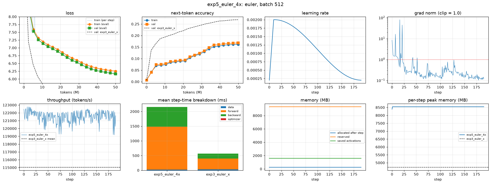

> **Notebook-generated findings (`exp5_euler_4x`)**
>
> - **Quality:** final val loss **6.1749** (perplexity 480.5), val accuracy **16.80%**; train loss 6.2019, generalization gap -0.0270.
> - **Convergence** (recomputed over the last 2.5M tokens): val loss fell 0.020 and was still improving, so the run is budget-limited.
> - **Speed:** 121,520 tokens/s (p10-p90: 120,600 to 122,307); step 2157.3 ms = data 21.7 + forward 1460.0 + backward 672.4 + optimizer 2.5 ms; wall clock 7.2 min. (Forward includes the fused lm_head gradient, see Section 3.)
> - **Compute:** 16.3 model TFLOP/s (18.6 hardware TFLOP/s incl. recompute); MFU **10.5%**, HFU 12.0%; 6.7 PFLOP total.
> - **Memory:** per-step peak **8,544 MB** (17.6% of the GPU); static 253 MB (params 78 + AdamW 157); activations saved for backward **1,587 MB** (of which 49 MB is the batch-independent fused-loss weight-gradient buffer) = **3.00 MB per sequence**.
> - **Optimization:** 191 steps, peak LR 2.00e-03, mean grad norm 1.135 (max 79.90), clipped on 10.5% of steps.
> - **Reversibility (trained weights, bf16):** max reconstruction drift 0.00e+00 (at the input: 0.00e+00); gradient vs plain autograd: cosine 1.000000, relative error 5.16e-04.
>
> **Compared to `exp3_euler_x`:** val loss +1.4004 (+29.33%), val accuracy -10.42 pts, throughput **+5.6%**, wall clock -6.6%, per-step peak memory **+81.2%**, activation memory per sequence **1.0x smaller**

**Interpretation.** 191 steps at peak LR 2.0e-3. Val loss **6.175**; the run never reached 6.0, which batch 128 passed
after 10M tokens. Throughput was 121.5k tokens/s (+5.6%) and peak memory 8.34 GB. Here the baseline would already
need 25.3 GB.

### Experiment 6: Euler, batch 1024 (8x)

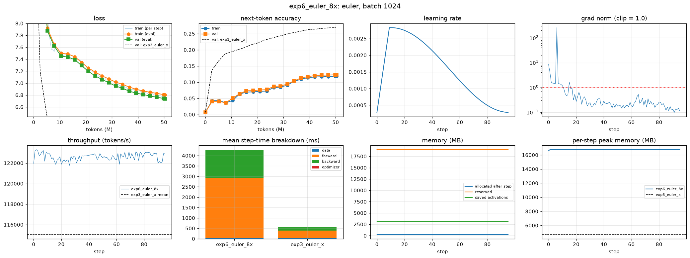

> **Notebook-generated findings (`exp6_euler_8x`)**
>
> - **Quality:** final val loss **6.7462** (perplexity 850.8), val accuracy **12.22%**; train loss 6.7623, generalization gap -0.0161.
> - **Convergence** (recomputed over the last 2.5M tokens): val loss fell 0.021 and was still improving, so the run is budget-limited.
> - **Speed:** 122,599 tokens/s (p10-p90: 122,152 to 123,032); step 4276.5 ms = data 26.9 + forward 2915.4 + backward 1330.9 + optimizer 2.5 ms; wall clock 7.2 min. (Forward includes the fused lm_head gradient, see Section 3.)
> - **Compute:** 16.4 model TFLOP/s (18.7 hardware TFLOP/s incl. recompute); MFU **10.6%**, HFU 12.1%; 6.74 PFLOP total.
> - **Memory:** per-step peak **16,750 MB** (34.4% of the GPU); static 257 MB (params 78 + AdamW 161); activations saved for backward **3,125 MB** (of which 49 MB is the batch-independent fused-loss weight-gradient buffer) = **3.00 MB per sequence**.
> - **Optimization:** 96 steps, peak LR 2.83e-03, mean grad norm 3.181 (max 257.49), clipped on 12.5% of steps.
> - **Reversibility (trained weights, bf16):** max reconstruction drift 0.00e+00 (at the input: 0.00e+00); gradient vs plain autograd: cosine 1.000000, relative error 2.37e-04.
>
> **Compared to `exp3_euler_x`:** val loss +1.9718 (+41.30%), val accuracy -15.00 pts, throughput **+6.6%**, wall clock -7.2%, per-step peak memory **+255.2%**, activation memory per sequence **1.0x smaller**

**Interpretation.** 96 steps at peak LR 2.83e-3. Val loss **6.746**, 122.6k tokens/s (+6.6%), peak **16.36 GB (34% of
the GPU)**: a configuration the baseline cannot run at all. Optimization was visibly strained: mean gradient norm
3.18 with a spike to 257 at step 6, 12.5% of steps clipped, and with only 10 warmup steps the LR reaches 2.83e-3
within the first 5M tokens.

### Scaling summary

| Batch | Steps | Peak LR | Val loss | Val acc | Tokens/s | Peak memory | Wall clock | Mean / max grad norm | Steps clipped |
|---:|---:|---:|---:|---:|---:|---:|---:|---:|---:|
| 128 | 763 | 1.00e-3 | **4.774** | **27.22%** | 115.0k | **4.61 GB** | 7.7 min | 0.82 / 36 | 7.3% |
| 256 | 382 | 1.41e-3 | 5.224 | 23.40% | 120.4k | 5.04 GB | 7.3 min | 0.67 / 34 | 8.1% |
| 512 | 191 | 2.00e-3 | 6.175 | 16.80% | 121.5k | 8.34 GB | 7.2 min | 1.13 / 80 | 10.5% |
| 1024 | 96 | 2.83e-3 | 6.746 | 12.22% | **122.6k** | 16.36 GB | **7.2 min** | 3.18 / 257 | 12.5% |

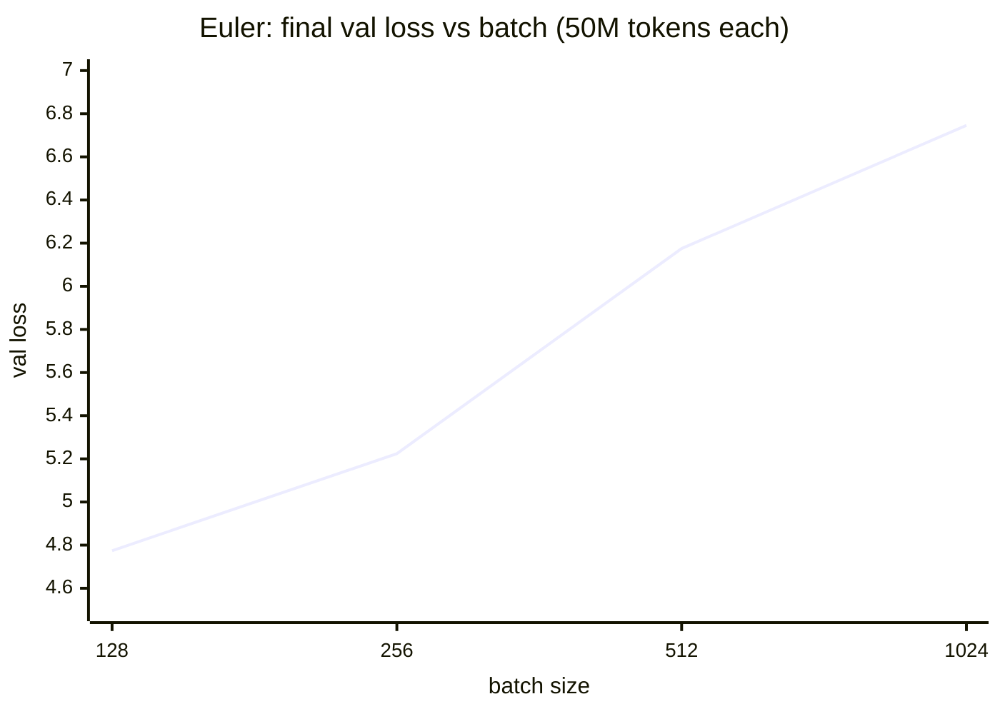
```mermaid
xychart-beta
    title "Euler: final val loss vs batch (50M tokens each)"
    x-axis "batch size" [128, 256, 512, 1024]
    y-axis "val loss" 4.5 --> 7
    line [4.774, 5.224, 6.175, 6.746]
```

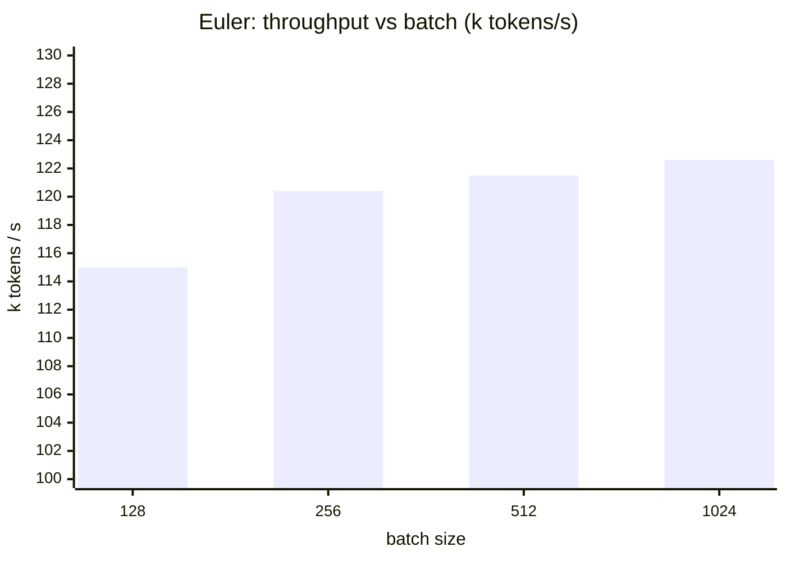
```mermaid
xychart-beta
    title "Euler: throughput vs batch (k tokens/s)"
    x-axis "batch size" [128, 256, 512, 1024]
    y-axis "k tokens / s" 100 --> 130
    bar [115.0, 120.4, 121.5, 122.6]
```

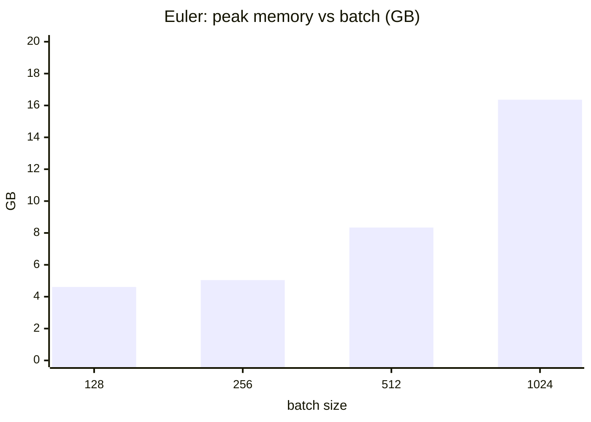
```mermaid
xychart-beta
    title "Euler: peak memory vs batch (GB)"
    x-axis "batch size" [128, 256, 512, 1024]
    y-axis "GB" 0 --> 20
    bar [4.61, 5.04, 8.34, 16.36]
```

* **Memory scaled as designed:** ~16 MB per extra sequence, against ~42 MB for the baseline. Batch 1024 needs 16.4 GB, **less than twice the baseline's 9.45 GB at batch 128**.
* **Speed barely moved:** +6.6% from 128 to 1024. The GPU is already saturated at batch 128 (the probe's throughput is flat from there on), so wall clock fell only from 7.7 to 7.2 min.
* **Loss got much worse:** 4.77 → 5.22 → 6.17 → 6.75. Batches 512 and 1024 never got below 6.0, which batch 128 passed after 10M tokens. This is the **critical batch size** effect: early in training the gradient signal dominates its noise, so each extra sample in a step adds little and fewer, larger steps waste tokens. For a 20M model at this stage, 65k tokens per step is already enough. sqrt LR scaling did not compensate; it added gradient spikes (max norm 257 at 8x) rather than progress.

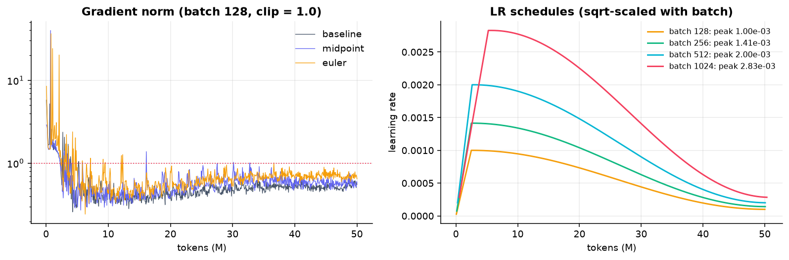

---

## The maximum batch

Doubling until out-of-memory, then bisecting to 32 sequences, with real training steps (the equivalent of
the paper's Table 3):

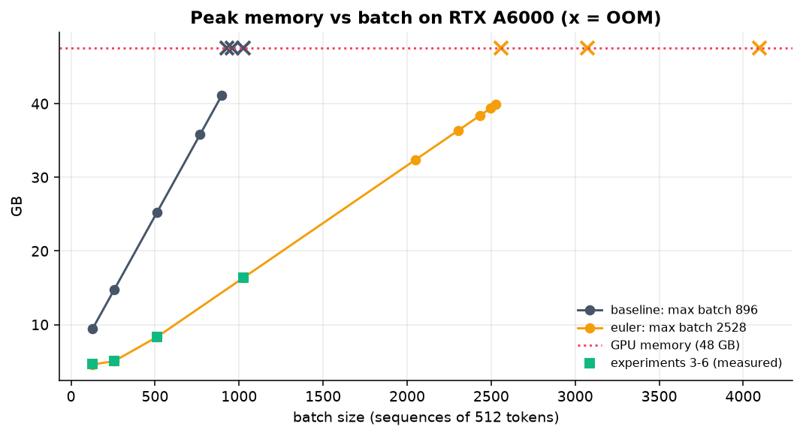

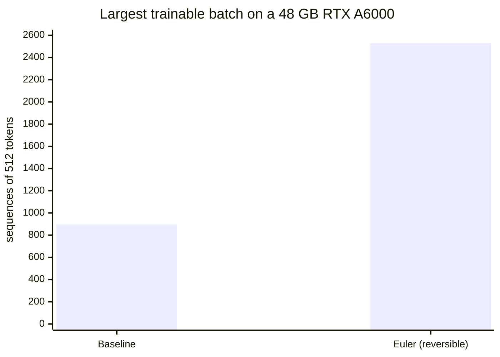
```mermaid
xychart-beta
    title "Largest trainable batch on a 48 GB RTX A6000"
    x-axis ["Baseline", "Euler (reversible)"]
    y-axis "sequences of 512 tokens" 0 --> 2600
    bar [896, 2528]
```

<details><summary><b>Full max-batch search log</b> (every probed batch, doubling then bisection)</summary>

| variant | batch_size | fits | peak_memory_mb | activation_saved_mb_per_sample | tokens_per_sec |
|---|---|---|---|---|---|
| baseline | 128 | ✅ | 9,653.5 | 41.8203 | 166,720 |
| baseline | 256 | ✅ | 15,057.5 | 41.7676 | 168,542 |
| baseline | 512 | ✅ | 25,864.6 | 41.7412 | 168,523 |
| baseline | 1,024 | ❌ | OOM | OOM | OOM |
| baseline | 768 | ✅ | 36,674.2 | 41.7336 | 169,062 |
| baseline | 896 | ✅ | 42,078.5 | 41.7313 | 169,031 |
| baseline | 960 | ❌ | OOM | OOM | OOM |
| baseline | 928 | ❌ | OOM | OOM | OOM |
| euler | 128 | ✅ | 4,698.3 | 3.0039 | 121,917 |
| euler | 256 | ✅ | 5,147.3 | 3.0039 | 123,317 |
| euler | 512 | ✅ | 8,523.8 | 3.0039 | 123,338 |
| euler | 1,024 | ✅ | 16,727.8 | 3.0039 | 123,780 |
| euler | 2,048 | ✅ | 33,135.8 | 3.0039 | 123,715 |
| euler | 4,096 | ❌ | OOM | OOM | OOM |
| euler | 3,072 | ❌ | OOM | OOM | OOM |
| euler | 2,560 | ❌ | OOM | OOM | OOM |
| euler | 2,304 | ✅ | 37,237.8 | 3.0039 | 123,017 |
| euler | 2,432 | ✅ | 39,288.8 | 3.0039 | 122,822 |
| euler | 2,496 | ✅ | 40,314.3 | 3.0039 | 122,776 |
| euler | 2,528 | ✅ | 40,827 | 3.0039 | 122,904 |

</details>

> **Max batch on NVIDIA RTX A6000 (48 GB):** baseline **896**, euler **2528**, which is **2.8x larger**. Experiment 6 used 1024 = 41% of the reversible maximum, and 1.1x the baseline's maximum. (For reference, the paper reports ~10x on A100 and H100 for GPT-2 sized models; our model's 50k-vocab head is a larger share of total memory, which caps the ratio.)

**2.8x larger** (896 → 2528). Experiment 6 (batch 1024) used 41% of Euler's maximum and is 1.14x the
baseline's maximum. Why not the paper's ~10x:

* **The peak slope sets the limit, not the stored activations.** Stored activations are 14x smaller, but the reversible *peak* still grows ~16 MB per sequence (one layer's reconstruction working set plus the float64 streams and their gradients) against ~42 MB for the baseline, a ratio of 2.6x that matches the measured 2.8x.
* **Only 9 layers.** The savings grow with depth; the paper's largest gains are on much deeper models.
* **64% of the parameters are the vocabulary embedding and head**, whose loss buffers are identical in both architectures.

---

## Complete results: every metric, every curve

The notebook's final comparison of all six runs (val loss vs tokens, vs wall clock, and throughput vs peak memory coloured by final loss):

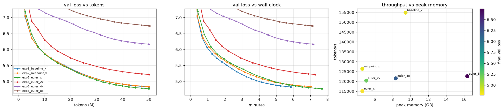

### Every metric for every run

All values come from `notebooks/results/<run>.json` (the same summaries are tracked in Aim):

| Metric | 1 · Baseline | 2 · Midpoint | 3 · Euler | 4 · Euler 2x | 5 · Euler 4x | 6 · Euler 8x |
|---|---:|---:|---:|---:|---:|---:|
| **Quality** |  |  |  |  |  |  |
| Final val loss (full split) | 4.8279 | 4.8420 | 4.7745 | 5.2241 | 6.1749 | 6.7462 |
| Final val perplexity | 124.9 | 126.7 | 118.4 | 185.7 | 480.5 | 850.8 |
| Final val accuracy | 26.75% | 26.46% | 27.22% | 23.40% | 16.80% | 12.22% |
| Final train loss | 4.8715 | 4.8855 | 4.8169 | 5.2663 | 6.2019 | 6.7623 |
| Final train accuracy | 26.23% | 26.03% | 26.82% | 22.83% | 16.41% | 12.09% |
| Val − train loss | -0.0437 | -0.0435 | -0.0424 | -0.0422 | -0.0270 | -0.0161 |
| Best periodic val loss | 4.8265 | 4.8384 | 4.7712 | 5.2165 | 6.1641 | 6.7381 |
| Train loss, last 5% of steps | 4.8806 | 4.8953 | 4.8258 | 5.2730 | 6.2124 | 6.7786 |
| Tokens to reach val loss 6.0 | 9,961,472 | 9,961,472 | 9,961,472 | 14,942,208 | – | – |
| Tokens to reach val loss 5.0 | 34,865,152 | 34,865,152 | 32,374,784 | – | – | – |
| **Speed** |  |  |  |  |  |  |
| Mean tokens/s | 154.8k | 126.4k | 115.0k | 120.4k | 121.5k | 122.6k |
| Median tokens/s | 157.0k | 127.8k | 116.5k | 120.6k | 121.6k | 122.6k |
| p10 tokens/s | 142.8k | 118.8k | 108.2k | 118.4k | 120.6k | 122.2k |
| p90 tokens/s | 164.0k | 132.3k | 120.4k | 122.0k | 122.3k | 123.0k |
| Step time (ms) | 424.6 | 519.6 | 570.8 | 1,089.2 | 2,157.3 | 4,276.5 |
| · data (ms) | 29.3 | 28.2 | 30.7 | 19.5 | 21.7 | 26.9 |
| · forward + fused loss grad (ms) | 325.4 | 349.6 | 367.1 | 731.4 | 1,460.0 | 2,915.4 |
| · backward (ms) | 66.6 | 138.6 | 169.8 | 335.2 | 672.4 | 1,330.9 |
| · optimizer (ms) | 2.6 | 2.6 | 2.5 | 2.6 | 2.5 | 2.5 |
| Backward / forward | 0.205 | 0.397 | 0.463 | 0.458 | 0.461 | 0.457 |
| Training time | 5.62 min | 6.76 min | 7.42 min | 7.01 min | 6.92 min | 6.87 min |
| Evaluation time | 0.29 min | 0.31 min | 0.32 min | 0.32 min | 0.31 min | 0.31 min |
| Wall clock | 5.91 min | 7.07 min | 7.74 min | 7.33 min | 7.23 min | 7.18 min |
| **Compute** |  |  |  |  |  |  |
| Model TFLOP/s | 20.72 | 16.91 | 15.39 | 16.11 | 16.26 | 16.41 |
| Hardware TFLOP/s (incl. recompute) | 20.72 | 19.30 | 17.57 | 18.38 | 18.56 | 18.72 |
| MFU (A6000 bf16 peak 154.8) | 13.38% | 10.92% | 9.94% | 10.40% | 10.50% | 10.60% |
| HFU | 13.38% | 12.47% | 11.35% | 11.87% | 11.99% | 12.09% |
| Model FLOPs / token | 133,817,856 | 133,817,856 | 133,817,856 | 133,817,856 | 133,817,856 | 133,817,856 |
| Hardware FLOPs / token | 133,817,856 | 152,692,224 | 152,692,224 | 152,692,224 | 152,692,224 | 152,692,224 |
| Total model PFLOP | 6.69 | 6.69 | 6.69 | 6.70 | 6.70 | 6.74 |
| **Memory** |  |  |  |  |  |  |
| Per-step peak allocated (MB) | 9,672 | 4,716 | 4,716 | 5,166 | 8,544 | 16,750 |
| Peak reserved (MB) | 11,242 | 6,214 | 6,216 | 6,216 | 9,324 | 18,978 |
| Static: params + AdamW (MB) | 251 | 250 | 250 | 251 | 253 | 257 |
| · parameters (MB) | 77.62 | 77.62 | 77.62 | 77.62 | 77.62 | 77.62 |
| · AdamW state (MB) | 155.37 | 154.45 | 154.45 | 155.45 | 157.45 | 161.45 |
| Activations stored for backward (MB) | 5,402 | 434 | 434 | 818 | 1,587 | 3,125 |
| · per 512-token sequence (MB) | 41.82 | 3.00 | 3.00 | 3.00 | 3.00 | 3.00 |
| · fused-loss buffer, batch-independent (MB) | 49.08 | 49.08 | 49.08 | 49.08 | 49.08 | 49.08 |
| Peak as % of 48 GB | 19.87% | 9.69% | 9.69% | 10.61% | 17.56% | 34.42% |
| **Optimization** |  |  |  |  |  |  |
| Batch (sequences) | 128 | 128 | 128 | 256 | 512 | 1,024 |
| Tokens / step | 65,536 | 65,536 | 65,536 | 131,072 | 262,144 | 524,288 |
| Optimizer steps | 763 | 763 | 763 | 382 | 191 | 96 |
| Tokens seen | 50,003,968 | 50,003,968 | 50,003,968 | 50,069,504 | 50,069,504 | 50,331,648 |
| Peak LR | 1.00e-03 | 1.00e-03 | 1.00e-03 | 1.41e-03 | 2.00e-03 | 2.83e-03 |
| Warmup steps | 38 | 38 | 38 | 19 | 10 | 10 |
| Mean grad norm | 0.554 | 0.658 | 0.819 | 0.668 | 1.13 | 3.18 |
| Max grad norm | 5.76 | 39.9 | 36.5 | 34.4 | 79.9 | 257 |
| Steps clipped | 5.50% | 5.77% | 7.34% | 8.12% | 10.47% | 12.50% |
| **Reversibility (trained weights)** |  |  |  |  |  |  |
| Max reconstruction error | – | 0 | 0 | 0 | 0 | 0 |
| Grad cosine vs autograd | – | 0.99999964 | 0.99999994 | 0.99999923 | 0.99999988 | 1.00000000 |
| Grad relative error vs autograd | – | 8.83e-04 | 4.49e-04 | 1.21e-03 | 5.16e-04 | 2.37e-04 |
| Aim run hash | `1c5bbaf6` | `464874f7` | `0c54998f` | `b0ebf7a8` | `c1c87864` | `530e217b` |

### Validation loss every 2.5M tokens

Best value in each row in **bold**. Runs 4-6 evaluate on a slightly different token grid (their steps are larger), so their values are linearly interpolated onto the same grid:

| Tokens (M) | 1 · Baseline | 2 · Midpoint | 3 · Euler | 4 · Euler 2x | 5 · Euler 4x | 6 · Euler 8x |
|---:|---:|---:|---:|---:|---:|---:|
| 2.5 | **7.0215** | 7.0596 | 7.1890 | 7.8194 | 8.4018 | 9.5601 |
| 5 | 6.3585 | **6.3553** | 6.4710 | 6.8868 | 7.6017 | 8.0257 |
| 7.5 | **6.0602** | 6.0670 | 6.0837 | 6.6173 | 7.2950 | 7.6563 |
| 10 | 5.8641 | 5.8692 | **5.8559** | 6.2968 | 7.1569 | 7.4837 |
| 12.5 | 5.7221 | 5.7261 | **5.7065** | 6.1006 | 7.0619 | 7.4402 |
| 15 | 5.6094 | 5.6029 | **5.5732** | 5.9505 | 6.9868 | 7.4049 |
| 17.5 | 5.5076 | 5.4934 | **5.4723** | 5.8410 | 6.9120 | 7.3264 |
| 20 | 5.4009 | 5.3850 | **5.3782** | 5.7354 | 6.8263 | 7.2326 |
| 22.5 | 5.3049 | 5.2880 | **5.2735** | 5.6542 | 6.7313 | 7.1526 |
| 25 | 5.2208 | 5.2130 | **5.1867** | 5.5820 | 6.6414 | 7.0888 |
| 27.5 | 5.1497 | 5.1461 | **5.1151** | 5.5250 | 6.5695 | 7.0341 |
| 30 | 5.0840 | 5.0779 | **5.0426** | 5.4681 | 6.5008 | 6.9818 |
| 32.5 | 5.0249 | 5.0246 | **4.9799** | 5.4179 | 6.4250 | 6.9360 |
| 35 | 4.9770 | 4.9815 | **4.9342** | 5.3731 | 6.3584 | 6.8962 |
| 37.5 | 4.9404 | 4.9444 | **4.8894** | 5.3390 | 6.3067 | 6.8545 |
| 40 | 4.9122 | 4.9149 | **4.8590** | 5.3070 | 6.2664 | 6.8265 |
| 42.5 | 4.8818 | 4.8890 | **4.8280** | 5.2779 | 6.2340 | 6.8040 |
| 45 | 4.8601 | 4.8689 | **4.8057** | 5.2536 | 6.2069 | 6.7815 |
| 47.5 | 4.8422 | 4.8544 | **4.7891** | 5.2350 | 6.1844 | 6.7617 |
| 50 | 4.8266 | 4.8384 | **4.7712** | 5.2173 | 6.1645 | 6.7408 |

### Validation accuracy every 2.5M tokens

| Tokens (M) | 1 · Baseline | 2 · Midpoint | 3 · Euler | 4 · Euler 2x | 5 · Euler 4x | 6 · Euler 8x |
|---:|---:|---:|---:|---:|---:|---:|
| 2.5 | **14.08%** | 13.92% | 13.63% | 11.73% | 3.93% | 3.93% |
| 5 | 17.03% | **17.11%** | 16.46% | 13.88% | 7.11% | 4.08% |
| 7.5 | 18.62% | 18.55% | **18.70%** | 15.10% | 7.52% | 3.67% |
| 10 | 19.24% | 19.23% | **19.34%** | 16.92% | 7.76% | 4.82% |
| 12.5 | 19.79% | 19.74% | **20.06%** | 18.19% | 8.51% | 6.08% |
| 15 | 20.43% | 20.52% | **20.68%** | 18.80% | 8.88% | 7.07% |
| 17.5 | 21.04% | 21.25% | **21.54%** | 19.16% | 9.14% | 7.37% |
| 20 | 21.83% | **22.14%** | 22.10% | 19.72% | 9.33% | 7.51% |
| 22.5 | 22.63% | 22.82% | **22.98%** | 20.11% | 10.18% | 7.64% |
| 25 | 23.32% | 23.36% | **23.51%** | 20.45% | 11.17% | 8.22% |
| 27.5 | 23.82% | 23.81% | **24.07%** | 20.72% | 11.92% | 8.73% |
| 30 | 24.35% | 24.51% | **24.57%** | 21.06% | 12.80% | 9.06% |
| 32.5 | 24.81% | 24.91% | **25.12%** | 21.40% | 13.95% | 9.82% |
| 35 | 25.20% | 25.15% | **25.49%** | 21.84% | 15.18% | 10.71% |
| 37.5 | 25.54% | 25.47% | **25.94%** | 22.07% | 15.91% | 11.43% |
| 40 | 25.85% | 25.78% | **26.32%** | 22.39% | 16.16% | 11.80% |
| 42.5 | 26.05% | 25.80% | **26.42%** | 22.69% | 16.47% | 12.06% |
| 45 | 26.25% | 26.10% | **26.65%** | 22.89% | 16.61% | 12.18% |
| 47.5 | 26.38% | 26.17% | **26.80%** | 23.05% | 16.70% | 12.21% |
| 50 | 26.44% | 26.26% | **26.84%** | 23.18% | 16.83% | 12.26% |

---

## Conclusions and recommendations

```text
                      memory (peak, GB)   loss (val)   speed (k tok/s)   max batch (48 GB)
baseline   @128            9.45             4.828          154.8               896
midpoint   @128            4.61             4.842          126.4                 -
euler      @128            4.61             4.774          115.0              2528
euler      @1024          16.36             6.746          122.6                 -
```

* **To fit a larger model, use reversible Euler with exact streams.** It halves peak memory, keeps stored activations flat in depth, and here even beat the baseline's loss per token.
* **If memory is not the constraint and wall-clock time matters, use the plain transformer.** On this GPU the reversible models are 18-26% slower.
* **Don't raise the batch just because it fits.** At a fixed token budget the optimizer steps matter more. Spend the freed memory on depth, context length or width.
* **Exactness is not optional.** Floating-point reversal drifts as the layers sharpen. Fixed-point streams make it exact, which the paper does not discuss.

<details><summary><b>Notebook-generated summary</b> (composed by the notebook from the measured numbers)</summary>

> ### 1. Architecture (same batch, same data)
> - **Memory:** reversible `euler` saved **14x less** activation memory per sequence than the baseline (3.00 vs 41.82 MB), and per-step peak memory changed by **-51.2%**.
> - **Speed:** throughput changed by **-25.7%** (115,041 vs 154,834 tokens/s). This is the cost of reconstructing activations in backward, compared with the ~14% extra FLOPs predicted analytically.
> - **Quality:** val loss 4.7745 vs baseline 4.8279 (**-0.0534**); the other reversible variant reached 4.8420.
> - **Selection:** `euler`, because lower final val loss (gap 1.39% >= 1%).
>
> ### 2. Batch-size scaling of the selected variant
> - batch **128**: val loss 4.7745, 115,041 tokens/s, peak 4.6 GB, 7.7 min
> - batch **256**: val loss 5.2241, 120,364 tokens/s, peak 5.0 GB, 7.3 min
> - batch **512**: val loss 6.1749, 121,520 tokens/s, peak 8.3 GB, 7.2 min
> - batch **1024**: val loss 6.7462, 122,599 tokens/s, peak 16.4 GB, 7.2 min
> - Largest trainable batch on this GPU: baseline **896** vs euler **2528** (**2.8x**).
>
> ### 3. Overall
> - Lowest val loss: `exp3_euler_x` (4.7745); highest throughput: `exp1_baseline_x` (154,834 tokens/s).

</details>

**Next experiments:** 2-3 seeds to confirm the Euler gain; a deeper, narrower model (24-48 layers), where the
depth savings dominate; a cheaper exact scheme (int32 fixed-point streams) or a GPU with fast fp64; and a
longer warmup or larger token budget for large-batch runs.

---

## Experiment tracking: Aim, logs, JSON

Every run writes the same metrics to four places: **Aim**, a human-readable **text log**, a streaming
**per-step JSONL**, and a full **per-run JSON** record.

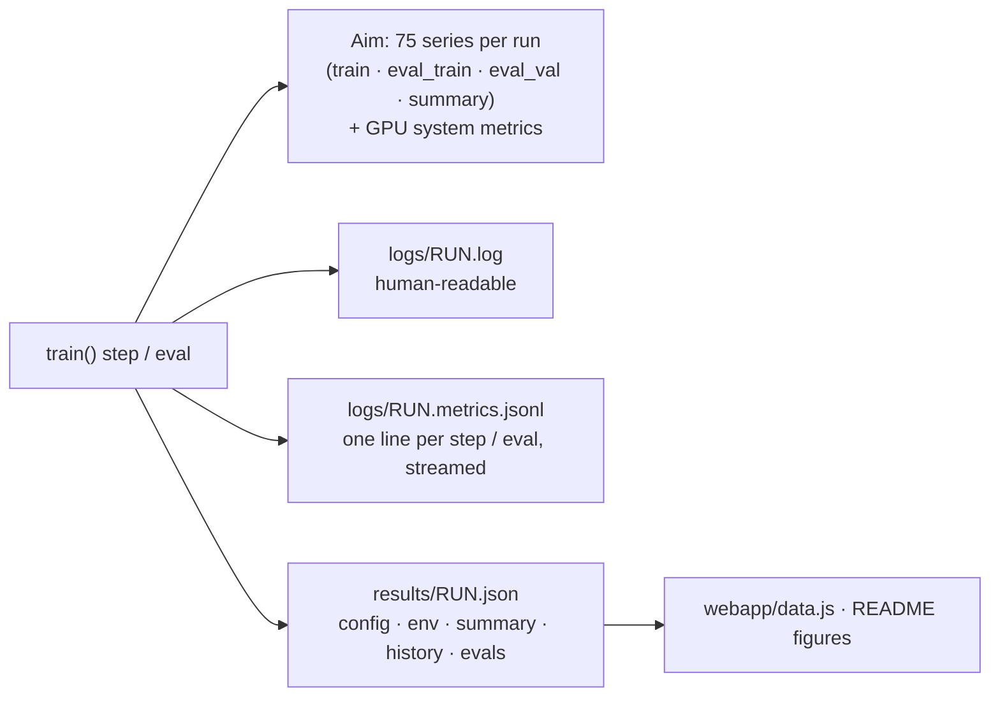
```mermaid
flowchart LR
    T["train() step / eval"] --> A["Aim: 75 series per run<br/>(train · eval_train · eval_val · summary)<br/>+ GPU system metrics"]
    T --> L["logs/RUN.log<br/>human-readable"]
    T --> J["logs/RUN.metrics.jsonl<br/>one line per step / eval, streamed"]
    T --> R["results/RUN.json<br/>config · env · summary · history · evals"]
    R --> W["webapp/data.js · README figures"]
```

**Aim runs explorer** (experiment `session13_reversible_llm`, all six runs with their tags):

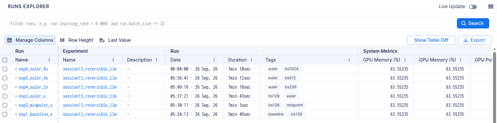

**Aim metrics for the Euler run** (every metric is tracked per step and per evaluation, split by `subset` context):

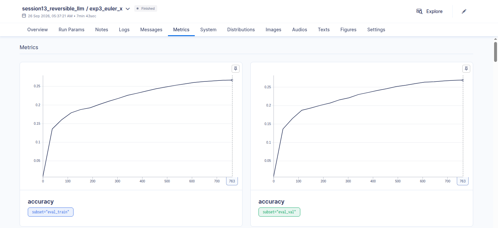

**Text log excerpt** (`notebooks/logs/exp3_euler_x.log`):

```text
2026-09-26 05:37:21,385 | INFO | start exp3_euler_x | variant=euler batch=128 steps=763 tokens/step=65536 peak_lr=1.00e-03 warmup=38 eval_every=38
2026-09-26 05:37:22,734 | INFO | step 0/763 | loss 10.8604 acc 0.0066 | lr 2.63e-05 | gnorm 8.483 | 116580 tok/s | step 562.2ms (fwd 365.6 bwd 168.8 opt 3.2) | peak 4563MB act 434MB
2026-09-26 05:41:11,044 | INFO | step 380/763 | loss 5.2081 acc 0.2382 | lr 5.90e-04 | gnorm 0.579 | 118395 tok/s | step 553.5ms (fwd 366.3 bwd 169.7 opt 2.5) | peak 4716MB act 434MB
2026-09-26 05:44:59,415 | INFO | step 760/763 | loss 4.8196 acc 0.2663 | lr 1.00e-04 | gnorm 0.725 | 120596 tok/s | step 543.4ms (fwd 366.4 bwd 169.9 opt 2.5) | peak 4716MB act 434MB
2026-09-26 05:45:01,362 | INFO | eval step=763 tokens=50003968 | train_loss=4.8728 val_loss=4.7712 val_acc=0.2684 val_ppl=118.06
2026-09-26 05:45:04,340 | INFO | reversibility diagnostics | {'max_rel_error': 0.0, 'input_rel_error': 0.0, 'per_layer_rel_error': […], 'grad_cosine': 0.9999999403953552, 'grad_rel_error': 0.0004493124142754823}
```

**Streaming JSONL records** (`notebooks/logs/exp3_euler_x.metrics.jsonl`: a training step and the final validation eval):

```json
{"kind": "step", "step": 380, "subset": "train", "tokens": 24969216, "lr": 0.0006, "loss": 5.2081, "accuracy": 0.2382, "grad_norm": 0.5786, "step_time_ms": 553.5391, "data_ms": 14.5741, "forward_ms": 366.3136, "backward_ms": 169.7147, "optimizer_ms": 2.4832, "tokens_per_sec": 118394.5309, "model_tflops": 15.8433, "mfu": 0.1023, "memory_allocated_mb": 250.3452, "memory_reserved_mb": 6216.0, "step_peak_memory_mb": 4716.3364, "activation_saved_mb": 433.583}
{"kind": "eval", "step": 763, "subset": "eval_val", "loss": 4.7712, "accuracy": 0.2684, "perplexity": 118.0565, "tokens_seen": 50003968}
```

---

## Reproduce

```bash
uv sync
uv run pytest -q                                   # 21 tests: exact gradients, inverses, fused loss, bf16 exactness, O(1) memory
cd notebooks
uv run jupyter nbconvert --to notebook --execute --inplace reversible_llm.ipynb --ExecutePreprocessor.timeout=-1
uv run aim up                                      # every per-step / per-eval metric
```

All settings (device, `BATCH_X`, token budget, LR, evaluation, output paths) live in the notebook's
configuration cell. With `REUSE_RESULTS = True`, finished runs are loaded instead of retrained, so an
interrupted notebook resumes where it stopped.
### Outputs

Everything below is under `notebooks/`:

| Where | What |
|---|---|
| `results/<run>.json` | config, environment, summary, per-step history, eval curve, reversibility diagnostics |
| `results/runs.jsonl` · `results/final_comparison.csv` | one summary line per run · the six-run table |
| `results/notebook_tables.json` | probe, depth, exactness-cost and max-batch tables (extracted from the notebook) |
| `logs/<run>.log` · `logs/<run>.metrics.jsonl` | human-readable log · streamed per-step and per-eval metrics |
| `.aim/` | Aim runs: 75 series per run (train, eval_train, eval_val, summary) plus GPU system metrics |

If Aim runs look empty when queried from Python, rebuild its index: `uv run aim storage --repo . reindex --yes`
(the notebook does this at the end, and `aim up` does it too).

### Project layout

```text
reversible_llm_experiments/
├── src/revllm/
│   ├── model.py        GPT (baseline / midpoint / euler), FLOPs accounting
│   ├── reversible.py   O(1)-memory reversible stack, exact fixed-point streams, diagnostics
│   ├── loss.py         fused chunked lm_head + cross-entropy
│   ├── trainer.py      instrumented training loop → Aim + logs + JSON
│   ├── probe.py        memory probes and max-batch search
│   ├── data.py         WikiText-103 tokenization, batching, fixed eval windows
│   └── export.py       results → ../webapp/data.js
├── notebooks/          reversible_llm.ipynb (executed) · results/ · logs/
├── assets/             README figures
└── tests/              test_reversible.py
```
