# Session 14 — Dense nanoGPT → Mixture-of-Experts

**Assignment.** Train a traditional, linear-layer nanoGPT and track everything; train the same model with MoE layers instead of the MLPs; and, as the trainer asked, **train a linear model and convert it into an MoE — showing it keeps training and keeps reducing loss.**

> **🌐 Interactive write-up:** [`../webapp/`](../webapp/index.html) · **📓 Notebooks:** [`notebooks/`](notebooks/) · **📈 Tracking:** [Aim](#9-experiment-tracking-with-aim) (8 runs)

## TL;DR

| | |
|---|---|
| **Model** | session-11 nanoGPT, 8 layers × 8 heads × 512, 51.2 M parameters, GPT-2 BPE, WikiText-103 |
| **Conversion** | every 2nd block's MLP → **8 experts (top-2)**, experts = exact copies, new router → **110.0 M stored / 59.6 M active** |
| **Lossless?** | **Yes.** Loss before 3.6269, after 3.6269 (|Δ| = 0); max logit difference 5.5 × 10⁻⁵ |
| **Keeps training?** | **Yes.** 3.627 → **3.502** over 3,000 steps (perplexity 37.6 → 33.2) |
| **Beats just training longer?** | **Yes, by 0.019 nats** (3.502 vs 3.521 for a dense-continue control, identical batches, one seed); it matches the control's final loss in **2,507 instead of 3,000 steps** |
| **MoE from scratch** | leads dense by **0.096 nats** at the same budget (3.531 vs 3.627), reaching dense's final loss ≈ 25 % earlier |
| **A surprise** | validation loss **bumps +0.11 in *both* continuations** when the LR is re-warmed — the dense control does it too |
| **A cost** | at equal *time* the dense model is ahead here (MoE ran at ≈ 0.71 × the dense tokens/s, Python expert loop) |

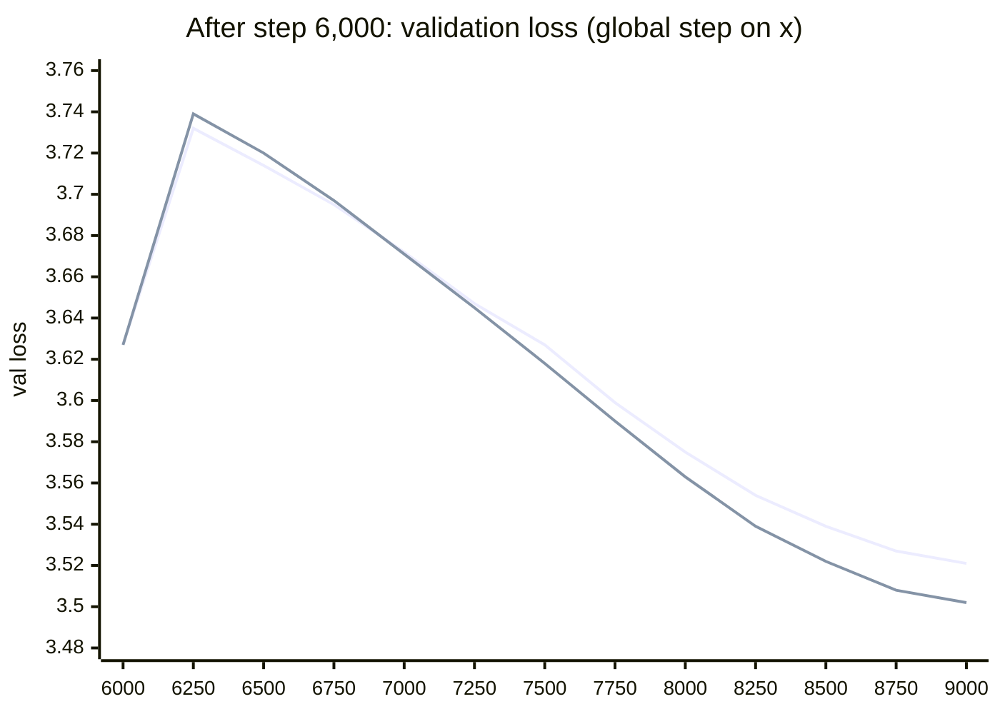
*First line: dense, continued (control). Second line: dense → MoE (upcycled).*

---

## Contents

1. [What was run](#1-what-was-run)
2. [Results at a glance](#2-results-at-a-glance)
3. [Architecture](#3-architecture)
4. [Training strategy](#4-training-strategy)
5. [Experiment 1 — dense baseline](#5-experiment-1--dense-baseline)
6. [Experiment 2 — MoE from scratch](#6-experiment-2--moe-from-scratch)
7. [Experiment 3 — convert and keep training](#7-experiment-3--convert-and-keep-training)
8. [Routing, experts, ablations and cost](#8-routing-experts-ablations-and-cost)
9. [Experiment tracking with Aim](#9-experiment-tracking-with-aim)

---

## 1. What was run

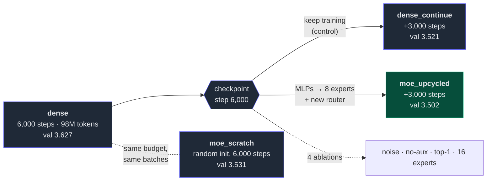

Eight runs, one seed (1337), the same data stream and the same fixed evaluation batches for all of them:

| run | init | steps | answers |
|---|---|---|---|
| `dense` | random | 6,000 | part 1 — the linear-layer baseline |
| `moe_scratch` | random | 6,000 | part 2 — MoE with the identical budget |
| `moe_upcycled` | dense @ 6,000 | +3,000 | **the trainer's task** — convert and continue |
| `dense_continue` | dense @ 6,000 | +3,000 | control — is the MoE better than just training longer? |
| `abl_noise0.02`, `abl_no_lb_loss`, `abl_top1`, `abl_experts16` | dense @ 6,000 | +3,000 | which design choices matter? |

## 2. Results at a glance

| run | params (total / active) | steps | val @ start | **val @ end** | ppl | wall (min) | median tok/s | MaxVio (L0…L3) | dead |
|---|---|---:|---:|---:|---:|---:|---:|---|---:|
| dense | 51.2 M / 51.2 M | 6,000 | 10.919 | 3.6269 | 37.6 | 25.4 | 61 k † | – | – |
| MoE from scratch | 110.0 M / 59.6 M | 6,000 | 10.920 | **3.5314** | 34.2 | 32.8 | 83 k † | 0.03 / 0.04 / 0.05 / 0.15 | 0 |
| dense, continued | 51.2 M / 51.2 M | +3,000 | 3.627 | 3.5213 | 33.8 | 8.2 | **116 k** | – | – |
| **dense → MoE (upcycled)** | 110.0 M / 59.6 M | +3,000 | 3.627 | **3.5019** | 33.2 | 11.5 | 82 k | 0.45 / 0.16 / 0.12 / 0.07 | 0 |
| ablation: expert noise 0.02 | 110.0 M / 59.6 M | +3,000 | 3.627 | 3.5002 | 33.1 | 11.5 | 82 k | 0.22 / 0.19 / 0.12 / 0.09 | 0 |
| ablation: no aux loss | 110.0 M / 59.6 M | +3,000 | 3.627 | 3.5017 | 33.2 | 11.4 | 82 k | 0.32 / 0.23 / 0.10 / 0.07 | 0 |
| ablation: top-1 routing | 110.0 M / 51.2 M | +3,000 | 3.627 | **3.5402** | 34.5 | 10.3 | 91 k | 0.40 / 0.13 / **1.83 / 4.13** | **5** |
| ablation: 16 experts | 177.2 M / 59.6 M | +3,000 | 3.627 | **3.4941** | 32.9 | 14.9 | 63 k | 0.84 / 0.14 / 0.15 / 0.28 | 0 |

† The dense pre-training run was disturbed (median 60 k vs mean 83 k tokens/s, likely a shared GPU), so pre-training speeds are not comparable. The two continuation runs ran back to back and are. **Peak GPU memory is not reported:** the recorded value is 0.0 because of a device-query bug.

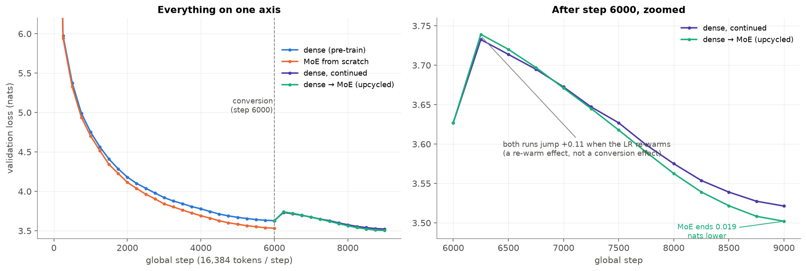

## 3. Architecture

The base model is the session-11 nanoGPT: pre-LN blocks of (LayerNorm → causal attention) and (LayerNorm → MLP), learned position embeddings, tied output head, 8 layers × 8 heads, width 512, context 512, GPT-2 BPE vocabulary of 50,257.

### The MoE layer

An MoE block keeps attention untouched and replaces the MLP by a **router** and **8 experts**, each an MLP of exactly the dense one's shape. Per token, the router keeps its top 2 experts and mixes their outputs:

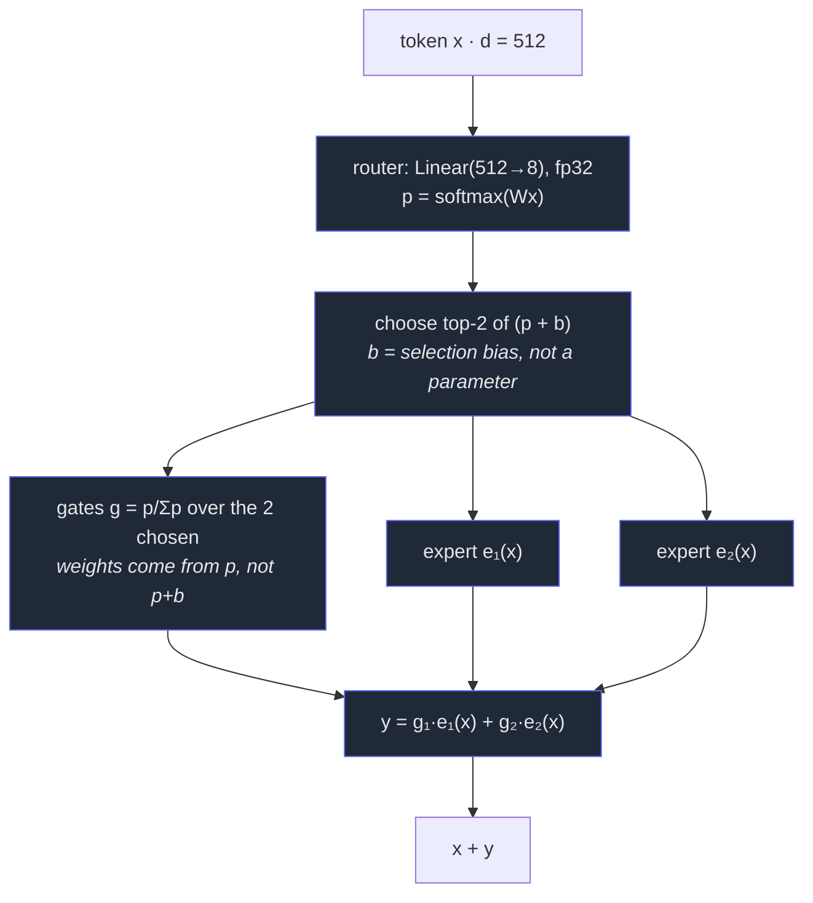

* **Dropless:** no capacity limit, no dropped tokens. Dispatch sorts the (token, expert) pairs by expert and runs each expert once — verified against a naive per-token loop (max error 4.7 × 10⁻⁹).
* **Renormalised gates** sum to 1. If all experts are the same function *f*, then *y = f(x)* regardless of the router — this is what makes the conversion lossless. A side effect: with *k = 1* the gate is always exactly 1, so the router gets **no gradient** from the language loss (see the top-1 ablation).
* MoE sits in blocks **1, 3, 5, 7**; blocks 0, 2, 4, 6 stay dense.

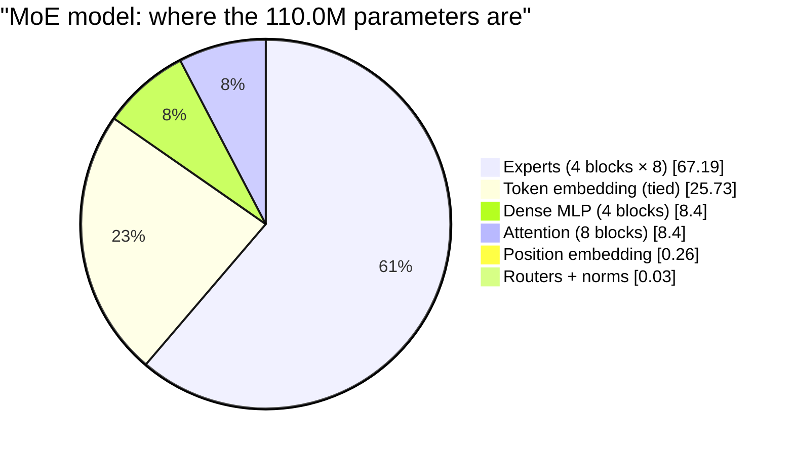

| | dense | MoE | ratio |
|---|---:|---:|---:|
| stored parameters | 51.21 M | 110.02 M | **2.15 ×** |
| active parameters / token | 51.21 M | 59.63 M | 1.16 × |
| FLOPs / token (6·N + attention) | 330.9 M | 381.4 M | 1.15 × |

Half of the dense model is the (tied) embedding, which is why doubling the MLPs in half the blocks "only" doubles the total.

## 4. Training strategy

**Optimisation (all runs).** AdamW (β = 0.9 / 0.95, weight decay 0.1 on matrices only), gradient clipping 1.0, bf16 autocast with an fp32 router, batches of 32 × 512 = 16,384 tokens, one seed. Pre-training: 300-step warm-up to 6 × 10⁻⁴, cosine to 6 × 10⁻⁵. Continuation: LR **re-warmed** 6 × 10⁻⁵ → 3 × 10⁻⁴ over 100 steps, cosine to 3 × 10⁻⁵; optimiser state reset for *both* the MoE and the dense control.

**Data.** WikiText-103 (raw), GPT-2 BPE via tiktoken: 119,085,169 training tokens (the 98.3 M-token pre-training is 0.83 epochs), 249,750 validation tokens. Evaluation uses 50 × 32 × 512 tokens from fixed batches (seed 4242), identical for every run; continuation runs share their data stream.

### Sparse upcycling

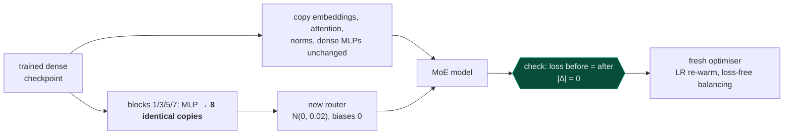

The conversion is verified numerically before any training: loss 3.653676 vs 3.653676 on a held-out batch, max logit difference 5.5 × 10⁻⁵ (fp32), and expert noise of 0.01 / 0.05 / 0.10 × weight-std shifts the loss by only −0.00004 / +0.0002 / +0.0012.

### Keeping experts busy: loss-free balancing

A router left alone is self-reinforcing (favoured experts learn faster and are favoured more) until some experts are **dead**. Instead of a large auxiliary loss — whose gradient fights the language loss — each expert has a **selection bias** nudged after every optimiser step:

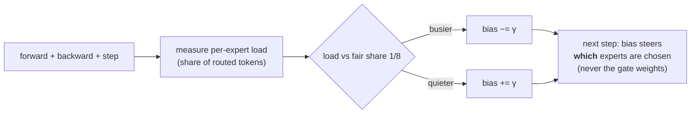

γ = 10⁻³, plus a tiny Switch auxiliary loss (10⁻⁴) and a router z-loss (10⁻³) as backstops. Imbalance is reported as **MaxVio** = (max load − mean load) / mean load: 0 is perfect, 1 means the busiest expert carries twice its share.

## 5. Experiment 1 — dense baseline

6,000 steps, 98.3 M tokens. Validation loss falls at every one of the 25 evaluations, from 10.92 (ln 50,257 = 10.82) to **3.627 (perplexity 37.6)**.

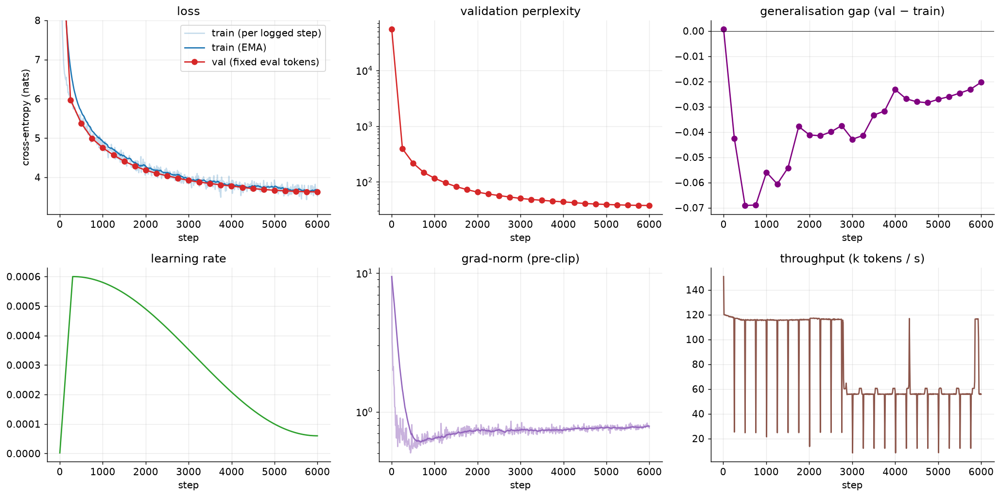

* **No overfitting** — validation loss sits *below* training loss throughout (final 3.627 vs 3.647); each token is seen at most once.
* **The schedule, not capacity, ends the run.** The last 250 steps gain only 0.005 nats because the LR has decayed to 6 × 10⁻⁵; the continuation runs gain another ≈ 0.1.
* Sample text is grammatical and encyclopedic, and repetitive — what a 51 M model with 98 M tokens produces.
* The notebook's single-batch overfit check printed `False`: its pass mark (loss halved in 40 steps) was too strict (10.91 → 6.79, −38 %), not a training failure.

Token statistics, parameter breakdown, LR schedule

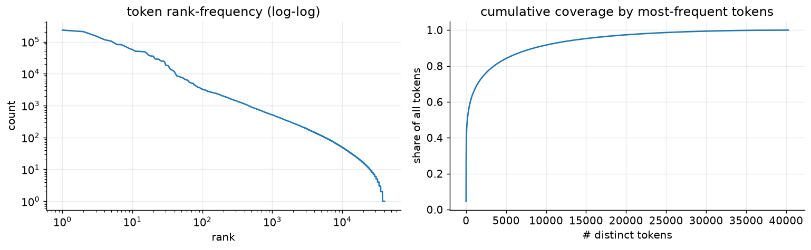 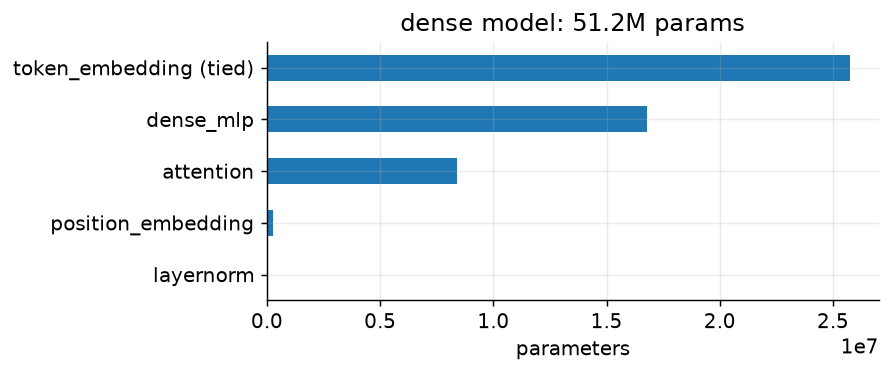 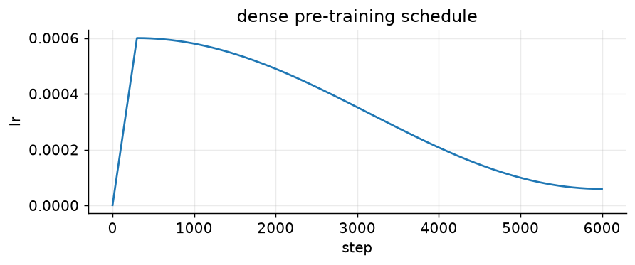

## 6. Experiment 2 — MoE from scratch

Same seed, batches and schedule as `dense`; only the architecture changes.

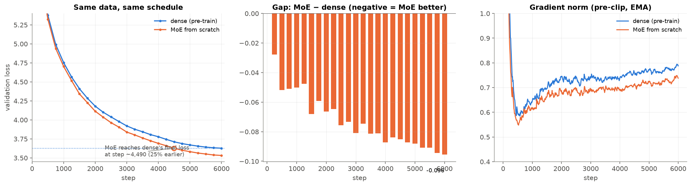

| step | dense val | MoE val | gap |
|---:|---:|---:|---:|
| 1,000 | 4.752 | 4.702 | −0.050 |
| 3,000 | 3.920 | 3.839 | −0.081 |
| 5,000 | 3.670 | 3.582 | −0.088 |
| 6,000 | 3.627 | **3.531** | **−0.096** |

The MoE is ahead from the first evaluation and **the gap keeps widening** (perplexity 37.6 → 34.2). It reaches dense's final loss at step ≈ **4,490** (≈ 25 % fewer tokens). Its gradient norm is slightly *lower* (mean 0.71 vs 0.76), so it is no less stable. **This is not a compute-matched comparison** (2.15 × stored, ≈ 1.15 × per-token FLOPs).

## 7. Experiment 3 — convert and keep training

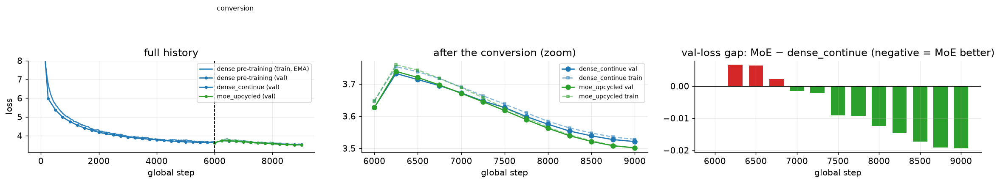

* **Lossless:** 3.6269 → 3.6269.
* **It keeps learning:** 3.627 → 3.502 (perplexity 37.6 → 33.2). From step 6,250 on, every evaluation is lower than the previous one.
* **It ends ahead of the control:** 3.502 vs 3.521 (**−0.019**). The two curves are within 0.007 of each other for the first ≈ 1,000 steps and then separate steadily; the MoE crosses the control's *final* loss at step ≈ 8,507, i.e. after **2,507 instead of 3,000 steps (−16 %)**.
* **The gap has no error bar** — one seed.

### The bump: a re-warm effect, not a conversion effect

Validation loss jumps by **+0.112 (MoE) and +0.106 (dense control)** at step 6,250 and is back at the pre-conversion loss by step ≈ 7,420 (MoE) / 7,500 (dense). The never-converted control does exactly the same, and the gradient norm steps up with the LR (≈ 0.75 → 0.85): the cause is the learning rate jumping from 6 × 10⁻⁵ to 3 × 10⁻⁴, not the new experts. A smaller peak or a longer warm-up should remove the bump; that was not tried.

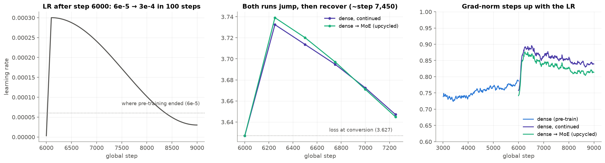

## 8. Routing, experts, ablations and cost

### Routing health

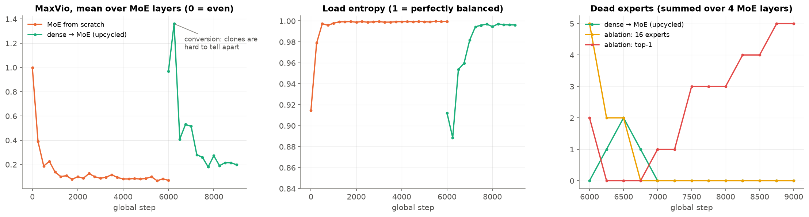

* **From scratch:** flat within a few hundred steps — shares 0.10–0.14 against a fair 0.125, entropy ≈ 1.000, final MaxVio 0.03 / 0.04 / 0.05 / 0.15, no dead experts at the end.
* **After conversion:** the untrained router sends tokens wildly unevenly (layer 0: 0.02 → 0.29). MaxVio peaks at **1.36** (mean over layers) at step 6,250 and **dead experts appear briefly** (0 → 1 → 2 → 1 → 0, summed over four layers) — identical clones are hard for a router to tell apart. All are revived by step 7,000.
* **It never gets as even as from scratch** (final MaxVio 0.45 / 0.16 / 0.12 / 0.07) yet trains to a better loss: near-perfect balance is not required.

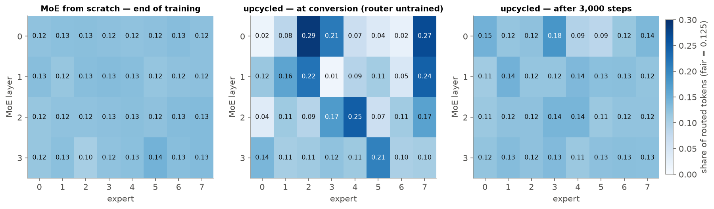

### The clones did not stay clones

After 3,000 steps the experts of each layer have a mean pairwise cosine similarity of **0.926–0.933** (exactly 1.0 at conversion) and each has moved **28–29 %** of the dense MLP's weight norm away from where it started.

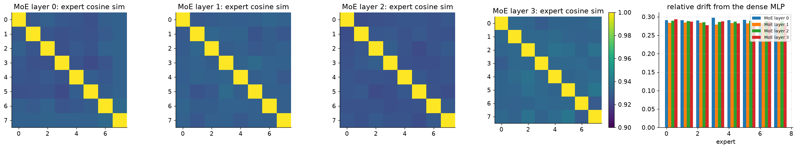

### What the experts specialise in

Routing recorded on 655 k validation tokens. Specialisation is **weak and mostly about token type and syntax, not subject matter**: a few small, sharply defined "tail" experts (layer 0, expert 7 — 2 % of tokens, rare sub-word fragments, lift ≈ 50 ×; expert 6 — `...`, `"`, `!`, lift 12–29 ×), structural and connective experts (layer 1: `=`, `<|endoftext|>`, `This`, `The` / `including`, `while`, `After`), and most experts with broad, mixed token lists and lift of only 4–7 ×.

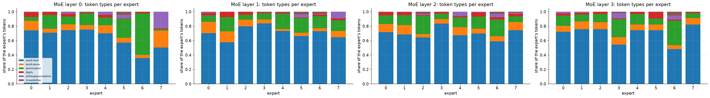

### Ablations (single seed each)

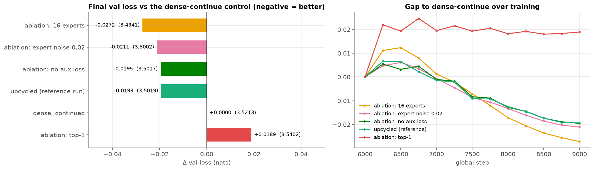

| variant | final val | Δ vs control | what it shows |
|---|---:|---:|---|
| 16 experts | **3.4941** | **−0.0272** | more capacity at the same active size helps (−0.008 vs 8 experts) at 1.6 × the stored parameters and ≈ 0.76 × the throughput; rough start (5 dead, MaxVio 2.3), recovered by step 6,750 |
| expert noise 0.02 | 3.5002 | −0.0211 | no measurable effect (inside single-seed noise) |
| **no aux loss** | 3.5017 | −0.0195 | the 10⁻⁴ auxiliary loss does nothing: **the bias carries the balancing** |
| reference (upcycled) | 3.5019 | −0.0193 | |
| dense, continued | 3.5213 | 0 | control |
| **top-1 routing** | 3.5402 | **+0.0189** | **the only variant worse than the control**: with one expert the renormalised gate is always 1, so the router gets no language-loss gradient; 5 dead experts and MaxVio 4.1 in the last layer |

Differences of ≈ 0.002 among the top-2 variants are below what one seed can resolve; do not read a ranking into them.

### Cost

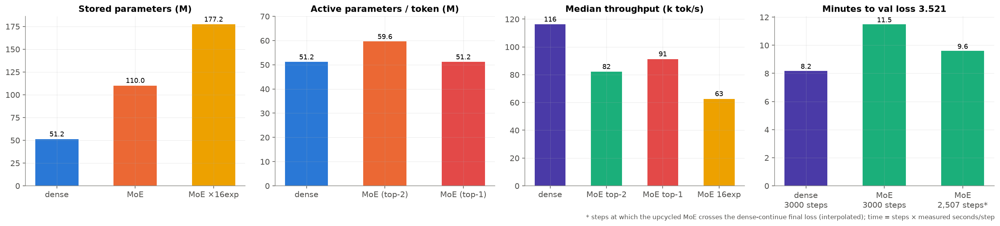

The MoE wins at equal **tokens**, not at equal **time**: the continuation took 11.5 min vs 8.2 min, and even the 2,507 steps it needs cost ≈ 9.6 min. Median throughput is ≈ 0.71 × the dense model's. The experts run in a Python loop rather than a grouped-GEMM kernel (and without expert parallelism), so this is a statement about *this implementation*, not about MoE.

## 9. Experiment tracking with Aim

Everything is tracked in **Aim** (`.aim/`, git-ignored; `uv run aim up`): per-step loss, LR, grad-norm and tokens/s; train/val loss and perplexity at every evaluation; and for MoE runs per-layer expert load, load entropy, MaxVio, dead experts and the balance losses. Phase-2 runs continue the global step axis of the dense run, so curves line up. Two experiments: `session14` (4 runs) and `session14_ablations` (4 runs).

| | |
|---|---|
| 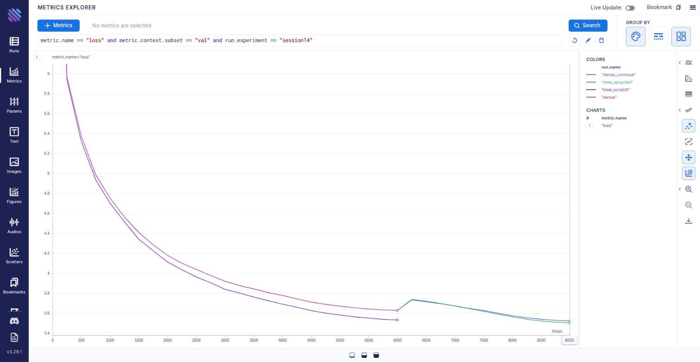 |  |
| **Validation loss** (`metric.name == "loss" and metric.context.subset == "val"`, coloured by run): the fork at step 6,000 | **Router MaxVio** (`router/max_vio`), one line per MoE layer: quickly low from scratch; the spike (up to 2.7 in one layer) after conversion |
| 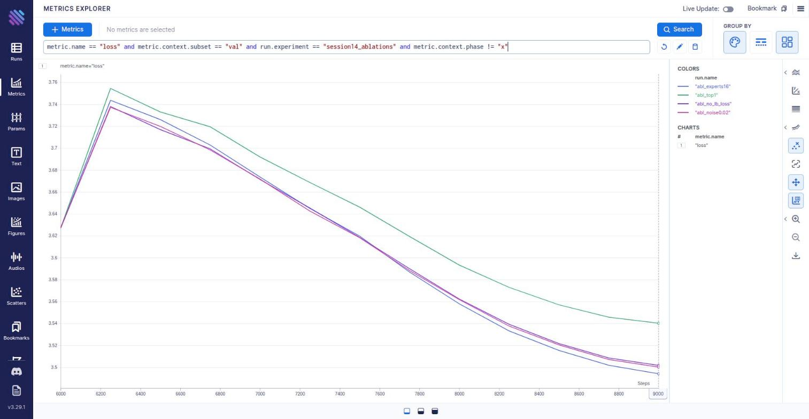 | 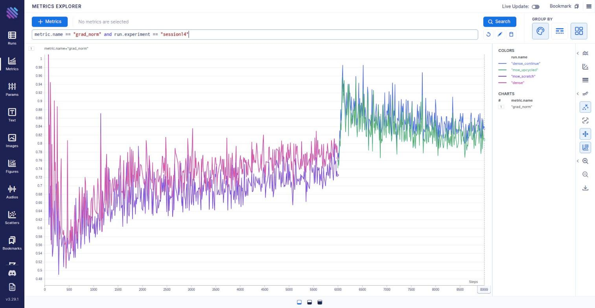 |
| **Ablations** (`session14_ablations`): top-1 clearly above, 16 experts lowest | **Gradient norm:** the step at 6,000 is the LR re-warm; the MoE sits a little below the control |

