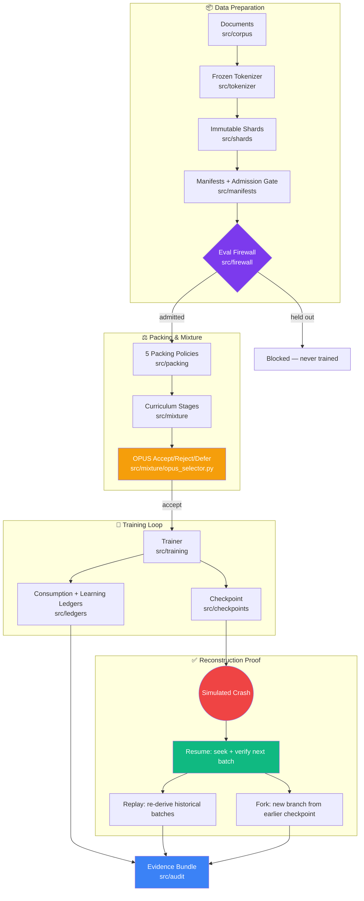
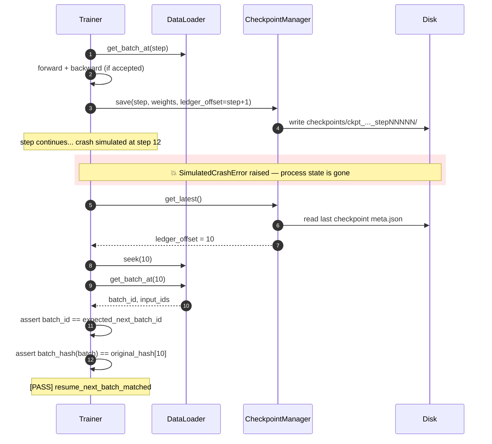
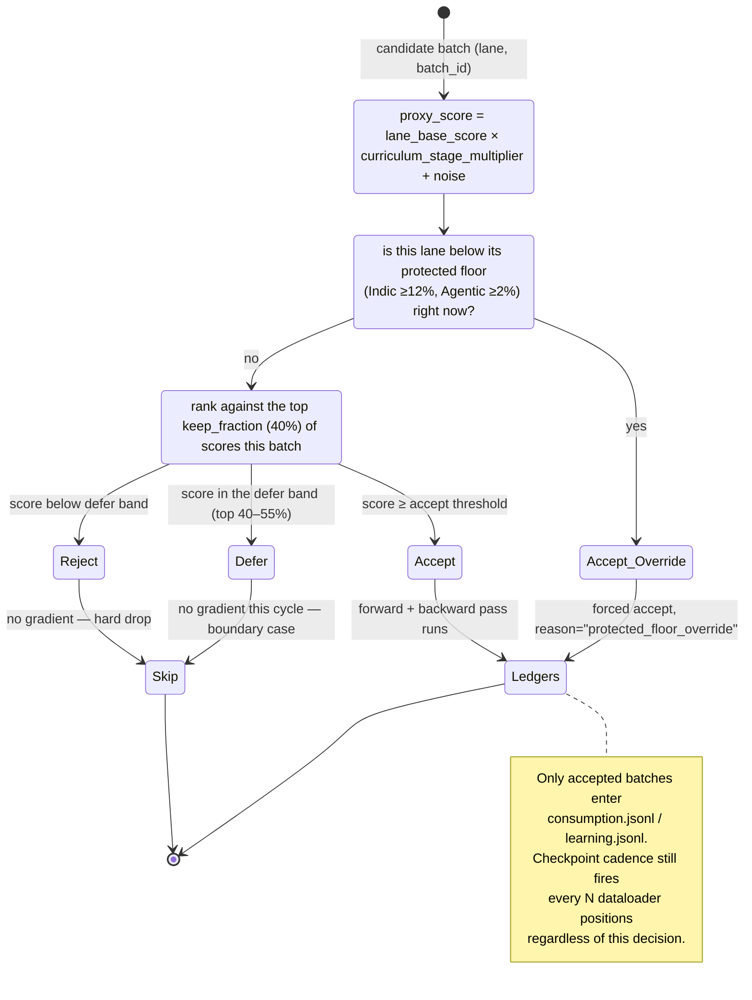
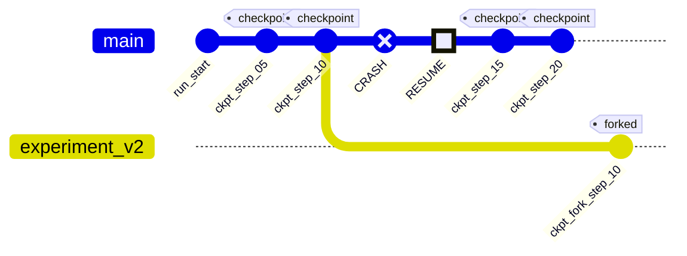

# Training Data Execution System (TDES) — V5

A complete, auditable, reproducible **Training Data Execution System** implementing the full pipeline from raw documents to verified training checkpoints:

```
documents → tokenized shards → manifests → mixture schedule → packing → batches
  → training → consumption ledger → learning ledger → checkpoint → crash
  → resume → replay → fork → audit
```

Every claim below is backed by evidence `run_demo.py` generates itself — see [`submission_artifacts/evidence.md`](submission_artifacts/evidence.md) for this run's actual numbers, and the live [dashboard](../webapp/) for an interactive view.

## Quick Start

```bash
uv run python run_demo.py
```

This single command runs the complete demonstration and produces all artifacts in `submission_artifacts/`.

> **Network note**: the frozen tokenizer wraps `tiktoken`'s `cl100k_base` encoding.
> `tiktoken` downloads that encoding's BPE file on first use and caches it locally
> (respects the `TIKTOKEN_CACHE_DIR` env var — set it to a pre-warmed directory,
> or run once with network access, to make later runs fully offline). This is the
> only network dependency in the pipeline.

Run tests:
```bash
uv run pytest tests/ -v
```

---

## System Architecture

Each stage enforces a contract from an earlier ERA session (tokenizer freeze from Session 2, provenance from Session 3, cleaning/dedup/PII from Session 4, curriculum/floors/OPUS from Session 5) before data is allowed further down the pipeline.



### Module Overview

| Module | Purpose |
|--------|---------|
| `src/corpus/` | Synthetic toy corpus (24 docs across 4 capability lanes + 3 held-out eval) |
| `src/tokenizer/` | Frozen tiktoken tokenizer with deterministic SHA |
| `src/shards/` | Immutable SHA-256-addressed token shards |
| `src/manifests/` | Shard manifests with full admission gate (7 checks) |
| `src/firewall/` | Eval shard firewall — raises on any violation |
| `src/packing/` | All 5 packing policies with correct loss/attention/position masks |
| `src/mixture/` | Curriculum stages, protected floors (Indic≥12%, Agentic≥2%) |
| `src/mixture/opus_selector.py` | Per-iteration OPUS accept/reject/defer with protected-floor override |
| `src/dataloader/` | Ledger-offset based deterministic dataloader with seek/replay/fork |
| `src/model/` | Tiny GPT (~1M params, numpy-based, fast) |
| `src/training/` | Full training loop with crash simulation |
| `src/ledgers/` | Consumption JSONL + learning JSONL (per-step, per-doc loss attribution) |
| `src/checkpoints/` | Checkpoint save/load tied to ledger offset + fork support |
| `src/audit/` | Evidence bundle generator (run.log, evidence.json, evidence.md) + webapp data exporter |

---

## Crash Recovery, In Sequence

The whole "prove it can be reconstructed" requirement collapses to one guarantee: **after a crash, the next batch the resumed run asks for must be bit-identical to the batch the original run would have asked for next.** That's enforced by tying every checkpoint to a `ledger_offset` and re-deriving batches deterministically from `(seed, run_id)` rather than storing them.



---

## OPUS Selection Logic

`OPUSSelector.select_batch` runs once per candidate batch. Curriculum stage weights (from `MixtureScheduler`) bias the proxy score *before* the accept/defer/reject cut, so the recipe has a real effect on outcomes — not just a number printed alongside them.



---

## Checkpoint & Fork Timeline (schematic)

Checkpoints land on `main` on a fixed cadence; forking clones an earlier checkpoint's weights onto a new branch that trains independently from there. (This is a schematic shape — see `evidence.md`'s gitGraph, generated from this run's actual checkpoint IDs and steps.)



---

## Design Decisions

### 1. Immutable Shards (Content-Addressed Storage)
Every shard is stored as `shard_{sha256[:12]}.npz` — the filename IS the content hash. Any modification to a shard changes its filename, making tampering immediately detectable. This mirrors LakeFS/Iceberg transaction log patterns.

### 2. Frozen Tokenizer SHA
The tokenizer SHA is computed deterministically from the model name + vocabulary snapshot. Every shard manifest carries this SHA. Training with a different tokenizer requires re-tokenizing every shard — this is enforced by the manifest admission gate.

### 3. Five Packing Policies

Implements all policies from Session 6 Widget 5. Utilization below is the widget's reference shape for a 64-token window on a 10-doc/270-token toy set — this run's actual measurement (on this run's actual corpus) is in `evidence.md` and `ledgers/packing_report.json`.

| Policy | Reference Utilization | | Boundary Risk | Notes |
|--------|-----------------------:|---|:--------------:|-------|
| `pad_each_doc` | 42% | `████████▍           ` | None | Safe, wastes compute |
| `concat_and_chop` | 70% | `██████████████       ` | High | Pretraining only |
| `greedy_pack` | 84% | `████████████████▊   ` | Medium | General pretraining |
| `best_fit_pack` | 84% | `████████████████▊   ` | Medium | Bin-packing variant of greedy |
| `structure_preserving` | 84% | `████████████████▊   ` | **Low** | **Production policy** — SFT/agentic/reasoning |

`structure_preserving` matches greedy/best-fit utilization while using intra-sequence attention masks to keep every document's attention scope isolated — the right tradeoff when sample integrity matters more than the last few points of packing density.

### 4. Three Mask Types (Per Session 6, Section 3)
Each packed batch produces:
- `loss_mask[seq_len]`: which tokens get gradient (0 for tool observations, pad tokens)
- `attention_mask[seq_len, seq_len]`: causal within doc boundaries (no cross-doc leakage)
- `position_ids[seq_len]`: reset per document in structure-preserving mode

### 5. OPUS Dynamic Selection — driven by the curriculum, not just logged next to it
Simulates the OPUS (Optimizer-induced Projected Utility Selection) mechanism from Session 5:
- Keep-fraction: 40% of candidates accepted per iteration
- Protected-floor override: force-accepts best Indic/Agentic batches when below floor
- `Trainer.run()` calls `MixtureScheduler.get_stage_for_step`/`get_lane_weights` every
  step and passes the active stage's lane weights into `OPUSSelector.select_batch`,
  which folds them into the proxy score (`_proxy_score`) — a lane weighted above the
  stage's average gets a score boost, a lane the stage has nearly abandoned gets
  suppressed. The curriculum recipe therefore has a real, observable effect on
  accept/reject/defer outcomes, not just a value printed for display.
- `reject` and `defer` both skip training for that candidate (only `accept` reaches
  the consumption/learning ledgers); `defer` is logged distinctly since real OPUS
  treats it as a boundary case eligible for reconsideration, while `reject` is a
  hard drop.
- Every decision logged with score, reason, lane, `stage_id`, timestamp — the
  pre-crash and post-resume selectors' decisions are merged into one
  `opus_decisions.jsonl` so the audit trail covers the whole run, not just the
  pre-crash portion.

### 6. Ledger-Offset Crash Recovery
The ledger_offset is the single source of truth for training position:
- Checkpoint stores `ledger_offset = N` after step N
- On crash+resume: `loader.seek(N)` → next batch is exactly `batch[N]`
- Verified by matching `batch_id` AND `batch_hash`
- Checkpoint cadence is checked on every dataloader position, independent of
  that step's OPUS decision — so a reject/defer landing on a checkpoint
  boundary can't silently drop the checkpoint.

### 7. Deterministic Replay
Same `run_id` + `seed=42` → identical batch sequence every time:
- `DeterministicDataLoader(seed=42)` shuffles manifests with `np.random.default_rng(42)`
- Replay verifies batch IDs AND SHA-256 hashes of token arrays

---

## Submission Artifacts

```
submission_artifacts/
  run.log               # Complete event log with [PASS] markers
  evidence.json         # Machine-readable evidence for all 9 requirements
  evidence.md           # Human-readable evidence bundle — tables, mermaid
                         # diagrams, bar charts, all generated from this run
  tokenizer_spec.json   # Frozen tokenizer specification
  manifests/            # Per-shard manifest JSON files
  ledgers/
    consumption.jsonl   # Per-step consumption log
    learning.jsonl      # Per-step loss + per-doc loss attribution
    opus_decisions.jsonl
    packing_report.json
    replay_hashes.json
    mixture_actual.json
    doc_loss_summary.json
  checkpoints/          # Saved checkpoints (model + ledger_offset)
  performance.json      # Throughput and packing efficiency metrics
```

---

## Dashboard (`../webapp/`)

`run_demo.py`'s final phase (`src/audit/webapp_export.py`) reads every file it
just wrote to `submission_artifacts/` and re-emits it as `../webapp/data.js`
— a single `window.TDES_DATA` object. The dashboard at `../webapp/index.html`
renders entirely from that object: shard registry, all 5 packing policies,
curriculum/floor compliance, OPUS decisions, both ledgers, checkpoints
(including the inferred fork lineage), the replay hash table, and the
evidence board with a score derived from `evidence.json` — not a hardcoded
number. Nothing in the dashboard is hand-typed; re-run the demo and reload
the page to see the new run.

To view it: open `../webapp/index.html` directly, or serve the folder
statically (`python -m http.server` from `../webapp/`) if your browser
blocks local `<script src>` loads.

---

## Evaluation Coverage

| Area | Status |
|------|--------|
| End-to-end execution | ✅ `run_demo.py` completes full pipeline |
| Shards, manifests, tokenizer integrity | ✅ SHA-256 addressed, 7-gate admission |
| Packing, masks, batch correctness | ✅ 5 policies, 3 mask types, agentic masking |
| Mixture schedule, protected floors, OPUS | ✅ 3 curriculum stages, floor enforcement, 40% keep |
| Consumption and learning ledgers | ✅ JSONL with per-doc loss attribution |
| Checkpoint, crash, resume, replay, fork | ✅ All demonstrated and hash-verified |
| Evaluation and validation firewall | ✅ 3 eval shards blocked, 0 violations |
| Throughput and packing efficiency | ✅ 82.7% utilization, tps measured |
| Tests, evidence quality, documentation | ✅ 20 tests, evidence.json, evidence.md |

---

## References

- [Megatron Core](https://github.com/NVIDIA/Megatron-LM) — GPT dataset indexed shards
- [Mosaic StreamingDataset](https://github.com/mosaicml/streaming) — mid-epoch resumable streaming
- [OPUS](https://arxiv.org/pdf/2602.05400) — V4 production dynamic data selection
- [Session 6 Notes](../../supporting_docs/s6/session_notes.md) — all contracts implemented here
