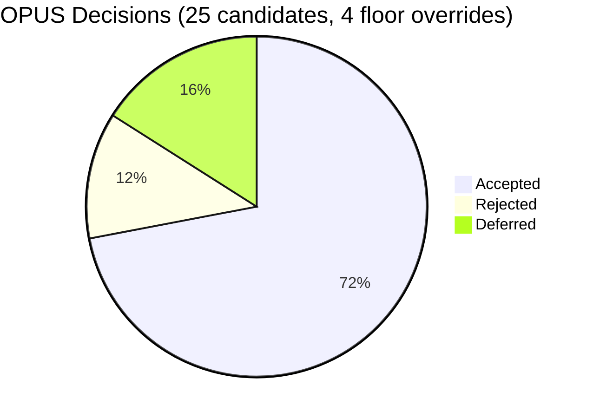
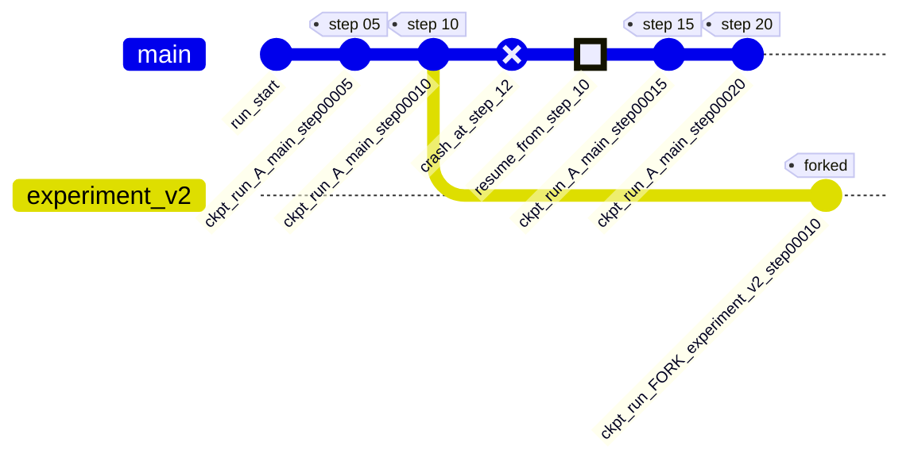

# Training Data Execution System — Evidence Bundle

**Generated:** 2026-08-07T10:22:41Z · **Result:** ✅ ALL PASS · **Run:** `run_A`

> Every number, table and diagram on this page is generated by `run_demo.py` from the real `submission_artifacts/` this run produced — nothing here is hand-typed. Re-run `uv run python run_demo.py` and this file is rewritten from scratch.

## Pipeline At A Glance

```mermaid
flowchart LR
    A[Documents] --> B[Tokenized Shards]
    B --> C[Manifests]
    C --> D{Eval Firewall}
    D -->|admitted| E[Packing]
    D -->|held out| X[Blocked — never trained]
    E --> F[Mixture + OPUS]
    F --> G[Training]
    G --> H[Consumption + Learning Ledgers]
    H --> I[Checkpoint]
    I --> J((Crash))
    J --> K[Resume]
    K --> L[Replay]
    L --> M[Fork]
    M --> N[Evidence Bundle]

    style C fill:#1a7f37,color:#fff
    style D fill:#1a7f37,color:#fff
    style E fill:#1a7f37,color:#fff
    style F fill:#1a7f37,color:#fff
    style H fill:#1a7f37,color:#fff
    style K fill:#1a7f37,color:#fff
    style L fill:#1a7f37,color:#fff
```



## Requirement Results

| Requirement | Result | Evidence |
|-------------|--------|----------|
| Tokenizer integrity | ✅ PASS | `submission_artifacts/tokenizer_spec.json` |
| Evaluation firewall | ✅ PASS | `submission_artifacts/manifests/manifest_summary.json` |
| Packing correctness | ✅ PASS | `submission_artifacts/ledgers/packing_report.json` |
| Mixture compliance | ✅ PASS | `submission_artifacts/ledgers/mixture_actual.json` |
| OPUS audit trail | ✅ PASS | `submission_artifacts/ledgers/opus_decisions.jsonl` |
| Crash recovery | ✅ PASS | `submission_artifacts/checkpoints/ckpt_run_A_main_step00010/meta.json` |
| Replay hash match | ✅ PASS | `submission_artifacts/ledgers/replay_hashes.json` |
| Learning trace | ✅ PASS | `submission_artifacts/ledgers/doc_loss_summary.json` |
| Throughput & utilization | ✅ PASS | `submission_artifacts/performance.json` |

## Shards & Tokenizer

- Tokenizer: `cl100k_base` · SHA `tok_27b6a09dd8613291` · vocab 100,277
- Shards: **27** total → **24** admitted `█████████████████████▍  ` **3** blocked (held-out eval)

## Packing Policy Comparison

All 5 policies packed the *same* admitted corpus this run — this is a real measurement, not the Session 6 widget's reference numbers.

| Policy | Utilization | | Sequences |
|--------|------------:|---|----------:|
| `pad_each_doc` | 79.3% | `███████████████▉    ` | 24 |
| `concat_and_chop` | 98.6% | `███████████████████▊` | 38 |
| `greedy_pack` | 82.7% | `████████████████▌   ` | 23 |
| `best_fit_pack` | 82.7% | `████████████████▌   ` | 23 |
| `structure_preserving` **← production** | 82.7% | `████████████████▌   ` | 23 |

## Curriculum & OPUS Selection

| Stage | Budget | Top Lanes |
|-------|-------:|-----------|
| Seed / General | 70% | web 49%, code 18%, indic 16% |
| Reasoning / Code | 20% | code 28%, web 25%, reasoning 18% |
| Anneal (Low-LR Cooldown) | 10% | indic 28%, code 20%, reasoning 18% |



Keep-fraction target **40%**, actual **72%** (effective token multiplier ×1.39). Curriculum stage weights feed directly into the OPUS proxy score (see `src/mixture/opus_selector.py:_proxy_score`), so a lane's weight *this stage* has a real, observable effect on which batches get accepted.

## Mixture — Planned vs. Actual

| Lane | Actual Share | |
|------|-------------:|---|
| code | 40.7% | `████████▏           ` |
| web | 34.5% | `██████▉             ` |
| indic | 14.2% | `██▉                 ` |
| agentic | 10.6% | `██▏                 ` |

**Protected floors** (hard minimums, enforced by OPUS floor override):

| Lane | Floor | Actual | Status |
|------|------:|-------:|:------:|
| indic | 12% | 17.3% | ✅ compliant |
| agentic | 2% | 12.8% | ✅ compliant |

## Checkpoint · Crash · Resume · Replay · Fork

Checkpoint saved every **5** dataloader positions, independent of that step's OPUS decision. Crash simulated at step **12**; resume loaded the checkpoint at step **10**.



**Replay** of steps `5..9`: ✅ all batch hashes matched byte-for-byte.

## Learning Trace

Per-document average loss recorded for **18** source documents (min `11.5135`, mean `11.5157`, max `11.5205`).

Loss per accepted step: `▂▁▂▃▁▁▁▁█▂▃▄▄▅▂▅▁▁` (11.5154 → 11.5139)

## Performance

| Metric | Value |
|--------|------:|
| Average loss | 11.5157 |
| Average tokens/sec | 623.9 |
| Packing utilization | 82.7% |
| Useful tokens | 2,436 |

## Log Excerpt

```

-- PHASE 1: CORPUS & TOKENIZER --
[15:52:23] [PASS] tokenizer_integrity: tokenizer_sha=tok_27b6a09dd8613291
[15:52:23] [PASS] tokenizer_hash_verified

-- PHASE 2: TOKENIZE -> SHARDS -> MANIFESTS --
[15:52:23]   [PASS] All 27 shards passed integrity verification

-- PHASE 3: EVALUATION FIREWALL --
[15:52:23]   [PASS] eval_shard_blocked: shard=shard_ca51f610fcf6
[15:52:23]   [PASS] eval_shard_blocked: shard=shard_f8dea85b952b
[15:52:23]   [PASS] eval_shard_blocked: shard=shard_8f703fea119c
[15:52:23] [PASS] eval_firewall: 3 eval shards blocked, 0 violations
[15:52:23] [PASS] eval_shard_blocked (all eval shards intercepted)

-- PHASE 4: PACKING — ALL 5 POLICIES --
[15:52:23] [PASS] packing_correctness: structure_preserving: 82.7% util, agentic masks applied
[15:52:23] [PASS] packing_correctness: util=82.7%

-- PHASE 5: MIXTURE SCHEDULE & OPUS SELECTION --

-- PHASE 6: TRAINING RUN A (with crash at step 12) --
[15:52:23]   [STAGE] step=000 entering stage_1_general (Seed / General)
[15:52:26]   [CHECKPOINT] ckpt_run_A_main_step00005 at ledger_offset=5
[15:52:30]   [CHECKPOINT] ckpt_run_A_main_step00010 at ledger_offset=10
[15:52:30] [CRASH] Simulated crash at step 12
[15:52:30] 
[CRASH] Deliberate crash at step 12
[15:52:30] [PASS] crash_simulated
[15:52:30] [PASS] checkpoint_saved: ckpt_run_A_main_step00010 at ledger_offset=10

-- PHASE 7: CRASH RECOVERY — RESUME --
[15:52:30] [PASS] crash_recovery: next_batch=run_A_batch_0010 matched, hash verified
[15:52:30] [PASS] resume_next_batch_matched: expected=run_A_batch_0010, got=run_A_batch_0010
[15:52:30]   [STAGE] step=010 entering stage_1_general (Seed / General)
[15:52:34]   [CHECKPOINT] ckpt_run_A_main_step00015 at ledger_offset=15
[15:52:35]   [STAGE] step=017 entering stage_2_reasoning (Reasoning / Code)
[15:52:38]   [CHECKPOINT] ckpt_run_A_main_step00020 at ledger_offset=20
[15:52:38]   [STAGE] step=021 entering stage_3_anneal (Anneal (Low-LR Cooldown))
[15:52:39] [PASS] run_resumed successfully

-- PHASE 8: HISTORICAL STREAM REPLAY --
[15:52:39] [PASS] replay: All 5 replayed batches hash-matched original
[15:52:39] [PASS] replay_hash_matched: 5 batches verified

-- PHASE 9: FORK FROM EARLIER CHECKPOINT --
[15:52:41] [PASS] branch_forked

-- PHASE 10: LEDGER AUDIT & LEARNING TRACE --
[15:52:41] [PASS] opus_audit_trail: 25 decisions logged (pre-crash + post-resume), 4 floor overrides
[15:52:41] [PASS] opus_decisions_recorded
[15:52:41] [PASS] mixture_compliance: Curriculum stages executed, floors enforced
[15:52:41] [PASS] mixture_compiled
[15:52:41] [PASS] learning_trace: Loss linked to 18 source documents
[15:52:41] [PASS] learning_trace: per-document loss recorded

-- PHASE 11: PERFORMANCE REPORT --
[15:52:41] [PASS] throughput: packing=82.7%, avg_tps=624
[15:52:41] [PASS] performance_measured

-- PHASE 12: AUDIT COMPLETE — WRITING EVIDENCE BUNDLE --
```