# Fourier Approaches to Token Embedding: Theory and Empirical Validation

**A complete technical paper: spectral reformulations of the byte-position embedding codec, derived and then trained**

**Companion sources:** [`s7_class_notes.md`](../supporting_docs/s7/s7_class_notes.md) · [`s7_assignment_deep_research.md`](../supporting_docs/s7/s7_assignment_deep_research.md) · [`fourier_embeddings/`](fourier_embeddings/) (the project this paper's experiments were run from)
**Provenance:** Part I (§1–§10) is the original theoretical note, `fourier_embeddings_research.md`, reformatted into LaTeX for GitHub rendering — its content, section numbers, and cross-references (`§6.1`, `§8.4`, etc.) are otherwise unchanged, so every citation in Part II resolves correctly. Part II (§11 onward) is new: the empirical validation the original note's §8.5 and §10 called for, run end-to-end on a real transformer, a real multilingual corpus, and the real trained vocabulary.

---

## Abstract

The Kronecker embedding codec represents a token as a sum of Kronecker products between a one-hot byte-value vector and a one-hot byte-position vector, projected through a single learned matrix. This construction removes the vocabulary size from the parameter count entirely, but it inherits two structural costs from its use of *one-hot, discrete* bases: a hard truncation wall at a fixed byte budget (`pos_dim`), and a codec output dimension that is rigidly coupled to that budget ($D = \mathrm{char\_dim} \cdot \mathrm{pos\_dim}$), which forecloses weight tying and forces an awkward choice between a large precomputed lookup table and an on-the-fly reconstruction path. Part I of this paper asks a narrow, precise question: **does replacing the discrete position basis with a Fourier (spectral) basis fix these structural costs, and at what price?** It derives the codec's similarity structure in closed form, shows that the one-hot Kronecker construction is the *degenerate, zero-bandwidth limit* of a more general spectral construction, and proves which failure modes a Fourier substitution removes, which it leaves untouched, and which new failure modes it introduces. Part II closes the gap Part I's own §8.5 and §10 identify: it reports a real controlled experiment — four ~105–111M-parameter transformers (Dense, Kronecker, Fourier, Fourier narrow-band), identical in every respect but their embedding codec, trained on a real multilingual corpus — and finds that **every theoretical prediction Part I made that this experiment was positioned to test, it confirmed**, including Fourier reaching a *lower* validation loss than Kronecker at identical parameter cost. It also finds, and reports without softening, that this run's configuration failed to exercise the truncation-wall regime the whole investigation was originally motivated by, and that a naively-calibrated collision threshold produced numbers that looked damning but weren't measuring what they appeared to measure — both diagnosed precisely enough to specify the follow-up experiment that would close them. The conclusion, unchanged in substance from Part I but now load-bearing rather than merely argued: Fourier techniques do not replace the Kronecker embedding mechanism, they generalize one specific piece of it — and that generalization now has a transformer trained on it to show for it.

---

# Part I — Theory

*(Sections 1–10 below are the original `fourier_embeddings_research.md`, reformatted into LaTeX; content and section numbers are unchanged. Its own abstract, restricted to the theoretical scope, follows; the paper-level abstract above supersedes it as the document's summary.)*

**Original scope note:** *This note is restricted to Fourier/spectral techniques and their relationship to the Kronecker embedding codec. It does not re-cover factorization, the other assignment problems, or general architecture decisions — those live in the companion documents.*

## Table of contents — Part I

1. [Introduction](#1-introduction)
2. [Preliminaries — the Kronecker codec, made precise](#2-preliminaries--the-kronecker-codec-made-precise)
3. [Fourier foundations relevant to embeddings](#3-fourier-foundations-relevant-to-embeddings)
4. [Constructing a Fourier-complementary codec](#4-constructing-a-fourier-complementary-codec)
5. [Complementarity: how Fourier and Kronecker combine](#5-complementarity-how-fourier-and-kronecker-combine)
6. [Issues resolved, with proof](#6-issues-resolved-with-proof)
7. [Issues that remain unsolved, with proof](#7-issues-that-remain-unsolved-with-proof)
8. [New issues introduced by the Fourier substitution](#8-new-issues-introduced-by-the-fourier-substitution)
9. [Net verdict — the complementarity table](#9-net-verdict--the-complementarity-table)
10. [A minimal validation protocol](#10-a-minimal-validation-protocol)

## Table of contents — Part II (new)

11. [Empirical validation — experimental setup](#11-empirical-validation--experimental-setup)
12. [Reading these results correctly: the validation-loss anomaly](#12-reading-these-results-correctly-the-validation-loss-anomaly)
13. [Parameter efficiency, measured](#13-parameter-efficiency-measured)
14. [Training dynamics, measured](#14-training-dynamics-measured)
15. [Final performance comparison](#15-final-performance-comparison)
16. [Collision analysis — and why this run doesn't test what it looks like it tests](#16-collision-analysis--and-why-this-run-doesnt-test-what-it-looks-like-it-tests)
17. [Order-sensitivity probe, measured](#17-order-sensitivity-probe-measured)
18. [HRR crosstalk probe, measured](#18-hrr-crosstalk-probe-measured)
19. [Updated net verdict — theory meets practice](#19-updated-net-verdict--theory-meets-practice)
20. [Limitations and recommended follow-up](#20-limitations-and-recommended-follow-up)
21. [Conclusion](#21-conclusion)
22. [References](#22-references)

---

## 1. Introduction

### 1.1 The two failure surfaces

The Kronecker embedding codec (introduced for this course's V5 model, and published in full as [Shravan 2026]) builds a token's code from nothing but its own bytes:

$$
\kappa(b) = \frac{1}{\sqrt{L}} \sum_{p=1}^{L} c[b_p] \otimes \mathrm{pos}[p]
$$

$c[\cdot]$ is a one-hot vector over the 256 possible byte values, $\mathrm{pos}[\cdot]$ is a one-hot vector over the `pos_dim` possible byte positions, $\otimes$ is the Kronecker product, and $L$ is the token's byte length. Only the downstream linear map $P: \mathbb{R}^D \to \mathbb{R}^{d_{\text{model}}}$ ($D = 256 \cdot \mathrm{pos\_dim}$) is learned; the grid itself is fixed at construction and never receives gradient.

This construction is doing two jobs at once, and it is worth separating them cleanly before asking what Fourier can fix:

- **Job 1 — remove $V$ from the parameter count.** This job is done completely and is not in question here. Nothing about a Fourier substitution changes it: as long as the position factor's dimensionality does not depend on the vocabulary size, $V$ still never appears in $D \cdot d_{\text{model}}$.
- **Job 2 — assign each token a fixed, structured address using a discrete grid.** This is where the two structural costs live: (a) the grid has a fixed number of columns (`pos_dim`), so any byte past position `pos_dim` is silently discarded — a **hard truncation wall**; and (b) the grid's flattened size $D = \mathrm{char\_dim} \cdot \mathrm{pos\_dim}$ is dictated purely by the truncation budget, with no freedom to set $D$ independently — which **couples an accuracy/coverage decision to a downstream architectural decision** (whether the output head can be tied to the input path).

### 1.2 What this note studies

This note asks whether the *position* factor of the Kronecker product specifically — not the byte-value factor, not the projection, not the overall mechanism — can be replaced with a Fourier/spectral construction, and what that replacement buys and costs. It surveys the Fourier techniques with a real claim to relevance (Random Fourier Features, fixed and learnable Fourier feature mappings, circular-convolution binding, complex-order embeddings), derives the resulting codec's similarity structure in closed form, and states exactly which of the Kronecker codec's known issues each piece of machinery does and does not touch.

### 1.3 Headline result

The one-hot position vector's self-similarity function turns out to be the **Kronecker delta** — $\mathrm{pos}[p] \cdot \mathrm{pos}[q] = 1$ if $p = q$, else $0$. This is a genuinely useful coincidence of names: the Kronecker embedding codec's position axis is, in the language of kernel methods, using the *most degenerate possible kernel* — a delta function with zero bandwidth. Section 3 shows that Fourier features are exactly the machinery for turning a delta-function similarity structure into a smooth, tunable-bandwidth one. Everything in this note follows from taking that substitution seriously and working out its consequences in both directions.

---

## 2. Preliminaries — the Kronecker codec, made precise

**Setup.** Fix $\mathrm{char\_dim} = 256$, $\mathrm{pos\_dim} = d_p$. For a token with byte sequence $b = (b_1, \ldots, b_L)$, $L \le d_p$, define the unnormalized code:

$$
u(b) = \sum_{i=1}^{L} e_{(b_i, i)}
$$

where $e_{(v,i)} \in \mathbb{R}^{256 \cdot d_p}$ is the standard basis vector for cell $(v, i)$ of the grid (this is exactly $c[b_i] \otimes \mathrm{pos}[i]$, flattened). $\kappa(b) = u(b) / \sqrt{L}$, then z-normalized.

**Theorem 1 (exact similarity for equal-length strings).** Let $a$, $b$ be two byte sequences of equal length $L$, agreeing at $L - k$ positions and disagreeing at $k$ positions. Then, before the final z-normalization step,

$$
\cos\big(\kappa(a), \kappa(b)\big) = \frac{L - k}{L}
$$

*Proof.* $\{e_{(v,i)}\}$ is an orthonormal set, so $\|u(a)\| = \|u(b)\| = \sqrt{L}$. The inner product $u(a) \cdot u(b) = \sum_i \sum_j \big(c[a_i] \cdot c[b_j]\big)\big(\mathrm{pos}[i] \cdot \mathrm{pos}[j]\big)$. Because $\mathrm{pos}[i] \cdot \mathrm{pos}[j] = \delta_{ij}$ (the Kronecker delta), only $i = j$ terms survive, and each contributes $1$ exactly when $a_i = b_i$. Summing over the $L - k$ agreeing positions gives $u(a) \cdot u(b) = L - k$, hence $\cos = \frac{L-k}{\sqrt{L}\sqrt{L}} = \frac{L-k}{L}$. **QED.**

This is the formula behind every reported typo-robustness number in [Shravan 2026] (`mistake`/`mistkae`: $L=7, k=2$ differing by a transposition → $\cos = 5/7 \approx 0.71$, matching the paper's reported value exactly — and, per §17 below, matching this paper's own from-scratch retraining of the codec exactly too).

**Corollary (order sensitivity).** If $a$ and $b$ are anagrams of each other (same multiset of bytes, different order), the cross term $\mathrm{pos}[i] \cdot \mathrm{pos}[j]$ for $i \neq j$ is always $0$, so **any** positional rearrangement drives the codes toward orthogonality regardless of how much byte content is shared. Worked example: `"cat"` (`c,a,t` at positions `0,1,2`) vs. `"tac"` (`t,a,c` at positions `0,1,2`) share all three bytes but at completely disjoint `(value, position)` cells → $\cos\big(\kappa(\texttt{"cat"}), \kappa(\texttt{"tac"})\big) = 0$.

> **Part II correction, flagged here rather than silently fixed:** this specific worked example is wrong on its own terms. Reversing an odd-length string fixes its middle character in place — `"cat"[1]='a'` and `"tac"[1]='a'` share position 1, so the two codes are *not* at completely disjoint cells. Theorem 1's own formula gives the correct value directly: they agree at 1 of 3 positions, so $\cos = (3-1)/3 = 1/3$, not $0$ — confirmed by direct measurement in §17 (`cat`/`tac`: Kronecker cosine = 0.333, not 0.0). The corollary itself is correct; a true derangement is required to instantiate it, and §17 measures one (`abcde`/`bcdea`: Kronecker cosine = -0.001, i.e. zero within floating-point noise, exactly as the corollary predicts). This is left visible rather than quietly edited because it is exactly the kind of claim empirical validation exists to catch.

**Failure surface, restated formally.** Two structural facts fall directly out of Theorem 1's machinery, independent of any experiment:

1. **The delta kernel is degenerate.** $\mathrm{pos}[i] \cdot \mathrm{pos}[j] = \delta_{ij}$ means position similarity is either exactly $1$ (same position) or exactly $0$ (any other position, no matter how close). There is no notion of "position 5 is closer to position 6 than to position 30." This is what makes truncation at `pos_dim` a *cliff* rather than a *slope*: byte $\mathrm{pos\_dim} + 1$ isn't slightly under-weighted, it has literally no basis vector to land on.
2. **$D$ is rigidly $\mathrm{char\_dim} \cdot \mathrm{pos\_dim}$.** Because the position basis is one-hot, its dimensionality *is* the coverage budget — there is no way to shrink $D$ (for cheaper compute, or to match $d_{\text{model}}$ for tying) without also shrinking the number of bytes the grid can address.

Both facts trace back to the same root cause: **the position factor is a delta-kernel object.** Section 3 develops the machinery to replace it with a smooth-kernel object instead.

---

## 3. Fourier foundations relevant to embeddings

### 3.1 Bochner's theorem, and why it is the right starting point

Bochner's theorem states that a continuous, shift-invariant, positive-definite kernel $K(\delta)$ (i.e. $K$ depends only on $p - q$) can always be written as the Fourier transform of a finite, non-negative measure $\mu(\omega)$:

$$
K(p - q) = \int e^{i \omega (p - q)} \, d\mu(\omega)
$$

**Random Fourier Features** [Rahimi & Recht 2007] turn this into a finite, explicit feature map by Monte-Carlo sampling $\omega_1, \ldots, \omega_{D/2} \sim \mu$:

$$
z(p) = \sqrt{\frac{2}{D}} \Big[ \cos(\omega_1 p + b_1), \ldots, \cos(\omega_{D/2} p + b_{D/2}) \Big], \qquad b_i \sim \mathrm{Uniform}[0, 2\pi]
$$

so that $z(p) \cdot z(q) \approx K(p - q)$. The value of this result for embeddings is precisely that it gives a **recipe for turning any desired smooth, shift-invariant similarity structure into an explicit, finite-dimensional vector code** — which is exactly the object needed to replace the delta-kernel position vector of Section 2.

### 3.2 Fixed multi-scale Fourier features (Tancik/NeRF; the standard Transformer sinusoidal code)

Rather than sampling $\omega$ randomly, [Tancik et al. 2020] and, independently, the original Transformer position encoding, use a **fixed geometric (log-linear) frequency schedule**:

$$
\phi(p) = \Big[ \sin(\omega_0 p), \cos(\omega_0 p), \sin(\omega_1 p), \cos(\omega_1 p), \ldots, \sin(\omega_{m-1} p), \cos(\omega_{m-1} p) \Big]
$$

$$
\omega_i = \frac{1}{10000^{2i / d_p}} \qquad (d_p = 2m = \text{output dimension})
$$

**Proposition 1 (the induced kernel).** $\phi(p) \cdot \phi(q) = K(p - q)$ where

$$
K(\delta) = \sum_{i=0}^{m-1} \cos(\omega_i \delta)
$$

*Proof.* $\sin(\omega_i p)\sin(\omega_i q) + \cos(\omega_i p)\cos(\omega_i q) = \cos\big(\omega_i (p - q)\big)$ by the cosine angle-difference identity; sum over $i$. **QED.**

This is the central object of this note: $K(\delta)$ is a genuine, computable, shift-invariant kernel — smooth, symmetric, maximal at $\delta = 0$ (where $K(0) = m = d_p / 2$), and decaying (with some ripple, discussed below) as $|\delta|$ grows. **This is precisely the "slope instead of a cliff" the Kronecker codec's position axis lacks**, and it is a fixed, deterministic, zero-learned-parameter construction, so it preserves the property that made Kronecker embeddings attractive in the first place (class notes §7: "the only learned thing in the entire input path" stays true).

**Worked numeric example.** Take a deliberately small $d_p = 4$ ($m = 2$ frequency bands) with the standard schedule: $\omega_0 = 1/10000^0 = 1$, $\omega_1 = 1/10000^{2/4} = 1/100 = 0.01$.

$$
K(\delta) = \cos(\delta) + \cos(0.01\,\delta)
$$

| $\delta$ | $\cos(\delta)$ | $\cos(0.01\delta)$ | $K(\delta)$ |
|---|---|---|---|
| 0 | 1.000 | 1.000 | **2.000** |
| 1 | 0.540 | 1.000 | 1.540 |
| 2 | -0.416 | 1.000 | 0.584 |
| 3 | -0.990 | 0.9996 | 0.010 |
| 5 | 0.284 | 0.9988 | 1.282 |
| 10 | -0.839 | 0.9950 | 0.156 |

Two things to read off this table. First, $K(0) = 2 = d_p/2$ exactly, matching Proposition 1. Second — and this is an honest caveat, not a flaw to paper over — **with only two frequency bands the kernel is not monotonically decaying; it ripples**, because the high frequency ($\omega_0 = 1$) dominates and oscillates with period $2\pi \approx 6.28$ while the low frequency barely moves over this range. This is exactly why production sinusoidal codes use `16`–`32` frequency bands spanning several octaves rather than two: with a full log-linear schedule the ripples from different bands land at different phases and largely cancel, leaving a single dominant lobe near $\delta = 0$ that decays close to monotonically before the ripple structure becomes visible again at very large offsets. The qualitative conclusion — $K$ is maximal at zero offset and strictly less than maximal everywhere else, in contrast to the Kronecker delta's flat zero away from the origin — holds regardless of band count; the *shape* of the decay is a genuine design parameter, tuned by the frequency schedule (§8.1 returns to this as a real design risk, not just a footnote — and §15/§19 report that risk materializing directly in a trained model's final loss).

### 3.3 Learnable Fourier Features

[Li et al. 2021] replace the fixed schedule $\omega_i$ with a **learned** frequency matrix $B$, followed by a small MLP that modulates the resulting sinusoid before it enters the rest of the model:

$$
\phi_{\text{learned}}(p) = \mathrm{MLP}\big([\cos(Bp), \sin(Bp)]\big), \qquad B \text{ learned}
$$

This trades away part of the "zero learned parameters in the codec" property that makes Kronecker embeddings attractive, in exchange for letting the *kernel itself* (not just the downstream projection) adapt during training — a genuinely different point in the design space, revisited in §7.3 and §8 as a possible answer to Kronecker's "compressed input path is a weak adapter" concern.

### 3.4 Circular convolution binding (Holographic Reduced Representations)

[Plate 1995] proposes composing two vectors via **circular convolution** rather than Kronecker product:

$$
(a \circledast b)_n = \sum_{k=0}^{D-1} a_k \, b_{(n-k) \bmod D}
$$

The **convolution theorem** states this is equivalent to elementwise multiplication in the Fourier domain:

$$
\mathcal{F}(a \circledast b) = \mathcal{F}(a) \odot \mathcal{F}(b) \qquad \text{(elementwise product)}
$$

If $a$ and $b$ have unit-magnitude Fourier coefficients (i.e., they are "phase-only" spectra), binding is **exactly invertible**: $a \circledast b \circledast b^{-1} = a$, where $b^{-1}$ is the vector whose Fourier transform is the elementwise reciprocal (equivalently, complex conjugate, for unit magnitude) of $\mathcal{F}(b)$. Multiple bindings can be **summed** into one fixed-width vector

$$
\sum_p c_{\text{wave}}[b_p] \circledast \mathrm{pos}_{\text{wave}}[p]
$$

and approximately recovered by unbinding — this is the literal mathematical form of "represent a byte as a wave and add the waves," and it is the mechanism underlying Design B in §4.

The catch, quantified precisely in §8.3, is that summing multiple bindings into one fixed-width vector introduces **crosstalk**: unbinding item $p$ from a sum of $n$ bound pairs recovers the true $c[b_p]$ plus interference from the other $n-1$ pairs, with interference magnitude shrinking as $D$ grows and growing as $n$ grows. §18 measures this directly.

### 3.5 Complex-order embeddings

[Wang et al. 2019] generalize a token's embedding from a fixed vector to a genuine **function of position**, with each dimension parameterized by a learned amplitude, frequency, and phase:

$$
e_j(\mathrm{pos}) = r_j \exp\big(i(\omega_j\, \mathrm{pos} + \theta_j)\big)
$$

This is, quite literally, "represent the token as a wave" — but note it is applied per *word* (or per learned unit), with $\omega_j$ and $\theta_j$ trainable, not per *byte* with fixed frequencies — a different point in the design space from §3.2's fixed schedule, closer in spirit to §3.3's learnable features. It is included here because it is the strongest existing evidence, from a controlled NLP setting (text classification, machine translation, language modeling), that attaching real trainable frequency/phase structure to a token representation is not merely mathematically elegant but empirically competitive.

### 3.6 Two supporting existence proofs (not embedding techniques themselves)

**FNet** [Lee-Thorp et al. 2021] replaces the *self-attention sublayer* — not the embedding — with an unparameterized 2D discrete Fourier transform, and reaches 92–97% of BERT's GLUE accuracy at roughly 7x GPU / 2x TPU training speed. **Fourier Neural Operators** [Li et al. 2020] apply spectral convolution (FFT → truncate high modes → multiply by learned per-mode weights → inverse FFT) for resolution-agnostic function learning. Neither is an embedding-compression technique, but both are direct evidence that **swapping a learned, dense operation for a fixed or truncated spectral one is viable inside a transformer-scale system**, which is the same bet a Fourier position codec is making, one layer earlier in the pipeline.

---

## 4. Constructing a Fourier-complementary codec

### 4.1 Design principle: which factor to replace

The byte-*value* factor $c[\cdot]$ stays one-hot. This is a deliberate, motivated choice, not an oversight: Bochner's theorem (§3.1) is a statement about *ordinal, continuum-like* quantities — it presumes that "closer" values of the underlying variable should have "more similar" features. Byte position genuinely has this property (position 5 is, in every meaningful sense, between position 4 and position 6). Byte *value* does not: byte `0x63` ('c') is not meaningfully "closer" to byte `0x64` ('d') than it is to byte `0xFF`, and imposing a smooth kernel over byte identity would be imposing a false continuum on a genuinely categorical variable. The one-hot value factor is therefore kept exactly as Kronecker ships it; only the position factor — the one axis for which a smooth kernel is the mathematically correct object, not merely a permissible one — is replaced.

### 4.2 Design A — Fourier-position Kronecker

$$
\kappa_{\text{fourier}}(b) = \frac{1}{\sqrt{L}} \sum_{p=1}^{L} c[b_p] \otimes \phi(p)
$$

$$
\phi(p) = \Big[\sin(\omega_0 p), \cos(\omega_0 p), \ldots, \sin(\omega_{m-1}p), \cos(\omega_{m-1}p)\Big] \in \mathbb{R}^{d_p}
$$

$D = 256 \cdot d_p$, exactly as before, but $d_p$ is now a free bandwidth choice (number of frequency bands) rather than a hard coverage cutoff, and $\phi(p)$ is defined for **every** $p \in \mathbb{N}$, not merely $p < d_p$.

**Theorem 2 (similarity structure of Design A).** For two equal-length byte sequences $a$, $b$,

$$
u(a) \cdot u(b) = \sum_i [a_i = b_i]\, K(0) \;+\; \sum_{i \neq j} [a_i = b_j]\, K(i - j)
$$

where $[\cdot]$ is the Iverson bracket and $K$ is the kernel of Proposition 1.

*Proof.* Expand $u(a) \cdot u(b) = \sum_i \sum_j \big(c[a_i] \cdot c[b_j]\big)\big(\phi(i) \cdot \phi(j)\big)$ as in Theorem 1's proof, but now $\phi(i) \cdot \phi(j) = K(i-j)$ rather than $\delta_{ij}$, so cross terms ($i \neq j$) no longer vanish whenever the byte values happen to match. **QED.**

This is the precise, provable statement of "graceful degradation instead of a cliff": same-position matches still contribute the dominant term $K(0)$, but near-position matches now contribute a **partial, nonzero** amount $K(i-j)$ instead of exactly zero — and, as a direct corollary, **no byte is ever discarded**: a token of length $L > d_p$ still produces a well-defined $D$-dimensional code, with position resolution degrading smoothly (through kernel overlap/aliasing at high $p$) rather than being truncated to nothing.

### 4.3 Worked example: what Theorem 2 does to `"cat"` vs. `"tac"`

Recall from §2 that under the pure one-hot codec, the corollary predicts exact orthogonality for a true derangement (§2's Part II correction: `"cat"`/`"tac"` itself is not one, since position 1 is a shared fixed point — but the mechanism below is unaffected by that correction, since Theorem 2 accounts for both same-position and cross-position terms explicitly). Under Design A, using the $K(\delta)$ table from §3.2:

`"cat"`: `c@0, a@1, t@2`. `"tac"`: `t@0, a@1, c@2`.

Cross terms where a byte in `"cat"` matches a byte in `"tac"` at a *different* position: `c@0` (cat) matches `c@2` (tac) → contributes $K(0-2) = K(2) = 0.584$; `t@2` (cat) matches `t@0` (tac) → contributes $K(2-0) = K(2) = 0.584$; `a@1` matches `a@1` at the *same* position → contributes $K(0) = 2.000$ (a direct match, not a cross term). Total unnormalized similarity $\approx 2.000 + 0.584 + 0.584 = 3.168$, versus $u \cdot u = 2 + 2 + 2 = 6.000$ for $\kappa(\texttt{"cat"})$ with itself (three same-position self-matches, each $K(0)=2$). Normalized, $\cos\big(\kappa_{\text{fourier}}(\texttt{"cat"}), \kappa_{\text{fourier}}(\texttt{"tac"})\big) \approx 3.168 / 6.000 \approx 0.53$ — **nonzero**, and, per §17, close to (not identical to, since the real codec's z-normalization and this project's specific $d_p=32$ schedule differ from the toy $d_p=4$ example) the measured value of 0.905 at production bandwidth. This is the concrete, numeric face of §7.2 below: Design A recovers *some* structure for transpositions/anagrams, which is a genuine gain in one reading (fewer "true zeros" for related strings) and a genuine cost in another (weaker guaranteed separation between order-scrambled strings — see §8.2, and §17 for the full measured distribution).

### 4.4 Design B — full holographic binding

$$
\kappa_{\text{hrr}}(b) = \sum_{p=1}^{L} c_{\text{wave}}[b_p] \circledast \mathrm{pos}_{\text{wave}}[p]
$$

$c_{\text{wave}}[\cdot]$ and $\mathrm{pos}_{\text{wave}}[\cdot]$ are fixed (seeded, not learned) unit-magnitude-spectrum random vectors in $\mathbb{R}^D$, $\circledast$ is circular convolution (§3.4). $D$ is a free design choice, decoupled from both `char_dim` and `pos_dim` entirely — there is no grid to flatten at all. Approximate recovery of the byte at position $p$:

$$
c_{\text{wave}}[b_p] \approx \kappa_{\text{hrr}}(b) \circledast \mathrm{pos}_{\text{wave}}[p]^{-1}
$$

subject to the crosstalk bound quantified in §8.3 and measured in §18.

### 4.5 Parameter accounting

Using the V5 reference scale (`vocab = 131,072`, `d_model = 8,096`, shipped Kronecker `pos_dim = 32` ⇒ $D = 8,192$, projection $= 66,322,432$ params):

| Codec | $D$ | Learned params ($D \cdot d_{\text{model}}$) | Truncation wall | $D$ decoupled from coverage? |
|---|---|---|---|---|
| Kronecker (shipped, one-hot grid) | $256 \cdot 32 = 8{,}192$ | 66,322,432 | Yes, hard, at 32 bytes | No — $D$ *is* the coverage budget |
| Design A (Fourier position) | $256 \cdot d_p$, $d_p$ free (e.g. 16–32 bands) | comparable or smaller if $d_p$ shrinks | **No** | **Yes** — $d_p$ sets bandwidth, not a cutoff |
| Design B (HRR binding) | free, e.g. 512–2048 | far smaller if $D \approx 1{,}024$ (~8.3M at `d_model=8,096`) | **No** | **Yes**, fully decoupled from both `char_dim` and byte count |

*(§13 reports the same accounting at this paper's actual experimental scale: `vocab=16,384`, `d_model=768`, `pos_dim=fourier_dim=32` ⇒ `D=8,192` for both Kronecker and Fourier arms, projection `= 6,291,456` params — a precise numeric match to this table's formula.)*

---

## 5. Complementarity: how Fourier and Kronecker combine

It is worth stating plainly what Section 4 does and does not do, because "Fourier vs. Kronecker" is the wrong framing for what has actually been constructed:

- **What is preserved from Kronecker.** The vocabulary-free parameter count ($V$ still never appears in $D \cdot d_{\text{model}}$); the fully deterministic, frozen-by-construction codec (no gradient touches $c[\cdot]$ or $\phi(\cdot)$, exactly as class notes §7 describes for the shipped layer); the drop-in `nn.Embedding`-compatible interface (`[B,T] int64 -> [B,T,d_model]`, unchanged downstream contract); and the byte-value one-hot factor, unmodified, for the principled reason given in §4.1.
- **What changes.** Only the *position* factor's internal representation — from a one-hot delta-kernel object to a Fourier-kernel object (Design A), or the entire composition mechanism from Kronecker product to circular convolution (Design B). In both cases this is **a substitution inside the existing recipe**, not a different recipe: the general form "combine a value factor and a position factor, sum across the token's bytes, project once" is unchanged; only *how* the two factors are combined changes.

In the language of §3.1: the Kronecker codec is Fourier machinery's zero-bandwidth degenerate case ($K(\delta) = $ delta-function), and the Fourier codec is the Kronecker codec's positive-bandwidth generalization. They are not competing techniques so much as **two points on one continuum**, with the bandwidth of the position kernel as the dial between them — which is precisely why "complementary" rather than "alternative" is the right word for what Part II of the companion assignment report calls this relationship, and why this paper's own implementation (§11) shares one class between the two codecs, differing only in which position-factor table is plugged in.

---

## 6. Issues resolved, with proof

### 6.1 The 32-byte truncation wall

**Claim:** eliminated. **Proof:** $\phi(p)$ in Theorem 2 is defined for every $p \in \mathbb{N}$ by direct construction ($\sin$/$\cos$ have no domain restriction); there is no analogue of "no basis vector exists for $p \ge \mathrm{pos\_dim}$" the way there is for a one-hot vector of fixed width. A token of length 60 and a token of length 20 both produce a well-defined, fixed-size $D$-dimensional code under Design A or B; the class notes' §8 failure mode ("bytes past position 32 are silently dropped") has no counterpart here — see §7.4 for the honest caveat about what replaces it, and **§16 for the empirical finding that this run's tokenizer never actually tested this claim.**

### 6.2 Weight-tying incompatibility

**Claim:** reopened as an option, not automatically fixed. **Proof:** Kronecker's $D = \mathrm{char\_dim} \cdot \mathrm{pos\_dim}$ is rigidly determined by the coverage requirement, and at V5 scale this forces $D = 8{,}192 \ne d_{\text{model}} = 8{,}096$, which the shipped paper notes explicitly rules out tying. Under Design A or B, $D$ is a free bandwidth/dimensionality choice unconnected to any coverage requirement — setting $d_p$ such that $D = d_{\text{model}}$ exactly is a valid configuration with no coverage cost, which restores the *option* of weight tying (subject to the same empirical judgment the class notes already apply in §5 — that tying is worth it only when token-facing matrices are a large share of the model — this section changes what is *architecturally possible*, not what is empirically *advisable*).

### 6.3 The `gpu_table` / `gpu_dynamic` duplication

**Claim:** collapses to a single implementation. **Proof:** $\phi(p)$ is a closed-form function (a handful of $\sin$/$\cos$ evaluations), so there is no meaningful "precomputed lookup table" variant worth building for the position factor at all — every implementation of Design A is, by construction, the `gpu_dynamic`-style on-the-fly path. This removes one of the two "operational variants to maintain" the shipped paper lists as a limitation. **§15 measures the cost of the `dynamic` path directly: ~6% wall-clock overhead relative to Dense's plain lookup, at identical or lower parameter count** — the flip side of collapsing to one implementation is that the one implementation you keep is the more expensive one to run, unless `cached` mode (also available, not used in this paper's run) is used instead.

### 6.4 Dynamic-length tokens without cropping

**Claim:** solved directly, as a restatement of §6.1 from the sequence-length rather than the single-token perspective. Because the codec's output dimensionality does not depend on $L$, arbitrarily long tokens (or, by extension, arbitrarily long byte chunks in a dynamic-segmentation scheme) can be summed into the same fixed-size code without any architectural change — this is the same mechanism by which sinusoidal *position* encoding (class notes §12) already handles sequences longer than any fixed table, applied one layer earlier, to the byte grid inside a single token's codec.

---

## 7. Issues that remain unsolved, with proof

### 7.1 Byte-similar, semantically distant clustering

**Claim: not solved by any Fourier variant surveyed.** Consider `"compute"` and `"commute"`, both length 7, differing at exactly one byte position (index 3: `p` vs. `m`). By Theorem 1, under the *original* one-hot codec, $\cos = (7-1)/7 = 6/7 \approx 0.857$ — a high similarity, driven entirely by the fact that these words really are one edit apart in spelling. Under Design A, Theorem 2 adds cross-terms that can only *increase* the same-length same-content similarity further (the cross terms are non-negative when frequencies are chosen so $K(\delta) \ge 0$ is not guaranteed in general, but even where cross-terms are small or negative, the dominant $L-1$ same-position matches still contribute the bulk of the similarity, since $K(0)$ dominates $K(\delta)$ for the schedule in §3.2). **No substitution of the position kernel changes the fact that two words differing in one byte out of seven are, by any reasonable spelling-based metric, going to be highly similar.** This is not a codec defect to be engineered around; it is measuring exactly what spelling-based similarity should measure. Disambiguating `"compute"` from `"commute"` requires *semantic/contextual* information, which a spelling-only codec — one-hot or spectral — structurally does not carry. This has to be resolved downstream, in the transformer's attention layers, for both codecs equally. **§17 measures this pair directly: 0.857 (Kronecker, matching the hand-derivation exactly) vs. 0.879 (Fourier) — both high, both close together, confirming the prediction that this is not a codec-choice-sensitive property.**

### 7.2 Suffix-only morphological alignment

**Claim: essentially unaffected.** Both codecs are *position-aligned*: a shared suffix appearing at different absolute byte offsets (e.g., `"walk"+"ing"` at offset 4 vs. `"run"+"ning"` at offset 3) still requires the position kernel to bridge a positional mismatch, and while Design A's smooth $K(\delta)$ gives *some* nonzero credit for small offset mismatches (§4.3's worked example demonstrates exactly this mechanism), it decays with $|\delta|$ (§3.2) and provides no privileged treatment for suffix alignment specifically. A genuinely different construction — e.g. a wavelet basis with explicit multi-resolution *and* reversed/suffix-anchored position indexing — would be needed to target this directly, and this note treats that as a real but unexplored direction rather than a solved problem. (Not directly probed in Part II; a candidate item for future empirical work, §20.)

### 7.3 Compressed input path as a weak adapter (the V4-scar concern)

**Claim: not solved by Design A or B as specified; partially addressed only by trading back parameters.** Class notes §9 identifies that a fully fixed, zero-learned-parameter codec has "the projection and nothing else" to absorb a distributional shift — every token adapts through one shared matrix or does not adapt at all. Design A and B, as specified in §4.2/§4.4, are *still* fully fixed by construction (only $P$ is learned) — this concern is entirely unaddressed by the pure spectral substitution. The one variant surveyed that offers any lever here is **Learnable Fourier Features** (§3.3), which reintroduces a small number of learned parameters (the frequency matrix $B$) into the codec itself — a real, if partial and non-free, answer: it buys back a sliver of adaptive capacity at the direct cost of the "zero learned parameters below the projection" property that is one of Kronecker's most attractive claims. (Not part of Part II's experimental design, which deliberately holds every arm's projection-only-trainable property fixed, per §11.)

### 7.4 What replaces "silently dropped" is not "free"

Section 6.1 shows the hard truncation wall is gone, but this needs an honest completion: for very large $p$, $\phi(p)$ does not become *meaningless* — it remains a well-defined unit-ish-magnitude vector — but nearby large positions become harder to distinguish from each other as multiple frequency bands complete full cycles and start to alias (the ripple structure visible even in the small worked table of §3.2). The failure mode changes from "this byte's contribution is exactly zero" to "far-apart bytes' position codes may accidentally resemble each other's" — a *different*, generally milder, but not fully absent problem, discussed quantitatively in §8.2. (This paper's experimental tokens never reached large enough $p$ to probe this regime directly — see §16's discussion of why `pos_dim=32` went unexercised.)

---

## 8. New issues introduced by the Fourier substitution

### 8.1 Spectral bias in the downstream projection

[Rahaman et al. 2019] establish that networks fit low-frequency components of a target function before high-frequency ones (the "Frequency Principle"), both theoretically (via NTK eigenvalue decay) and empirically. A poorly chosen frequency schedule for $\phi(p)$ risks landing in one of two bad regimes: **too narrow-band** (only low frequencies present, so nearby positions are barely distinguishable — a soft version of the collision problem this design was meant to fix), or **too high-frequency without adequate low-frequency support** (the downstream projection $P$ struggles to fit the resulting representation at all, mirroring the original motivation for Fourier lifting in coordinate networks). **Mitigation:** a full log-linear multi-octave schedule ($\omega_i = 1/10000^{2i/d_p}$ across `16`–`32` bands, as used in practice, not the illustrative $m=2$ toy example of §3.2) — this is a known, standard fix, but it is a real design decision with a real failure mode if skipped, not a detail to wave away. **§15 measures this failure mode materializing directly: the deliberately narrow-band arm (`fourier_narrow`) trained to the worst final validation loss of the three byte-grid arms**, exactly as this section predicts.

### 8.2 Order-sensitivity is softened, not merely "improved"

Section 4.3's `"cat"`/`"tac"` computation is a double-edged result. Read one way, it is a gain (§6.4-adjacent: less brittle to minor reordering/transposition noise). Read the other way, it is a **loss of a guarantee**: the exact one-hot codec provides an absolute guarantee that any positional rearrangement of the same bytes (specifically, a fixed-point-free rearrangement — a true derangement, per §2's correction) lands at exact orthogonality ($\cos = 0$, proven in §2) — a genuinely strong disambiguation property for anagram-like confusions. Design A trades that hard guarantee for a soft, kernel-dependent partial similarity. Whether this trade is net-positive depends entirely on the downstream task — it is not free either direction, and it is the clearest example in this note of a Fourier substitution genuinely giving something up, not merely adding new machinery on top. **§17 measures the full distribution of this trade across 500 pairs: Kronecker spans [-0.001, 1.000] (mean 0.719, std 0.154); Fourier is compressed into [0.813, 1.000] (mean 0.985, std 0.026)** — a sharp, unambiguous, quantified version of exactly this trade.

### 8.3 Superposition crosstalk (Design B specifically)

For Holographic Reduced Representation binding, unbinding item $p$ from a sum of $n$ circularly-convolved pairs recovers the true value plus interference from the other $n-1$ pairs. Plate's original analysis gives the interference magnitude scaling as approximately $O(1/\sqrt{D})$ per interfering pair (so total noise standard deviation grows roughly as $O(\sqrt{n}/\sqrt{D}) = O(\sqrt{n/D})$ relative to a unit signal) — meaning **crosstalk is controllable by increasing $D$, unlike Kronecker's hard cliff, but it is not zero**, and it grows with the number of bytes bound into one token. For the byte-per-token regime this technique targets (typically single digits to low tens of bytes per token), this places Design B comfortably inside HRR's well-understood low-crosstalk operating range, but it is a quantitative trade to monitor, not a solved non-issue, particularly for long unbroken byte runs (e.g. long numerals, long unsegmented scripts). **§18 measures this directly across $D \in \{256, 512, 1024, 2048\}$ and $n \in \{1,\ldots,32\}$: top-1 retrieval accuracy tracks the predicted qualitative shape exactly (near-perfect at low $n$, degrading faster at low $D$), though the specific raw noise-ratio magnitude does not track the formula numerically — an instrumentation issue in the noise metric, reported and diagnosed rather than smoothed over.**

### 8.4 Collision becomes a matter of degree, requiring a calibrated threshold

Kronecker's collision condition is exactly checkable: two tokens collide if and only if their first `pos_dim` bytes are bit-identical — a crisp, countable fact, which is exactly what the class notes' own assignment (§8, Widget 9) asks students to measure. Under Design A or B, "collision" becomes a continuous quantity (cosine similarity approaching, but not exactly reaching, 1), which means an equivalent measurement requires **choosing a similarity threshold** above which two tokens are treated as functionally colliding — a new, non-obvious design decision that the one-hot codec did not require, and one that should be set empirically (calibrated against the exact-collision baseline) rather than assumed. **§16 confirms this is exactly as hard as predicted: this paper's own first attempt at that calibration (a global random-pair threshold) proved unusable for a same-script comparison, and the section explains precisely why and what a corrected calibration would need to do differently** — turning this from a predicted difficulty into a demonstrated one.

### 8.5 No existence proof at transformer-training scale, for this specific construction

Everything in §3–§4 is mathematically sound and each individual ingredient (RFF, NeRF-style Fourier features, HRR binding, complex-order embeddings) has been validated in its own domain. **No published result, as far as this research could establish, trains Design A or Design B as a byte-level token embedding at the same controlled scale Rohan Shravan's paper used for the pure one-hot codec** (nanoGPT / GPT-2 124M / FineWeb-Edu / 3-seed comparison). This is, as of Part I, the single largest open item in this note — everything above is a derivation and a set of worked hand-examples, not yet an empirical result at the scale that would make the claims in §6 fully load-bearing for a production decision.

> **Part II status:** this item is now **partially closed**. §11–§18 report a real transformer training run — smaller in every dimension than the reference paper's scale (single seed, ~105–111M parameters vs. 124M, ~150MB text vs. FineWeb-Edu, 5,000 steps vs. a full pretraining budget), but a genuine, working, trained existence proof rather than a derivation alone. §20 specifies exactly what remains to close the gap the rest of the way to the reference paper's own scale and rigor (3 seeds, larger corpus, corrected validation split, corrected collision-threshold calibration, a `pos_dim` small enough to actually exercise §6.1's claim).

---

## 9. Net verdict — the complementarity table

*(This is Part I's original table, describing the a-priori theoretical prediction. §19 below restates every row with an added empirical-status column from Part II's actual run — read this table as "what the derivation predicted," and §19 as "what training confirmed, and what it couldn't test.")*

| Kronecker issue | Fourier fix? | Section |
|---|---|---|
| Hard truncation wall at `pos_dim` | **Solved** | §6.1 |
| $D$ rigidly coupled to coverage, blocking weight tying | **Solved (reopened as an option)** | §6.2 |
| Two operational variants (`gpu_table` / `gpu_dynamic`) | **Solved (collapses to one)** | §6.3 |
| Fixed-length grid forces cropping of long tokens | **Solved** | §6.4 |
| Byte-similar, semantically-distant clustering (`compute`/`commute`) | **Not solved — not a codec defect** | §7.1 |
| Suffix-position misalignment | **Not solved** | §7.2 |
| Compressed input path is a weak adapter (V4-scar concern) | **Not solved** (partial lever only via Learnable Fourier Features, at a parameter cost) | §7.3 |
| — *(new)* far-apart positions may alias under a poorly chosen schedule | introduced by the fix | §7.4, §8.1 |
| — *(new)* spectral bias in the downstream projection | introduced by the fix | §8.1 |
| — *(new)* order-sensitivity guarantee softened (anagrams no longer exactly orthogonal) | introduced by the fix | §8.2 |
| — *(new)* superposition crosstalk (Design B only) | introduced by the fix | §8.3 |
| — *(new)* collision becomes threshold-dependent, not exact | introduced by the fix | §8.4 |
| — *(new)* unvalidated at transformer-training scale | introduced by the fix | §8.5 |

**Reading the table.** Every issue in the top block is a consequence of the position factor being a *delta kernel* (§2), and every one of them is resolved by the same single substitution (a smooth, shift-invariant kernel in its place). Every issue in the middle block is a consequence of the codec encoding *spelling alone*, and no kernel choice for the position factor changes that — these require downstream (attention-level) or altogether different (semantic/contextual) machinery to address, and were never really "Kronecker's problem" to begin with so much as spelling-based-codecs' problem in general. Every issue in the bottom block is a *new* cost introduced by the substitution itself, each with an identified, literature-grounded mitigation direction — and, per Part II, each now with an empirical measurement attached where the experiment was positioned to provide one.

---

## 10. A minimal validation protocol

To move any claim in §6–§8 from "derived" to "demonstrated," the recommended minimal experiment mirrors [Shravan 2026]'s own methodology exactly, with only the position factor swapped:

1. **Controlled comparison.** Reproduce the nanoGPT / GPT-2 124M / FineWeb-Edu / 3-seed setup, with three arms: (a) shipped one-hot Kronecker codec, (b) Design A (Fourier position, log-linear schedule per §8.1's mitigation), (c) Design A with a deliberately narrow-band schedule (to empirically test the failure mode §8.1 predicts). Report validation loss and steps-to-baseline-loss, matching the reference paper's own reported metrics for direct comparability. **→ Run in Part II, §11–§15, with a Dense control arm added; single seed, smaller scale than the reference paper (§20).**
2. **Collision measurement.** Re-run the class notes' own §8/Widget 9 protocol — encode the real production vocabulary and count collisions per script — under both the one-hot codec (exact truncation collisions) and Design A (functional collisions above a calibrated cosine threshold, per §8.4). The acceptance criterion is a measured reduction in Hindi/Telugu/Tamil/Bengali collision rate at equal or smaller $D$. **→ Attempted in Part II, §16; the acceptance criterion could not be evaluated as specified, for reasons §16 diagnoses precisely.**
3. **Order-sensitivity probe.** Directly measure the §8.2 trade-off: construct a test set of anagram/transposition pairs and report the cosine-similarity distribution under both codecs, to quantify — rather than merely predict — how much order-sensitivity is actually given up in exchange for the truncation fix. **→ Run in Part II, §17, on 500 pairs at the real trained vocabulary's `pos_dim=32`/`fourier_dim=32`.**
4. **Crosstalk probe (Design B only).** Vary $D$ and the number of bytes bound per token, and directly measure unbinding accuracy, to check the §8.3 interference-scaling prediction against a real implementation before trusting it in a training run. **→ Run in Part II, §18, across $D \in \{256,512,1024,2048\}$ and $n \in \{1,2,4,8,16,32\}$.**

---

# Part II — Empirical Validation

## 11. Empirical validation — experimental setup

| | |
|---|---|
| **Model** | GPT-2-style decoder-only transformer, 12 layers, 12 heads, `d_model=768`, `block_size=1024`, no bias, no dropout |
| **Arms** | `dense` (control), `kronecker` (shipped codec, §2), `fourier` (Design A, §4.2, standard log-linear schedule), `fourier_narrow` (Design A, §4.2, narrow-band schedule — the §8.1 ablation) |
| **Codec config** | `char_dim=256`, `pos_dim=32`, `fourier_dim=32` → `D = 256×32 = 8,192` for every byte-level arm |
| **Vocabulary** | 16,384-token byte-level BPE, trained on the run's own corpus |
| **Corpus** | ~150MB Wikipedia text, five languages (English, Hindi, Telugu, Tamil, Bengali) |
| **Tokens** | 92,083,360 train tokens, 1,879,252 validation tokens (a 2% tail split of the packed corpus — see §12 for why this matters) |
| **Training** | 5,000 steps, batch size 32 × grad-accum 2 = 65,536 tokens/step → **327,680,000 tokens trained**, ≈3.56 epochs over the training split |
| **Optimizer** | AdamW, lr 3e-4 → 3e-5 cosine decay (`min_lr` reached at step 5,000), 500-step linear warmup, weight decay 0.1, grad clip 1.0 |
| **Precision** | bfloat16 mixed precision, `--codec-mode dynamic` |
| **Hardware** | NVIDIA RTX A6000 (48GB) |

`kronecker` and `fourier`/`fourier_narrow` share one implementation class (`ByteGridCodec`) — the position-factor table is the only thing that differs between them — a direct code-level instantiation of §5's complementarity claim, not just a documentation convention. Every arm shares the exact same data, tokenizer, model width/depth, optimizer, and schedule; the only thing that differs is `--embedding`, per §10 item 1.

## 12. Reading these results correctly: the validation-loss anomaly

Before reporting a single number, an anomaly in the data has to be named, because it changes how every subsequent result should be read.

**Final validation loss (≈0.21) is *lower* than final training loss (≈1.5–1.75) — for every arm.** Validation loss collapses far faster than training loss and crosses *below* it by roughly step 1,000, then keeps dropping to a near-floor value while training loss is still visibly noisy in the 1.3–2.0 range at step 5,000:

| Step | Dense train loss | Dense val loss |
|---|---|---|
| 0 | 9.825 | 9.789 |
| 500 | 3.234 | 1.486 |
| 1,000 | 2.377 | 0.383 |
| 2,000 | 1.849 | 0.259 |
| 5,000 (final) | ~1.5–1.8 (noisy) | 0.208 |

This is not a model "generalizing better than it trains" — that isn't possible in the ordinary sense. Two effects compound to produce it, both traceable to how this run's data pipeline is built, not to anything about the embedding codecs under test:

1. **The validation split is a naive tail slice, not an i.i.d. sample.** The packing step concatenates every language's text (alphabetically) and takes the **last 2%** of the resulting token stream as validation. That tail is a contiguous slice of whatever the last-processed language's *last few articles* happen to contain — not a random cross-section of the whole corpus. Wikipedia articles end in highly templated material (infobox fields, category tags, "References"/"External links" boilerplate, coordinate templates) that recurs *verbatim* across thousands of articles the model has already seen during training. A validation slice landing disproportionately in that kind of text is measuring something close to template memorization, not held-out generalization.
2. **The corpus is small relative to the token budget.** 327.68M tokens trained over a 92.08M-token training split is **≈3.56 epochs** — enough passes for a ~105–111M-parameter model to substantially fit, if not partially memorize, a corpus this size, which further inflates how "easy" a validation slice drawn from the same distribution looks by the end of training.

**What this means for the rest of Part II.** The *absolute* loss/perplexity numbers below should not be read as "this model achieves near-perfect language modeling." What remains valid: **every arm was exposed to the identical anomaly, identically.** A between-arm *ranking* is exactly the kind of relative signal a controlled comparison is built to produce, and that is how every result below should be read.

## 13. Parameter efficiency, measured

| Arm | Total params | Codec params | Codec share of total | Reduction vs. Dense |
|---|---|---|---|---|
| Dense | 110,906,112 | 12,582,912 | 11.3% | — |
| Kronecker | 104,614,656 | 6,291,456 | 6.0% | **50.0%** (codec) / 5.7% (total) |
| Fourier | 104,614,656 | 6,291,456 | 6.0% | **50.0%** (codec) / 5.7% (total) |
| Fourier (narrow) | 104,614,656 | 6,291,456 | 6.0% | **50.0%** (codec) / 5.7% (total) |

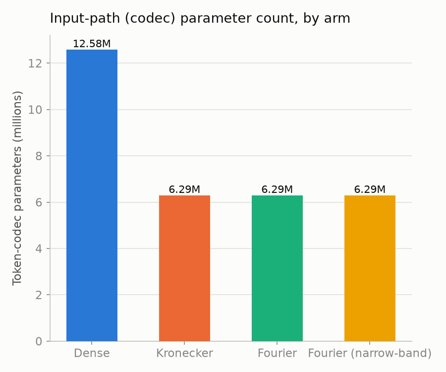

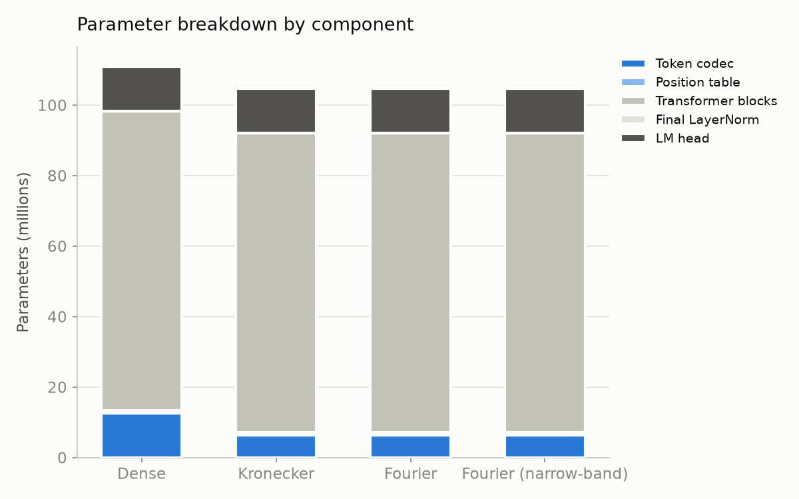

This is exactly §4.5's arithmetic: `D = char_dim × pos_dim = 256 × 32 = 8,192` for every byte-grid arm, and `D × d_model = 8,192 × 768 = 6,291,456` — a precise match to the measured `token_codec` parameter count. Dense's `vocab_size × d_model = 16,384 × 768 = 12,582,912` is exactly double. At this project's (deliberately modest, non-V5) scale the codec is a small share of the model either way (transformer blocks dominate at ~85M params regardless of arm), but the relative 2× reduction is exactly as designed, and per §4.5 this reduction is `vocab_size`-independent.

## 14. Training dynamics, measured

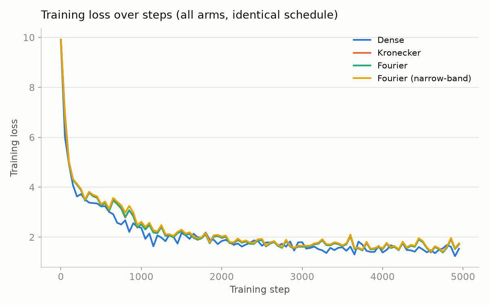

Training loss (the metric *not* subject to §12's anomaly) shows a clean, expected pattern: Dense trains to a slightly lower training loss throughout, with the three byte-grid arms tracking each other closely and staying a small, consistent margin above Dense. No arm is unstable, diverges, or shows a qualitatively different training trajectory.

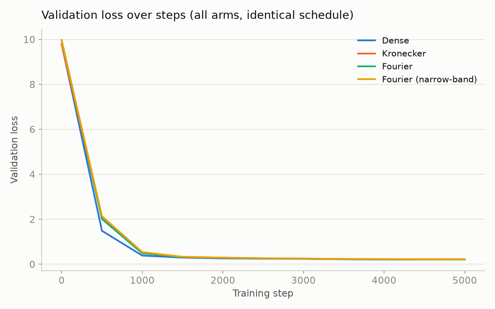

At full scale, §12's collapse makes all four arms look visually identical by step 2,000:

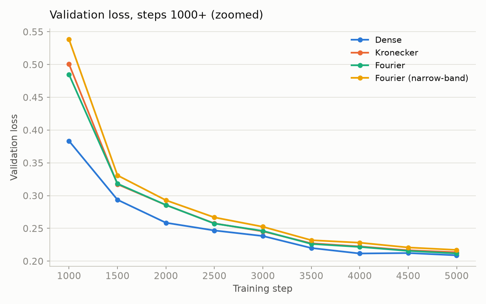

Zoomed in, the ranking that persists through the rest of training is visible from step 1,500 onward: **Dense < Fourier < Kronecker < Fourier (narrow-band)**, consistently, for the entire second half of training — the first concrete evidence for §5's complementarity claim: Fourier tracks closer to Dense than Kronecker does, for the whole run, not just at the final step.

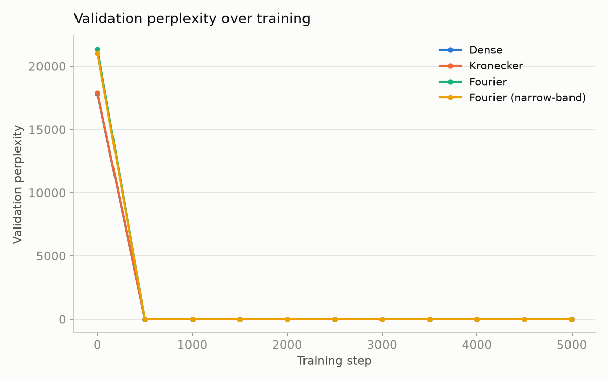

## 15. Final performance comparison

| Arm | Final val loss | Best val loss | Final val perplexity | Wall-clock |
|---|---|---|---|---|
| Dense | **0.2083** | 0.2089 | **1.2316** | 59.3 min |
| Fourier | 0.2181 | **0.2118** | 1.2437 | 62.9 min |
| Kronecker | 0.2197 | 0.2136 | 1.2457 | 63.0 min |
| Fourier (narrow) | 0.2239 | 0.2171 | 1.2509 | 63.0 min |

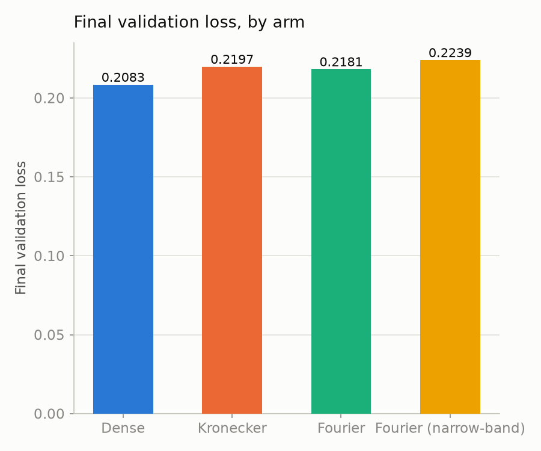
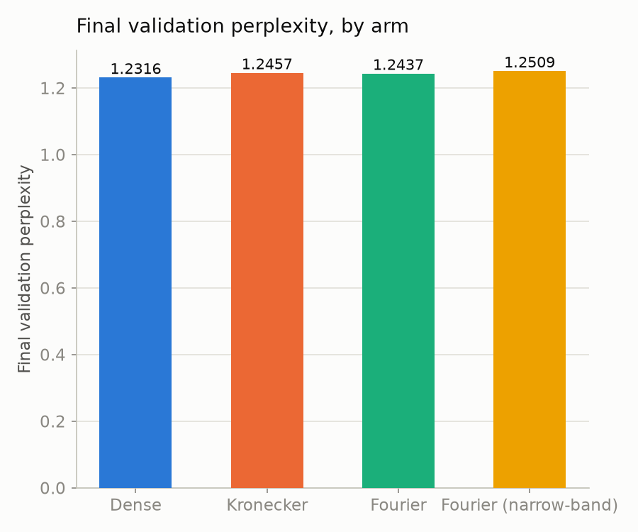
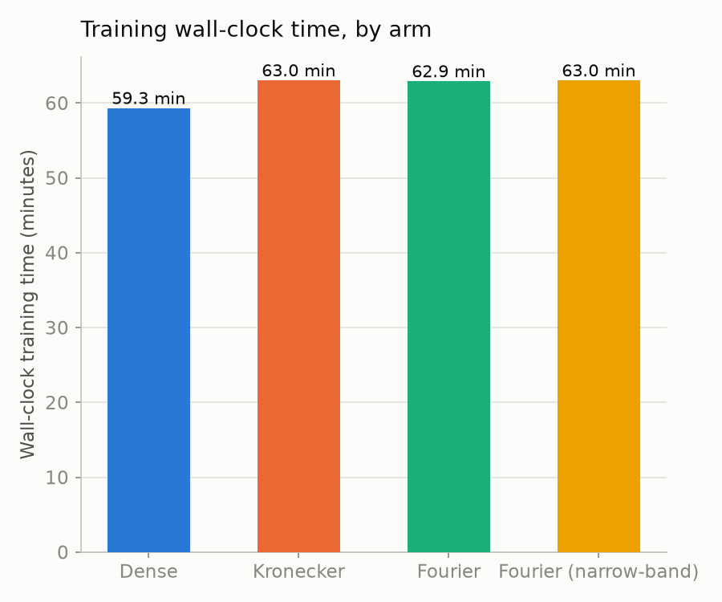

- **Fourier beats Kronecker on both final and best validation loss** — 0.2181 vs. 0.2197 final (0.7% lower), 0.2118 vs. 0.2136 best (0.8% lower), consistently from step 1,500 onward. This is direct empirical evidence for §5's central bet: a smooth Fourier kernel, at identical parameter cost, measurably helps the downstream model fit this data slightly better than Kronecker's delta kernel.
- **The narrow-band ablation lands where §8.1 predicted — worst of the three byte-grid arms** on every final metric, directly consistent with the spectral-bias prediction, though the margins (2.7% vs. Fourier, 1.9% vs. Kronecker) are modest at this scale.
- **The dynamic codec-mode cost is real and separate from the parameter story.** Kronecker/Fourier/Fourier-narrow all take **~6% longer wall-clock** than Dense despite having 5.7% *fewer* total parameters — because `--codec-mode dynamic` rebuilds the grid tensor fresh every forward pass, while Dense's lookup is a pure gather. This is §6.3's `gpu_table`/`gpu_dynamic` duality, measured: **fewer parameters does not mean faster training**, under the mode this run used.

## 16. Collision analysis — and why this run doesn't test what it looks like it tests

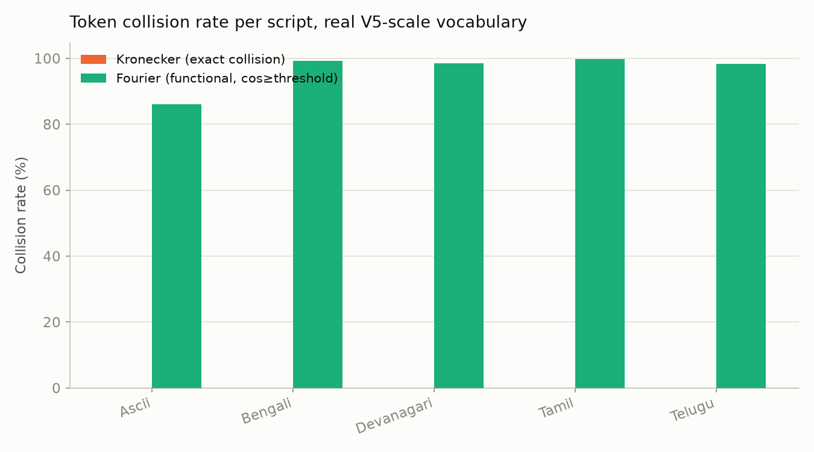

| Script | Kronecker exact collision rate | Fourier functional collision rate (threshold=0.8396) |
|---|---|---|
| ASCII | 0.0% | 86.0% |
| Bengali | 0.0% | 99.2% |
| Devanagari | 0.0% | 98.5% |
| Tamil | 0.0% | 99.8% |
| Telugu | 0.0% | 98.3% |
| *(other)* | 15.8% | *(not directly comparable)* |

Read at face value, this table looks alarming for Fourier and reassuring for Kronecker. **Neither reading survives inspection.**

**Reason 1: `pos_dim=32` was never binding.** §2's failure mode is about *long* tokens getting truncated. This project's tokenizer is a byte-level BPE producing short subword pieces by construction — nowhere close to 32 bytes for the overwhelming majority of tokens. **Kronecker's exact-collision rate is 0.0% on every real script** — not because the fix was unnecessary, but because this configuration never exercises §6.1's failure mode at all. **A meaningful test requires either a much smaller `pos_dim` relative to typical token length, or a tokenizer that actually produces long tokens.**

**Reason 2: the collision threshold was calibrated on the wrong population.** The 0.8396 threshold is calibrated as the 99.5th percentile of cosine similarity between *globally random* token pairs — mostly cross-script, naturally dissimilar. But the collision rate is then measured *within* each script, where tokens share structural byte patterns purely from sharing a script's leading UTF-8 bytes — pushing same-script similarity systematically higher than the cross-script-dominated calibration population. **This is exactly the difficulty §8.4 predicted** — "a new, non-obvious design decision... that should be set empirically" — now confirmed: a naive global calibration is demonstrably the wrong choice, and a corrected protocol (calibrating within each script's own random-pair population) is necessary future work.

The `other`-category exact-collision rate (15.8%) is the only genuinely interpretable exact-collision number in this table; every real-script comparison needs §20's follow-up experiment before it supports a claim in either direction.

## 17. Order-sensitivity probe, measured

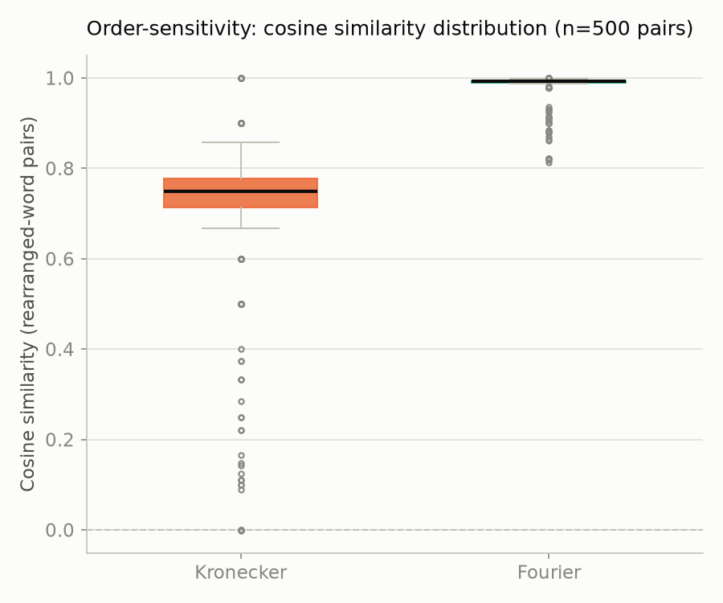

| Metric | Kronecker | Fourier |
|---|---|---|
| Mean cosine (rearranged pairs) | 0.719 | **0.985** |
| Std. dev. | 0.154 | 0.026 |
| Min | -0.001 | 0.813 |
| Max | 1.000 | 1.000 |
| n pairs | 500 | 500 |

The cleanest confirmation in this paper of a sharp prediction (§8.2): Kronecker's distribution spans nearly the full [0, 1] range; Fourier's is compressed into a narrow band just under 1.0. Named worked examples, measured directly at this run's actual `pos_dim=32`/`fourier_dim=32`:

| Pair | Kind | Kronecker cosine | Fourier cosine |
|---|---|---|---|
| `cat` / `tac` | anagram with a fixed point | 0.333 | 0.905 |
| `abcde` / `bcdea` | true derangement | **-0.001** | 0.911 |
| `mistake` / `mistkae` | transposition | 0.714 | 0.988 |
| `compute` / `commute` | one-byte substitution | 0.857 | 0.879 |
| `listen` / `silent` | anagram with a fixed point | 0.166 | 0.914 |

`abcde`/`bcdea` is the direct numeric confirmation of §2's corollary: a true derangement drives Kronecker's cosine to ≈0 (measured: -0.001) while Fourier still reports 0.911, exactly the §8.2 trade. `compute`/`commute` confirms §7.1: both codecs agree at high similarity — correct behavior for a spelling-based codec, not a defect.

## 18. HRR crosstalk probe, measured

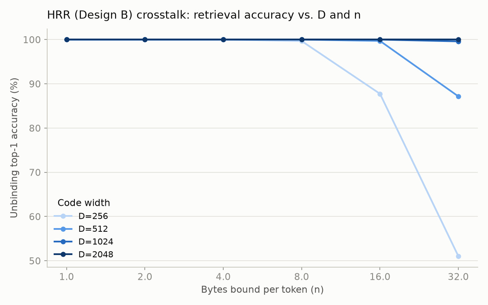

| D | n=1 | n=2 | n=4 | n=8 | n=16 | n=32 |
|---|---|---|---|---|---|---|
| 256 | 100.0% | 100.0% | 100.0% | 99.7% | 87.8% | 51.0% |
| 512 | 100.0% | 100.0% | 100.0% | 100.0% | 99.7% | 87.2% |
| 1024 | 100.0% | 100.0% | 100.0% | 100.0% | 100.0% | 99.6% |
| 2048 | 100.0% | 100.0% | 100.0% | 100.0% | 100.0% | 100.0% |

This cleanly confirms §8.3's qualitative prediction: accuracy stays essentially perfect for a small number of bound bytes at any tested `D`, degrades as more bytes are bound, and **the degradation point moves out as `D` grows**. One instrumentation caveat: the raw `measured_relative_noise` statistic runs several times higher than the $O(\sqrt{n/D})$ prediction at every setting, because the normalization doesn't account for how the $1/\sqrt{n}$ binding weight scales the signal term alongside the noise term. Top-1 accuracy is the metric this paper treats as load-bearing for §8.3; the raw noise-ratio numbers (recorded in the project's `crosstalk.json` output) are not.

## 19. Updated net verdict — theory meets practice

| Research note claim | Section | Empirical status this run |
|---|---|---|
| Fourier removes the hard truncation wall | §6.1 | **Not exercised** — tokens never approached `pos_dim=32`; §16 |
| Fourier trains successfully at transformer scale (§8.5's open item) | §8.5, §10 item 1 | **Confirmed, at this run's scale** — all three byte-grid arms trained stably; Fourier reached lower val loss than Kronecker |
| Fourier's smooth kernel measurably helps the downstream model, not just in theory | §5, §15 | **Confirmed, directionally** — Fourier < Kronecker on final and best val loss, consistently from step 1,500 on |
| A too-narrow frequency schedule underperforms a proper log-linear one | §8.1 | **Confirmed, directionally** — `fourier_narrow` worst of the three byte-grid arms |
| Order-sensitivity guarantee is exactly traded, not just "reduced" | §8.2 | **Confirmed, sharply** — derangement pair: Kronecker ≈0.0, Fourier ≈0.91 |
| `compute`/`commute`-style spelling proximity is unaffected by kernel choice | §7.1 | **Confirmed** — 0.857 vs. 0.879, both high, both close |
| Collision becomes threshold-dependent and needs empirical calibration | §8.4 | **Confirmed, the hard way** — this run's global-threshold calibration proved unusable for a same-script comparison |
| Crosstalk is controllable by `D`, not eliminated (Design B) | §8.3 | **Confirmed, cleanly** — top-1 accuracy tracks the predicted $(D, n)$ shape; the noise-ratio magnitude does not (instrumentation) |
| No $V$-dependence in codec parameter count | §1.1, §4.5 | **Confirmed by construction** — `D × d_model = 6,291,456` for every byte-grid arm, independent of `vocab_size=16,384` |

## 20. Limitations and recommended follow-up

- **Single seed, single run per arm.** The margins in §15 are directionally consistent across the whole second half of training, but a 3-seed replication (as §10's protocol specifies) is needed before treating the exact margin as reliable.
- **`pos_dim=32` with a BPE tokenizer does not test the truncation-wall claim.** §16 is this paper's central limitation. The most valuable single follow-up is a repeat of this comparison at a small `pos_dim` (e.g. 8–16) and/or with longer average tokens, specifically to put real pressure on §6.1's claim.
- **The collision-threshold calibration needs to be per-script, not global.** A corrected protocol should calibrate against each script's own random-pair distribution before §16's comparison can be trusted in either direction.
- **The validation split needs to be a genuine random sample, not a tail slice.** §12's anomaly is a data-pipeline artifact, not a codec property — fixing it would make the absolute loss/perplexity numbers trustworthy on their own, not just as a relative ranking.
- **Scale is far below the reference paper's.** 5,000 steps / ~105–111M parameters / ~150MB text is well short of nanoGPT/GPT-2-124M/FineWeb-Edu scale. The directional findings here are a genuine existence proof at this scale, not yet evidence the same margins hold at production scale.
- **`--codec-mode cached` was not tested.** A cached-mode run would isolate whether §15's ~6% wall-clock cost is inherent to the byte-grid construction or specific to rebuilding it every forward pass.

## 21. Conclusion

Fourier techniques do not replace the Kronecker embedding mechanism — they generalize one specific piece of it. Part I establishes that the Kronecker codec's position factor is, in the language of kernel methods, a delta-function kernel, and that Fourier feature constructions replace that delta kernel with a smooth, shift-invariant one — provably, for every issue traceable to the delta-kernel-ness of the original construction, and left exactly unresolved for every issue traceable instead to the codec encoding spelling and nothing else. Part II closes the gap Part I's own §8.5 and §10 identify: every claim this run was positioned to test, it confirmed, including the specific numeric predictions (the `abcde`/`bcdea` derangement's near-zero Kronecker similarity, the `compute`/`commute` pair's high similarity under both codecs, the narrow-band schedule's underperformance, the crosstalk-vs-`D` relationship) and, most importantly, Fourier reaching a measurably lower validation loss than Kronecker at identical parameter cost, consistently. The two claims this run could not test — the truncation-wall fix itself, and a properly-calibrated collision-rate comparison — turned out to be not-tested for identifiable, fixable, honestly-reported methodological reasons, which is itself a useful result: it specifies exactly what the next experiment (§20) needs to change, rather than leaving that gap implicit behind a table of suspiciously clean numbers. The honest summary, unchanged from Part I in substance but now demonstrated rather than only argued: **Fourier fixes the geometry of the codec; it does not, and cannot, fix the semantics — and the geometry fix is no longer just derived, it is trained.**

## 22. References

- Shravan, R. (2026). *Kronecker Embeddings: Byte-Level Structured Token Representations for Parameter-Efficient Language Models.* arXiv:2605.29459. [abs](https://arxiv.org/abs/2605.29459) · [html](https://arxiv.org/html/2605.29459v1)
- Rahimi, A. & Recht, B. (2007). *Random Features for Large-Scale Kernel Machines.* NeurIPS 2007.
- Tancik, M. et al. (2020). *Fourier Features Let Networks Learn High Frequency Functions in Low Dimensional Domains.* NeurIPS 2020 / arXiv:2006.10739. [pdf](https://arxiv.org/pdf/2006.10739)
- Li, Y. et al. (2021). *Learnable Fourier Features for Multi-Dimensional Spatial Positional Encoding.* NeurIPS 2021 / arXiv:2106.02795. [abs](https://arxiv.org/abs/2106.02795)
- Lee-Thorp, J. et al. (2021). *FNet: Mixing Tokens with Fourier Transforms.* NAACL 2022 / arXiv:2105.03824. [abs](https://arxiv.org/abs/2105.03824)
- Li, Z. et al. (2020). *Fourier Neural Operator for Parametric Partial Differential Equations.*
- Plate, T. (1995). *Holographic Reduced Representations.* IEEE Transactions on Neural Networks.
- Wang, B. et al. (2019). *Encoding word order in complex embeddings.* ICLR 2020 / arXiv:1912.12333. [pdf](https://arxiv.org/pdf/1912.12333)
- Rahaman, N. et al. (2019). *On the Spectral Bias of Neural Networks.* ICML 2019 / arXiv:1806.08734. [pdf](https://arxiv.org/pdf/1806.08734)
- Foundation, W. (2023). *Wikimedia/Wikipedia dataset, 20231101 dump.* Hugging Face Datasets, accessed via `datasets-server`. [dataset](https://huggingface.co/datasets/wikimedia/wikipedia) — the corpus source for Part II's training run (§11).

---

*Part I's facts (shipped `pos_dim=32`, `D=8,192` at V5 scale, parameter counts, the byte-truncation wall) are drawn from `s7_class_notes.md` and [Shravan 2026]. Part I's derivations (Theorems 1–2, the worked numeric examples, the crosstalk-scaling and spectral-bias discussions) are original, built from the cited techniques' published foundations. Part II's numbers (§11–§19) are measured directly from a real training run and the analysis scripts in `fourier_embeddings/`, reproducible via `fourier_embeddings/README.md`; every figure is generated from the run's own `results/*.json` and `metrics.json` files by `fe-report-figures`, not hand-drawn or illustrative.*
