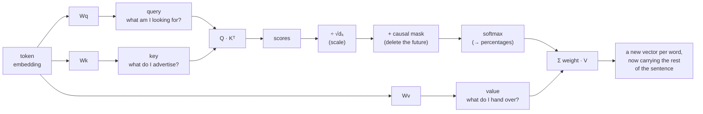
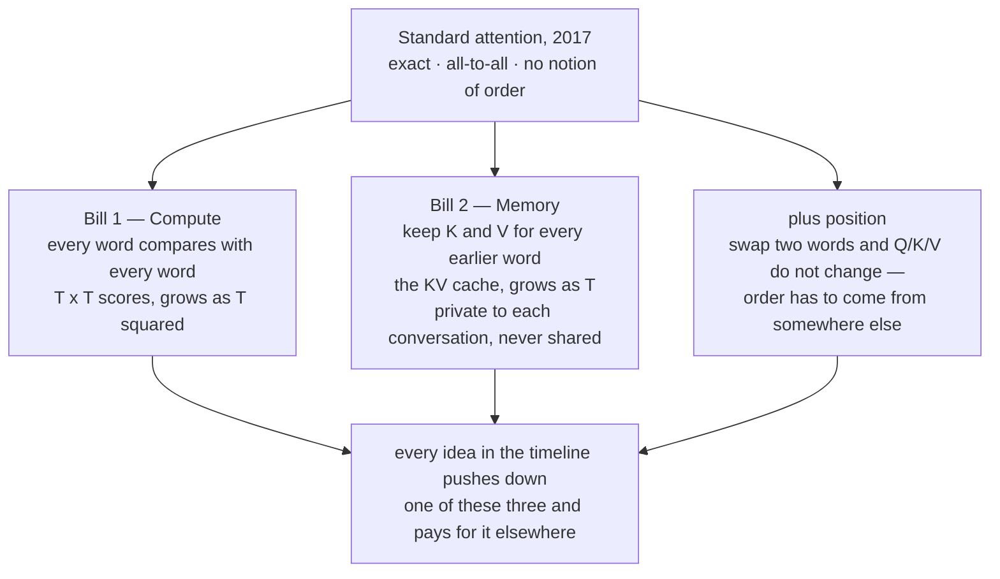
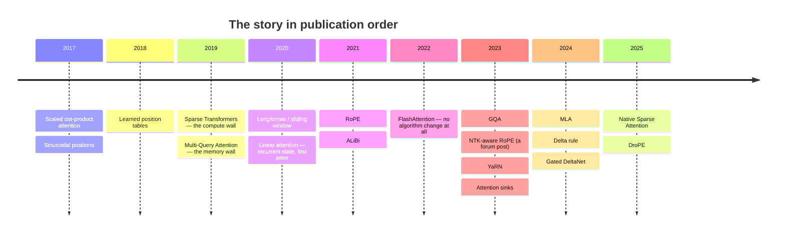

# How Does Attention Work Now?

A chronological account of attention mechanisms — from scaled dot-product
attention to Sakana AI's DroPE — told strictly in the order each idea was
actually published, so that each one reads as a reply to a limitation the
previous one created, rather than as an alphabetized list of techniques.

**🌐 Live app:** https://ravinaik.github.io/ERA/v5/session8/webapp/
**📂 Source:** [`webapp/`](./webapp/) — `index.html`, `style.css`, `data.js`, `app.js`

---

# Question 1 — The web app

## What it is

A friend asks: *"how does attention actually work now?"* Not the 2017
version — the current one, with everything that's happened to it since.
This is the answer that would actually help them: **one continuous story,
not eighteen unrelated flash cards.**

Three things the app insists on:

- **It starts from the bare mechanism, not a list of names.** The pipeline
  is built live, one step at a time, on a small worked sentence
  (*the bird fed its chicks* — deliberately **not** the class-notes
  example), before anything downstream is named.
- **It is sorted by publication date, full stop.** Not by family, not by
  how it was taught, not by which idea "won." Colour-coded threads let you
  watch the same concern resurface years apart — but the order itself never
  bends to group them.
- **Every date was checked against its primary source, not assumed** — see
  [the correction](#a-correction-made-honestly) further down, a real
  example of that mattering.

## The mechanism, first

Chapter One computes all six steps live on the same five words:



Turn the causal mask **off** in the app and you watch attention weight
land on words that haven't happened yet — the exact bug the mask exists to
prevent.

## The two bills

Standard attention isn't something to fix. It bought exact, all-to-all
access in one move — and that move sends **two bills** whenever the
sequence gets long:



The app makes both bills concrete — a comparison grid that grows as T²
next to a KV-cache stack that grows as T, plus a real GB calculator for a
mid-size model (48 layers · 8 KV heads · head\_dim 128 · bf16) — then
frames the rest of the page as *"which meter does this idea move?"*

## The story, sorted by date

19 ideas, one card each. Every card carries: a **plain-words** one-liner, a
**dedicated visual explainer of the mechanism itself**, the *buys / gives
up / when to actually pick it* triad, a *"moves the needle on"* tag row,
its primary source, and the hand-off sentence to the next idea.

| # | Date | Mechanism | Built-in visualization |
|---|---|---|---|
| 1 | 2017-06-12 | Scaled dot-product attention | live 6-step pipeline on a real sentence |
| 2 | 2017-06-12 | Sinusoidal positions | stacked sine waves → a per-position "fingerprint" |
| 3 | 2018-06 | Learned position table | a grid of trained rows, then a hard wall at row N+1 |
| 4 | 2019-04-23 | Sparse / strided attention | causal T×T grid, full vs. local+stride pattern toggle |
| 5 | 2019-11-06 | Multi-Query Attention | 8 query heads wired to 1 shared K/V head |
| 6 | 2020-04-10 | Sliding-window attention | band-diagonal grid widening with layer depth |
| 7 | 2020-06-29 | Linear attention | growing (k,v) list vs. one fixed-size running state |
| 8 | 2021-04-20 | RoPE | rotation dial — slide both words, the score doesn't move |
| 9 | 2021-08-27 | ALiBi | raw score bars minus a linear distance penalty ramp |
| 10 | 2022-05-27 | **FlashAttention** *(not on the list — added)* | HBM ↔ SRAM tiling, full T×T matrix never written |
| 11 | 2023-05-22 | GQA | head-sharing dial: MHA · 8 → GQA · 2 → MQA · 1 |
| 12 | 2023-06 | NTK-aware scaled RoPE | uniform squeeze vs. uneven per-frequency stretch |
| 13 | 2023-08-31 | YaRN | frequency spectrum split into keep / blend / stretch bands |
| 14 | 2023-09-29 | Attention sinks | sliding-window eviction sim, with and without pinned sinks |
| 15 | 2024-05-07 | MLA | per-token cache width: MHA vs. GQA vs. compressed latent |
| 16 | 2024-06-10 | Delta rule / DeltaNet | read → diff → write only the gap (30→70, not 100) |
| 17 | 2024-12-09 | Gated DeltaNet | a per-step forget gate decaying a stale fact toward 0 |
| 18 | 2025-02-16 | Native Sparse Attention | compress every block, re-read only the top-k in full |
| 19 | 2025-12-13 | DroPE | train-with-rotation → remove → short recalibration schedule |

### The shape of the story, once it's sorted by date

```
2017  exact, all-to-all attention, quadratic by construction
2017  ↳ needs some notion of order                       → sine waves
2018  ↳ order becomes just another trainable table        → learned positions
2019  the compute bill bites  → look at fewer tokens       → sparse attention
2019  the memory bill bites   → share keys/values          → multi-query attention
2020  the sparse pattern gets shaped to the task           → sliding windows
2020  what if the past were a running total, not a list?   → linear attention
2021  position becomes a rotation, not an addition         → RoPE
2021  ↳ or almost no position mechanism at all             → ALiBi
2022  make the exact version fast instead of approximate   → FlashAttention
2023  a dial between full sharing and none                 → GQA
2023  stretch the rotation, unevenly                       → NTK-aware scaling
2023  ↳ then more carefully, in three bands                → YaRN
2023  fixed windows get a safety valve                     → attention sinks
2024  compress the cache instead of just sharing it        → MLA
2024  a running total learns to correct itself             → the delta rule
2024  ↳ and then to forget, too                            → Gated DeltaNet
2025  sparsity returns, built around real hardware         → Native Sparse Attention
2025  and, at the very end: drop the rotation entirely     → DroPE
```

## Design notes

Fully static, dependency-free, no build step, no chart library — every
number on the page is computed live from `data.js` by `app.js`, including
the hand-drawn SVG diagrams. `data.js` is the single source of truth for
the whole story; editing the chronology means editing one file.

---

# Question 2 — What does the timeline actually show?

*What I could see once the mechanisms were in date order that I could not
see as a list.*



## Nine things visible in date order that a categorised list hides

1. **The two bills were discovered twice, independently, seven months
   apart, in 2019.** Sparse Transformers (Apr) attacked compute;
   Multi-Query Attention (Nov) attacked KV-cache memory. Different teams,
   different bottlenecks, neither urgent before long context. A list files
   these under "sparsity" and "cache" and hides that they're twins.

2. **Position was never solved — it was patched seven times.** Each patch
   is a direct reply to the previous one's specific failure. A list says
   "there are seven position schemes"; the timeline says "the field kept
   failing at this and kept coming back."

3. **Ideas return under new names, years later.** "Recurrence returns" and
   "sparsity returns" are literally on the page as the same idea being
   abandoned and revived:

   ```mermaid
   flowchart LR
       subgraph SP["Sparsity: read fewer tokens per query"]
           direction LR
           S1["2019<br/>Sparse<br/>Transformers"] --> S2["2020<br/>Longformer"] --> S3["2025<br/>Native Sparse<br/>Attention"]
       end
       subgraph RC["Recurrent fixed-size state"]
           direction LR
           R1["2020<br/>Linear<br/>attention"] --> R2["2024<br/>Delta<br/>rule"] --> R3["2024<br/>Gated<br/>DeltaNet"]
       end
       subgraph PO["Position: never solved, only patched"]
           direction LR
           P1["2017<br/>sinusoidal"] --> P2["2018<br/>learned<br/>table"] --> P3["2021<br/>RoPE"] --> P4["2021<br/>ALiBi"] --> P5["2023<br/>NTK-aware"] --> P6["2023<br/>YaRN"] --> P7["2025<br/>DroPE"]
       end
   ```

4. **The field's priorities visibly rotate** — along the exact arc the
   brief predicted: exact global attention (2017) → cheaper decode memory
   (2019) → position (2021) → longer context (2023) → recurrent state
   returning (2024) → sparsity returning and compression getting more
   aggressive (2025).

5. **2022 is a gap year with no algorithm change.** FlashAttention only
   makes the exact math fast by fixing memory traffic. In a taxonomy it
   fits no family; in a timeline it's obviously "the year the field paused
   to make exact attention cheap before continuing," and in retrospect it
   sits underneath everything after it.

6. **Community sources feed formal ones.** NTK-aware scaling (Jun 2023) is
   a Reddit post with no paper; YaRN (Aug 2023) formalises and credits it
   two months later. You watch the idea move from a forum to a method.

7. **"Solved" ≠ "deployed."** Attention sinks shipped 29 Sep 2023; Mistral
   7B shipped sliding-window attention *without* sinks two weeks later.

8. **Staying power is uneven and only shows with dates.** RoPE (2021) and
   GQA (2023) are still defaults; sinusoidal and learned tables were gone
   within ~2 years; NTK was displaced by YaRN in two months. A list gives
   every entry equal weight.

9. **Nothing is strictly better.** Every entry buys against one of the two
   2017 bills and spends on another, so the sequence cannot be read as
   "attention improved over time" — only as "the field kept trading."

**One correction the chronology forced:** the class notes place DroPE
mid-story as an internal V4 training step. The actual public paper (Sakana
AI, [arXiv:2512.12167](https://arxiv.org/abs/2512.12167), 13 Dec 2025)
moves it to the very **end** of the timeline.

## Mechanism not covered in class: **FlashAttention**

| | |
|---|---|
| **Date** | **27 May 2022** (v1 arXiv submission) |
| **Source** | Dao, Fu, Ermon, Rudra, Ré — *"FlashAttention: Fast and Memory-Efficient Exact Attention with IO-Awareness,"* [arXiv:2205.14135](https://arxiv.org/abs/2205.14135) (NeurIPS 2022). Date taken from the arXiv submission-history page (`[v1] Fri, 27 May 2022`). |
| **Motivation** | Naive exact attention was slower than its own arithmetic — it wrote the full T×T score matrix out to slow HBM and read it back. The bottleneck was data movement, not FLOPs. |
| **Mechanism** | Tile Q/K/V into blocks small enough to fit in on-chip SRAM, run softmax with a running statistic as blocks stream through, never materialise the full matrix; recompute what's needed in the backward pass instead of storing it. |
| **Advantage** | Bit-identical output to standard attention, at a fraction of the wall-clock time and memory. |
| **Cost** | Same FLOP count — a large constant-factor win, not a new complexity class; the kernel is tied to a specific accelerator's memory hierarchy. |
| **Where it belongs** | 2022, between ALiBi and GQA — and, functionally, underneath every exact-attention system built since. |

It is neither on the *"cover at minimum"* list nor taught anywhere in the
session, and it's the most load-bearing omission: it's the reason exact
attention is still competitive at all.

### Two further out-of-list mechanisms, cited as context in the app

- **Big Bird** — Zaheer et al., [arXiv:2007.14062](https://arxiv.org/abs/2007.14062),
  **28 Jul 2020** (NeurIPS 2020): random + window + global sparse attention
  with theoretical full-coverage guarantees. Noted alongside sparse attention.
- **Mistral 7B** — Jiang et al., [arXiv:2310.06825](https://arxiv.org/abs/2310.06825),
  **10 Oct 2023**: sliding-window attention + rolling-buffer KV cache in a
  shipped production model — notably *without* attention sinks, two weeks
  after the sinks paper. Noted alongside sliding window and sinks.

### On the "cover at minimum" list, but not taught in the session

The session notes jump from the causal mask straight to RoPE, and treat
cache compression only as DeepSeek's sparse form. So **sinusoidal
positions, learned absolute positions, ALiBi, sliding window, attention
sinks, and MLA** appear in the assignment brief but are never actually
explained in the lesson. The app builds all of them from their primary
sources regardless.

---

## Sources, and how the dates were checked

Every date below is the primary source's own **v1 submission date**
(fetched directly from its own record — an arXiv submission-history page,
or the closest available primary record where no preprint exists), checked
individually rather than accepted from memory.

| # | Date | Idea | Primary source |
|---|---|---|---|
| 1 | **2017-06-12** | Scaled dot-product attention *(where the story starts)* | Vaswani et al., *"Attention Is All You Need,"* NeurIPS 2017 — [arXiv:1706.03762](https://arxiv.org/abs/1706.03762) |
| 2 | **2017-06-12** | Sinusoidal position signal | Same paper, §3.5 |
| 3 | **2018-06** | A trainable position table | Radford et al., *"Improving Language Understanding by Generative Pre-Training,"* OpenAI (June 2018); reinforced by Devlin et al., *"BERT,"* [arXiv:1810.04805](https://arxiv.org/abs/1810.04805) (11 Oct 2018) |
| 4 | **2019-04-23** | Sparse & strided attention | Child, Gray, Radford, Sutskever, *"Generating Long Sequences with Sparse Transformers,"* [arXiv:1904.10509](https://arxiv.org/abs/1904.10509) |
| 5 | **2019-11-06** | Multi-Query Attention | Shazeer, *"Fast Transformer Decoding: One Write-Head is All You Need,"* [arXiv:1911.02150](https://arxiv.org/abs/1911.02150) |
| 6 | **2020-04-10** | Sliding-window attention | Beltagy, Peters, Cohan, *"Longformer: The Long-Document Transformer,"* [arXiv:2004.05150](https://arxiv.org/abs/2004.05150) |
| 7 | **2020-06-29** | Linear attention | Katharopoulos, Vyas, Pappas, Fleuret, *"Transformers are RNNs,"* ICML 2020 — [arXiv:2006.16236](https://arxiv.org/abs/2006.16236) |
| 8 | **2021-04-20** | RoPE (rotary position embedding) | Su, Lu, Pan, Wen, Liu, *"RoFormer,"* [arXiv:2104.09864](https://arxiv.org/abs/2104.09864) |
| 9 | **2021-08-27** | ALiBi | Press, Smith, Lewis, *"Train Short, Test Long,"* ICLR 2022 — [arXiv:2108.12409](https://arxiv.org/abs/2108.12409) |
| 10 | **2022-05-27** | FlashAttention *(not on the required list — included anyway)* | Dao, Fu, Ermon, Rudra, Ré, NeurIPS 2022 — [arXiv:2205.14135](https://arxiv.org/abs/2205.14135) |
| 11 | **2023-05-22** | GQA (grouped-query attention) | Ainslie et al., EMNLP 2023 — [arXiv:2305.13245](https://arxiv.org/abs/2305.13245) |
| 12 | **2023-06** | NTK-aware scaled RoPE | u/bloc97, [r/LocalLLaMA, thread 14lz7j5](https://www.reddit.com/r/LocalLLaMA/comments/14lz7j5/) — a forum post, no peer-reviewed paper |
| 13 | **2023-08-31** | YaRN | Peng, Quesnelle, Fan, Shippole, ICLR 2024 — [arXiv:2309.00071](https://arxiv.org/abs/2309.00071) |
| 14 | **2023-09-29** | Attention Sinks (StreamingLLM) | Xiao, Tian, Chen, Han, Lewis, ICLR 2024 — [arXiv:2309.17453](https://arxiv.org/abs/2309.17453) |
| 15 | **2024-05-07** | MLA (multi-head latent attention) | DeepSeek-AI, *"DeepSeek-V2,"* [arXiv:2405.04434](https://arxiv.org/abs/2405.04434) |
| 16 | **2024-06-10** | The delta rule / DeltaNet | Yang, Wang, Zhang, Shen, Kim, NeurIPS 2024 — [arXiv:2406.06484](https://arxiv.org/abs/2406.06484) |
| 17 | **2024-12-09** | Gated DeltaNet | Yang, Kautz, Hatamizadeh (NVIDIA), ICLR 2025 — [arXiv:2412.06464](https://arxiv.org/abs/2412.06464) |
| 18 | **2025-02-16** | Native Sparse Attention | DeepSeek-AI, ACL 2025 — [arXiv:2502.11089](https://arxiv.org/abs/2502.11089) |
| 19 | **2025-12-13** | DroPE — dropping positional embeddings after training | Gelberg, Eguchi, Akiba, Cetin (Sakana AI), *"Extending the Context of Pretrained LLMs by Dropping Their Positional Embeddings,"* [arXiv:2512.12167](https://arxiv.org/abs/2512.12167) · [project page](https://pub.sakana.ai/DroPE/) · [code](https://github.com/SakanaAI/DroPE) |

Two further techniques are cited as context on a related card rather than
given a separate row of their own, since the page treats them the same
way — as a footnote on the idea they extend: **Big Bird** (Zaheer et al.,
NeurIPS 2020 — [arXiv:2007.14062](https://arxiv.org/abs/2007.14062), 28 Jul
2020, noted alongside sparse attention) and **Mistral 7B** (Jiang et al. —
[arXiv:2310.06825](https://arxiv.org/abs/2310.06825), 10 Oct 2023, noted
alongside sliding-window attention and attention sinks — including the
detail that Mistral shipped sliding-window attention *without* attention
sinks, two weeks after the sinks paper had already shipped).