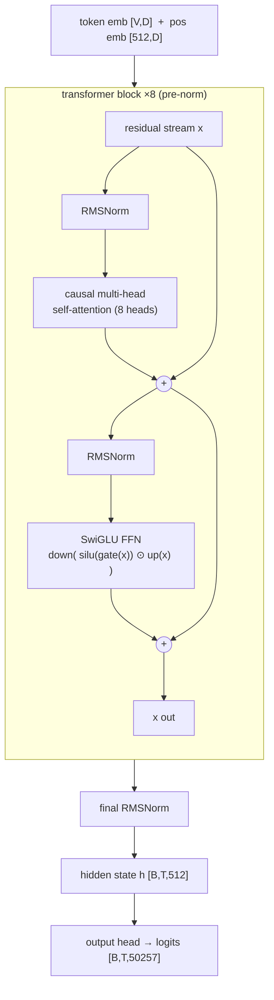
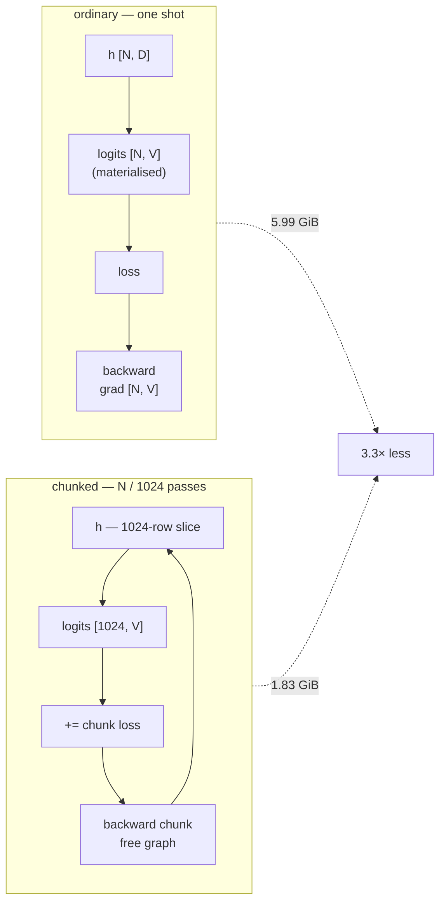
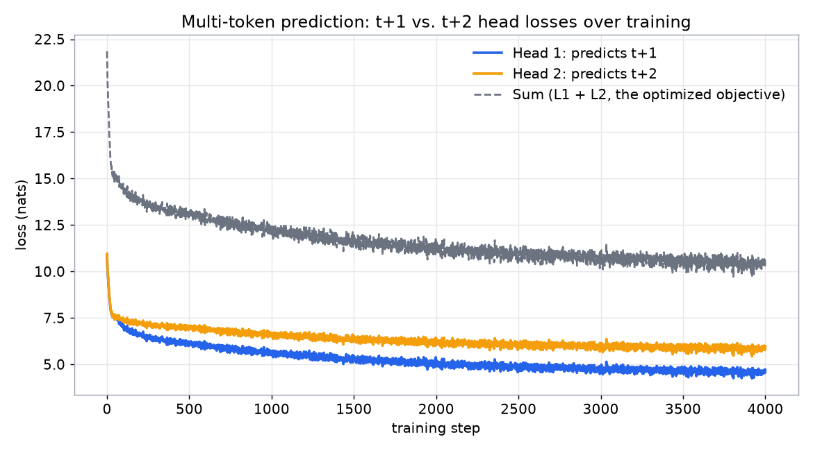
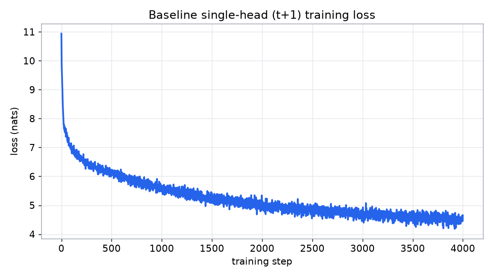
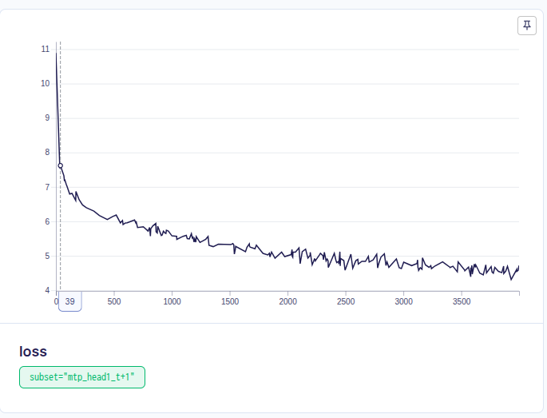
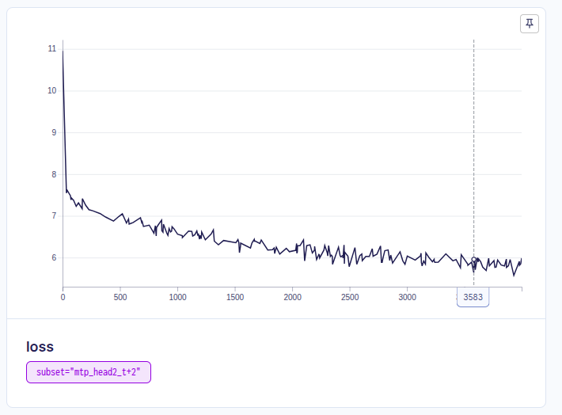
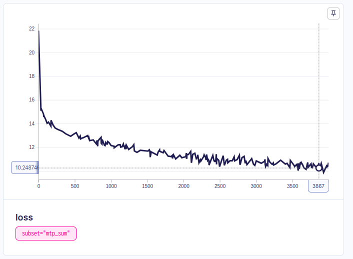
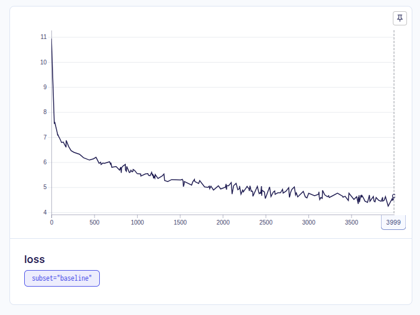
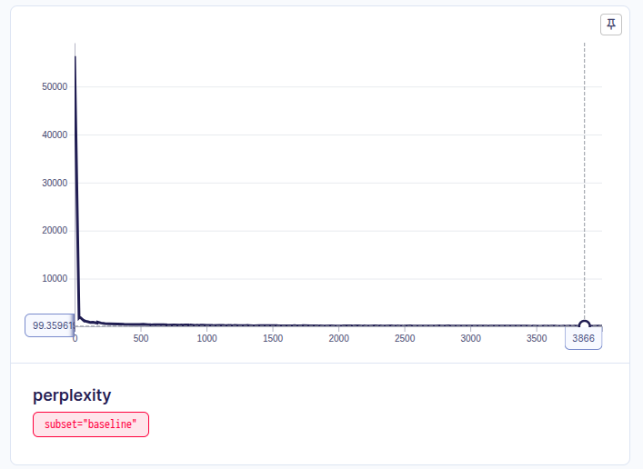

# Session 9 — The Loss Harness

**Making next-token cross-entropy correct and observable, then adding a second output head that predicts `t+2`.**

The assignment starts from four lines that *look* right:

```python
hidden = model(tokens)
logits = output_head(hidden)
loss = cross_entropy(
    logits[:, :-1].reshape(-1, vocab_size),
    tokens[:, 1:].reshape(-1),
)
```

…and asks you to turn them into something you can *trust* — every shape printed and named, the input/target shift verified by reading decoded **strings** (not ids), padding and document boundaries masked with the contributing-token count shown to move, perplexity checked against vocabulary size, tied-vs-untied head cost measured, and peak memory for an ordinary vs. a hand-written chunked cross-entropy measured on a real GPU. Then Part 2 bolts on a second head that predicts two tokens ahead and watches what its loss does.

> 📓 **Notebook:** [`loss_harness/session9_loss_harness.ipynb`](./loss_harness/session9_loss_harness.ipynb) — executed top to bottom on an RTX A6000, outputs saved in place.
> 🌐 **Web app:** [`webapp/index.html`](./webapp/index.html) — visual walkthrough of the experiment and results.

---

## 1. The one warning this session is about

> A target shift in the **wrong** direction produces a beautiful, smoothly-falling loss curve. The model just learns to copy its input. It never raises an exception.

Everything in Part 1 is a defense against that class of silent bug — the ones that live in the few lines between the model output and the scalar. The single most important cell in the notebook prints this:

```
 pos | input token        | target token       | check
------------------------------------------------------------
   0 | 'Sen'              | 'j'                | OK
   1 | 'j'                | 'ō'                | OK
   2 | 'ō'                | ' no'              | OK
   3 | ' no'              | ' V'               | OK
   ...
mismatches found: 0 / 12  -> shift is CORRECT
```

vs. the bug it rules out:

```
 pos | input token        | WRONG target (=input)
   0 | 'Sen'              | 'Sen'    <- model would just learn to copy its input
```

---

## 2. The loss spine


Cross-entropy asks exactly one question at every position: **what probability did you assign to the token that actually came next?** Perplexity = `exp(mean loss)` re-expresses that as "how many equally-likely options is the model effectively choosing between."

---

## 3. Experiment setup

| | |
|---|---|
| **Hardware** | NVIDIA RTX A6000 (47.5 GiB), CUDA 12.4, PyTorch 2.6.0 |
| **Dataset** | WikiText-103-raw — **1,153,246** documents, **115,689,651** GPT-2 tokens |
| **Tokenizer** | GPT-2 BPE via `tiktoken` — real sub-word vocab, **V = 50,257** |
| **Model** | decoder-only transformer, from scratch (`loss_harness/src/harness/`) |
| **Trunk** | `d_model=512`, `n_layers=8`, `n_heads=8`, `d_ff=1408` (SwiGLU), `max_seq_len=512` — **51,692,544 params** |
| **Norm / layout** | RMSNorm, pre-norm residual stream |
| **Training** | `seq_len=512`, `batch=12` (6,144 tokens/step), **4,000 steps**, AdamW `lr=3e-4` |
| **Tracking** | [Aim](https://aimstack.io/) — every step's loss & perplexity |
| **Wall clock** | baseline run ≈ 11 min · MTP run ≈ 16 min |

### Model architecture



The trunk **returns hidden states only** — `TinyGPT.forward` never touches the vocabulary. The output head is a separate module attached afterward (`hidden = model(tokens); logits = head(hidden)`), which is exactly what makes tied-vs-untied and the Part-2 second head *drop-in* changes rather than surgery on the trunk.

---

## 4. Part 1 — the seven numbers

| # | Check | Result | What it tells you |
|---|---|---|---|
| **1** | **Tensor shapes** | `tokens [4, 32]` → `hidden [4, 32, 512]` → `logits [4, 32, 50257]` | `[batch, position]` → `+ hidden width D` → `+ one score per vocab token V`. The logits tensor is **98×** bigger than the hidden state that produced it. |
| **2** | **Shift verification** | **0 / 12** string mismatches | `target[i]` really is `input[i+1]`. Read as decoded strings, not ids — this is the check that catches the copy-the-input bug. |
| **3** | **Padding mask** | contributing tokens **234 → 167** (−67); loss **10.6834 → 10.8603** | The loss went *up* after masking. Padding is trivially predictable, so counting it was **flattering the mean**. The contributing-token count is the tell. |
| **4** | **Document-boundary mask** | loss **10.7940 → 10.7902** over **47 → 46** positions; the boundary position's own loss is **10.9666** (above the mean) | On an *untrained* model the delta is tiny — the head can't yet tell a real continuation from an unrelated document join. Once trained, that unmasked pair is scored as a genuine failure forever and drags both the loss and the gradient toward a relationship that doesn't exist. |
| **5** | **Perplexity sanity anchor** | untrained loss **10.9328** → ppl **55,984** vs. **V = 50,257** (`ln V = 10.8249`, gap **1.00 %**) | ✅ PASS. A freshly-initialised head scores the vocabulary ~uniformly. If this were far from `ln V`, the target alignment is broken and nothing downstream can be trusted. |
| **6** | **Tied vs. untied head params** | **51,692,544** vs. **77,424,128** — **+25,731,584** params, ratio **1.498×** | Untying gives the head its own `[V, D]` matrix — `50257 × 512 = 25.7M` params, the single largest block in the model, as big as the entire token-embedding table. |
| **7** | **Peak memory: ordinary vs. chunked CE** | **5.99 GiB** vs. **1.83 GiB** — ratio **3.3×** | Same loss to `9.5e-7`, same gradients to `2.6e-8`. Ordinary materialises the full `[16384, 50257]` logits tensor *and* its gradient; chunked (size 1,024) never holds more than one slice. Pure memory-vs-arithmetic trade, objective unchanged. |

### The chunked cross-entropy (written by hand)



The subtlety that actually matters for memory: computing the whole chunked loss and then calling `.backward()` once keeps *every* chunk's graph alive at once and defeats the point. The implementation back-propagates **each chunk immediately** (pre-scaled by `1/total_count`) so autograd frees that chunk before the next is computed.

---

## 5. Part 2 — a second head predicting `t+2`

Two **untied, architecturally identical** heads sit on the shared trunk. The only difference is the target: Head 1 predicts `t+1`, Head 2 predicts `t+2`. Keeping them identical is deliberate — if Head 1 were tied to the embedding and Head 2 weren't, a loss gap could be "t+2 is harder" *or* "the tied head is more constrained." Untying both isolates the one effect the assignment asks about.


### The two losses

| Head | Predicts | Loss: start → end | Perplexity: start → end |
|---|---|---|---|
| **Head 1** | `t+1` | **10.8917 → 4.7166** | 53,730 → **111.8** |
| **Head 2** | `t+2` | **10.9536 → 5.9851** | 57,157 → **397.5** |
| **Sum** (optimised) | — | **21.8453 → 10.7017** | — |
| *baseline (single tied `t+1` head)* | `t+1` | *10.9386 → 4.6513* | *56,307 → 104.7* |

**Gap `L2 − L1`:** `+0.0618` (step 0) → **`+1.2685`** (step 3999). Mean over the run `+1.0645`; mean after warm-up `+1.1254` (min `+0.7736`, max `+1.3420`). **Head 2's loss is above Head 1's at 100 % of the 4,000 steps.**





### Tracked in Aim

| Head 1 · `t+1` | Head 2 · `t+2` | Sum · `L1 + L2` |
|---|---|---|
|  |  |  |

| Baseline loss | Baseline perplexity |
|---|---|
|  |  |

---

## 6. Commentary — what the result actually says

- **The gap is the finding.** At step 0 both heads are random, so `L2 − L1 ≈ 0` — noise. As training shapes the *shared* trunk, the gap opens to a stable **~1.13 nats** and never closes. That is the multi-token-prediction claim made concrete: predicting `t+2` from the same hidden state carries **one extra step of genuine, irreducible uncertainty** about what the text does next. Its entropy floor is simply higher.

- **In perplexity terms:** by the end the model is effectively choosing among **~112** options for the very next token, but **~400** for the token after that. Same context, same representation — the further-out prediction is a measurably harder question.

- **Both curves fall together, not apart.** They share one trunk, so anything that improves the hidden state helps both objectives at once. The `t+2` head is *extra supervision on the same representation*, not a competing task fighting for capacity.

- **The second head is nearly free on the primary objective.** The standalone baseline (single tied `t+1` head) ends at **4.6513**; the `t+1` head *inside* the two-head model ends at **4.7166** — within noise. Adding a `t+2` head did not measurably hurt next-token quality at this scale and step budget; the denser gradient signal, if anything, is a mild regulariser.

- **The sum is what's optimised**, and it's roughly `2×` a single head because the two losses are **added, not averaged** — so Head 2 pulls on the shared trunk exactly as hard as Head 1. If you wanted the `t+1` objective to dominate you would weight the sum (`L1 + λ·L2`); here `λ = 1`.

- **The honest cost of MTP** (not paid here, but real at scale): each extra head is another `V × D` matrix — **25.7M params** in this config, as large as the embedding table. Four dense heads would more than double the model. This is the argument for a *factored* output head.

---

## 7. Reproducing this

```bash
cd loss_harness
uv sync                                              # torch (CUDA), tiktoken, datasets, aim, jupyter, ...

# fast correctness pass — tiny model, WikiText-2, 20 steps, CPU, ~2 min
S9_SMOKE=1 uv run python dry_run.py

# the real run (GPU) — ~30 min on an A6000
uv run jupyter nbconvert --to notebook --execute --inplace session9_loss_harness.ipynb
uv run aim up                                        # browse tracked runs at http://localhost:43800
```

The notebook reads one environment variable, `S9_SMOKE`: unset it for the full config above, set it to `1` for a 2-minute CPU smoke run. Tokenised WikiText ids are cached under `loss_harness/.cache/`.

---

## 8. Project layout

```
session9/
├── README.md                      ← you are here (the submission)
├── webapp/                        ← visual walkthrough (dark/light, no build step)
│   ├── index.html
│   ├── style.css
│   ├── data.js                    ← every number from the run
│   └── app.js
└── loss_harness/
    ├── session9_loss_harness.ipynb   ← the whole assignment, executed top to bottom
    ├── src/harness/
    │   ├── model.py                  ← TinyGPT trunk + OutputHead (tied/untied)
    │   ├── data.py                   ← WikiText load, batched+cached tokenize, packing, padding
    │   ├── losses.py                 ← ordinary + chunked cross-entropy, perplexity, peak-mem
    │   └── utils.py                  ← seeding, device, shape-printer, param dedup
    ├── assets/                       ← plots + results.json written by the notebook
    ├── pyproject.toml / uv.lock      ← uv-managed dependencies
    └── build_notebook.py             ← regenerates the notebook from cell source (dev only, gitignored)
```

## 9. Notes on a few decisions

- **Why WikiText-103 + GPT-2 BPE, not a toy vocabulary.** "Print the strings, not the ids" only means something with a real sub-word vocabulary — misalignment shows up as whole sub-words shifted by one. A char-level toy vocab would hide it.
- **The tied-weight double-update trap.** Tying reuses `tok_emb.weight` as the head weight — the *same* `nn.Parameter`. Building an optimizer from `list(model.parameters()) + list(head.parameters())` lists that tensor twice and AdamW updates it twice per step. `collect_params()` dedups by tensor identity before every optimizer in the notebook.
- **Peak memory is measured, not estimated** — `torch.cuda.reset_peak_memory_stats` / `max_memory_allocated` bracket each implementation individually.
- **Document-boundary masking is demonstrated in isolation (§3.4), not wired into the Part 2 training loops** — the packed corpus inserts `<|endoftext|>` between documents but doesn't additionally mask the join in the loss, a common simplification once a run spans thousands of steps.
