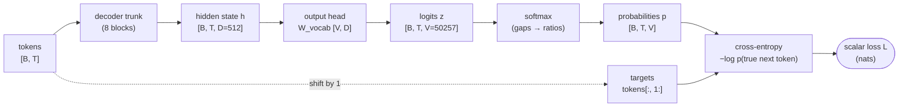
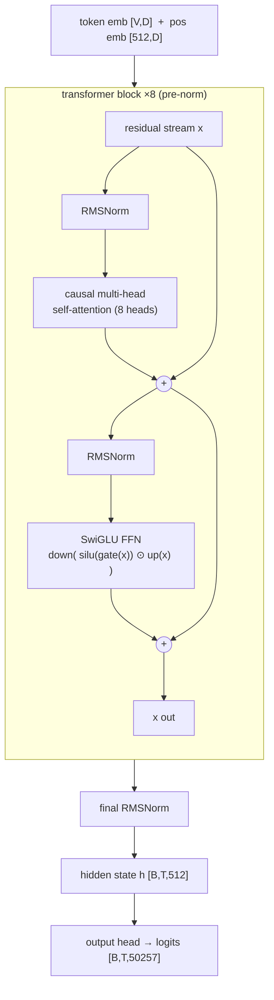
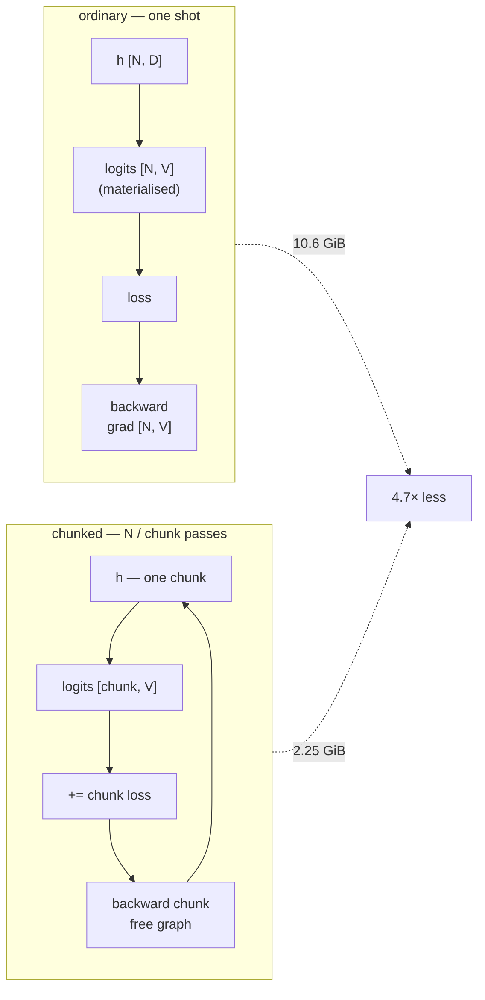
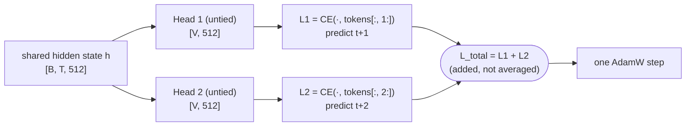
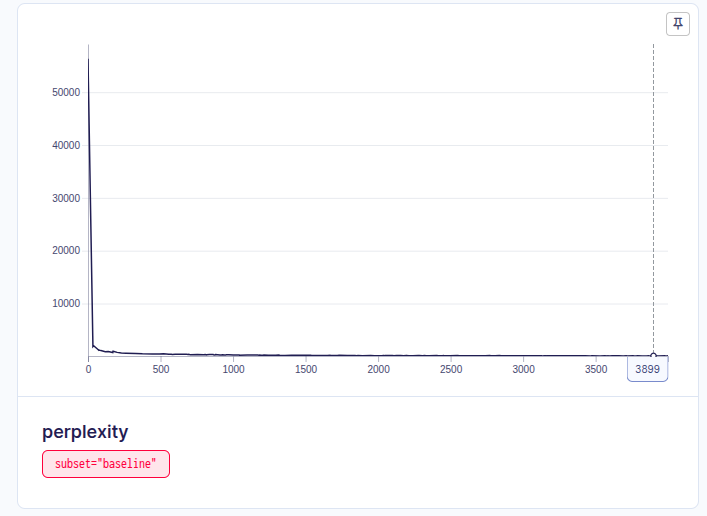

# Session 9 — The Loss Harness

**Making next-token cross-entropy correct and observable, then adding a second output head that predicts `t+2`.**

The assignment starts from four lines that *look* right:

```python
hidden = model(tokens)
logits = output_head(hidden)
loss = cross_entropy(
    logits[:, :-1].reshape(-1, vocab_size),
    tokens[:, 1:].reshape(-1),
)
```

…and asks you to turn them into something you can *trust* — every shape printed and named, the input/target shift verified by reading decoded **strings** (not ids), padding and document boundaries masked with the contributing-token count shown to move, perplexity checked against vocabulary size, tied-vs-untied head cost measured, and peak memory for an ordinary vs. a hand-written chunked cross-entropy measured on a real GPU. Then Part 2 bolts on a second head that predicts two tokens ahead and watches what its loss does.

> 📓 **Notebook:** [`loss_harness/session9_loss_harness.ipynb`](./loss_harness/session9_loss_harness.ipynb) — executed top to bottom on an RTX A6000 (baseline 11 min + MTP 16 min); `S9_SMOKE=1` for a 2-minute CPU pass.
> 🌐 **Web app:** [`webapp/index.html`](./webapp/index.html) — visual walkthrough of the experiment and results.

---

## 1. The one warning this session is about

> A target shift in the **wrong** direction produces a beautiful, smoothly-falling loss curve. The model just learns to copy its input. It never raises an exception.

Everything in Part 1 is a defense against that class of silent bug — the ones that live in the few lines between the model output and the scalar. The single most important cell in the notebook prints this, for a *human* to read:

```
 pos | input token        | target token       | check
------------------------------------------------------------
   0 | 'Sen'              | 'j'                | OK
   1 | 'j'                | 'ō'                | OK
   2 | 'ō'                | ' no'              | OK
   3 | ' no'              | ' V'               | OK
   ...
```

vs. the bug it rules out:

```
 pos | input token        | WRONG target (=input)
   0 | 'Sen'              | 'Sen'    <- model would just learn to copy its input
```

The `0 / 12` counter beneath the table only checks that `targets_out == tokens[:, 1:]` — true by construction of the slice, so it catches a wrong slice expression but is **not** a mechanical proof that the loss call is aligned. That `logits[:, :-1]` lines up with those targets is a *functional* fact, checked by the **perplexity anchor** (§4, check 5): an untrained model that lands at ≈ `ln V` is aligned; a wrong-way shift collapses it well below, and a forgotten shift makes the trained loss fall to near zero. The strings and the anchor together are the guard.

---

## 2. The loss spine



Cross-entropy asks exactly one question at every position: **what probability did you assign to the token that actually came next?** Perplexity = `exp(mean loss)` re-expresses that as "how many equally-likely options is the model effectively choosing between."

---

## 3. Experiment setup

| | |
|---|---|
| **Hardware** | NVIDIA RTX A6000 (47.5 GiB), CUDA 12.4, PyTorch 2.6.0 |
| **Dataset** | WikiText-103-raw — **1,153,246** documents, **115,689,651** GPT-2 tokens |
| **Tokenizer** | GPT-2 BPE via `tiktoken` — real sub-word vocab, **V = 50,257** |
| **Model** | decoder-only transformer, from scratch (`loss_harness/src/harness/`) |
| **Trunk** | `d_model=512`, `n_layers=8`, `n_heads=8`, `d_ff=1408` (SwiGLU), `max_seq_len=512` — **51,692,544 params** |
| **Norm / layout** | RMSNorm, pre-norm residual stream |
| **Training** | `seq_len=512`, `batch=12` (6,144 tokens/step), **4,000 steps**, AdamW `lr=3e-4` |
| **Tracking** | [Aim](https://aimstack.io/) — every step's loss & perplexity |
| **Wall clock** | baseline run ≈ 11 min · MTP run ≈ 16 min |

### Model architecture



The trunk **returns hidden states only** — `TinyGPT.forward` never touches the vocabulary. The output head is a separate module attached afterward (`hidden = model(tokens); logits = head(hidden)`), which is exactly what makes tied-vs-untied and the Part-2 second head *drop-in* changes rather than surgery on the trunk.

---

## 4. Part 1 — the seven numbers

| # | Check | Result | What it tells you |
|---|---|---|---|
| **1** | **Tensor shapes** | `tokens [4, 32]` → `hidden [4, 32, 512]` → `logits [4, 32, 50257]` | `[batch, position]` → `+ hidden width D` → `+ one score per vocab token V`. The logits tensor is **98×** bigger than the hidden state that produced it. |
| **2** | **Shift verification** | prints the inputs/targets table for eye-reading; **0 / 12** target-slice mismatches | The table is the deliverable — you read it and confirm each target is the next word. The counter only proves `targets_out` is the right *slice*; loss-call alignment is check 5. |
| **3** | **Padding mask** | contributing tokens **234 → 167** (−67); loss **10.6834 → 10.8603** | The loss went *up* after masking. Padding is trivially predictable, so counting it was **flattering the mean**. The contributing-token count is the tell. |
| **4** | **Document-boundary mask** | *untrained:* loss **10.7940 → 10.7902**, boundary position **10.9666** ≈ the mean · *trained `t+1` head (§6.2):* loss **5.6512 → 5.4732** (**−0.178 nats** from masking one position), boundary position itself **13.8385** = **2.53× the mean** | Untrained, the join is indistinguishable from a real continuation — the delta is noise. Trained, the model is good at real continuations, so predicting an unrelated document's first token is the worst position in the sequence by 2.5×; masking that one position lowers the whole-sequence mean loss by 0.18 nats and stops the gradient teaching a relationship that doesn't exist. |
| **5** | **Perplexity anchor** (in nats) | untrained loss **10.9328** vs. `ln V` **10.8249** — **1.0 % gap in nats** (perplexity **55,984** vs. **V = 50,257**, ~11 % high) | ✅ PASS. The right unit here is nats: the model is ~1 % from a uniform distribution. In perplexity that 1 % becomes ~11 %, which is why "sits near the vocabulary size" is doing a little work — read the nats. |
| **6** | **Tied vs. untied head params** | **51,692,544** vs. **77,424,128** — **+25,731,584** params, ratio **1.498×** | Untying gives the head its own `[V, D]` matrix — `50257 × 512 = 25.7M` params, the single largest block in the model, as big as the entire token-embedding table. |
| **7** | **Peak memory: ordinary vs. chunked CE** | **10.61 GiB** vs. **2.25 GiB** — ratio **4.7×** (`N = 32,768`, `bf16`, `chunk = 2,048`) | Same loss to `9.5e-7`, same gradients to `2.3e-9` / `2.6e-8`. The naive `[N, V]` figure (3.07 GiB bf16) is **not** what either path costs — the byte-by-byte reconciliation is §4b below. |

### The chunked cross-entropy (written by hand)



The subtlety that actually matters for memory: computing the whole chunked loss and then calling `.backward()` once keeps *every* chunk's graph alive at once and defeats the point. The implementation back-propagates **each chunk immediately** (pre-scaled by `1/total_count`) so autograd frees that chunk before the next is computed.

## 4b. Where the memory goes — reconciling the numbers

The naive `[N, V]` logits figure is not what either path costs. The notebook prints this account (`N = 32,768`, `bf16`, `V = 50,257`, `D = 512`, `chunk = 2,048`):

| | GiB | why |
|---|---:|---|
| **Ordinary — one `[N, V]` pass** | | |
| logits `[N, V]` ×2 (bf16) | 3.07 | materialised by the matmul |
| log-softmax `[N, V]` ×4 (**fp32**) | 6.13 | `F.cross_entropy` up-casts to fp32 for numerical stability |
| grad of logits `[N, V]` ×2 (bf16) | 3.07 | the backward pass needs it too |
| hidden + grad (2 × `[N, D]`) | 0.06 | small next to `[N, V]` |
| head weight + grad (2 × `[V, D]`) | 0.10 | small next to `[N, V]` |
| **predicted ≈ 12.4** | | **measured 10.6** — logits and log-softmax don't fully coexist |
| **Chunked — 16 passes of 2,048 tokens** | | |
| one chunk: logits + fp32 log-softmax + grad | 0.77 | transient — freed after each chunk's backward |
| hidden + grad, head weight + grad | 0.16 | **does not shrink with `chunk`** — this is the floor |
| CUDA context + cuBLAS workspace | ~1.3 | fixed cost of touching the GPU at all |
| **predicted ≈ 0.9 + context** | | **measured 2.25** |

So the ordinary path is **~3× the naive `[N, V]` figure** (the `float32` log-softmax up-cast is the biggest hidden term, larger than the logits themselves), and the chunked path **can't reach the one-chunk ideal** (~0.1 GiB): the CUDA context is a fixed ~1.3 GiB and the `N`-independent hidden/weight tensors don't go away. The ratio here is **4.7×**. The key asymmetry: the ordinary path's cost is `3·N·V·bytes` and grows with every token; **every chunked term is flat in `N`**. At the class notes' frontier `V` (131k) and context, that gap is 30–60×.

---

## 5. Part 2 — a second head predicting `t+2`

Two **untied, architecturally identical** heads sit on the shared trunk. The only difference is the target: Head 1 predicts `t+1`, Head 2 predicts `t+2`. Keeping them identical is deliberate — if Head 1 were tied to the embedding and Head 2 weren't, a loss gap could be "t+2 is harder" *or* "the tied head is more constrained." Untying both isolates the one effect the assignment asks about.



### The two losses

Single-step training loss is one random minibatch — per-step noise sd is **0.109 nats**. Every "settled" figure below is a **trailing mean over the last 400 steps** (standard error **0.0055 nats**), not the final data point.

| Head | Predicts | Loss: start → final → **settled** | Perplexity (settled) |
|---|---|---|---|
| **Head 1** | `t+1` | 10.892 → 4.725 → **4.602** | ~100 |
| **Head 2** | `t+2` | 10.954 → 5.994 → **5.865** | ~353 |
| **Sum** (optimised) | — | 21.845 → 10.719 → **10.467** | — |
| *baseline (single tied `t+1` head)* | `t+1` | 10.939 → 4.653 → *4.555* | *~95* |

**Gap `L2 − L1`:** `+0.062` (step 0, both heads random) → settled **`+1.263 nats`** (final-step `+1.269`; whole-run mean `+1.064`; post-warm-up mean `+1.125`). **`L2 > L1` at 100 % of the 4,000 steps** — the trailing-mean gap is **231 standard errors** above zero.

**Cost to the `t+1` objective:** the MTP `t+1` head settles at **`+0.047 nats`** above the standalone baseline — well below the per-step noise, but **8.6 standard errors** of the trailing mean, so a small but cleanly *resolved* cost, not zero. And the comparison is unfair to the two-head model: its `t+1` head is **untied** and also carries the `t+2` gradient, while the baseline's is **tied** (tying usually helps a little).


### Tracked in Aim

| Head 1 · `t+1` | Head 2 · `t+2` | Sum · `L1 + L2` |
|---|---|---|
|  |  |  |

| Baseline loss | Baseline perplexity |
|---|---|
|  |  |

### 6.2 Boundary masking, re-checked on the trained model

Check 4 in §4 was run on an *untrained* head, where masking the packed-document join barely moved the loss (`10.7940 → 10.7902`). The notebook re-scores **the exact same two documents** on the `t+1` head after its full 4,000-step run:

| | untrained (§3.4) | **trained `t+1` head** |
|---|---:|---:|
| mean loss, all positions | 10.7940 | **5.6512** |
| mean loss, boundary position masked | 10.7902 | **5.4732** |
| the boundary position itself | 10.9666 | **13.8385** |
| Δ from masking one position | −0.0038 | **−0.1780** |
| boundary loss ÷ mean-of-the-rest | 1.02× | **2.53×** |

Trained, the model is genuinely good at real continuations (mean ≈ 5.65), so being asked to predict the first token of an *unrelated* document is its single worst position — **2.5× the rest of the sequence**. Leaving that pair in the loss both inflates the reported number and, worse, feeds a gradient that teaches "unrelated things follow each other." A one-position mask removes it. This is what §3.4's untrained demo could only assert.

---

## 6. Commentary — what the result actually says

- **The gap is the finding.** At step 0 both heads are random, so `L2 − L1 ≈ 0` — noise. As training shapes the *shared* trunk, the gap opens to a stable **~1.26 nats** (trailing mean, **231 SE** from zero) and never closes. That is the multi-token-prediction claim made concrete: predicting `t+2` from the same hidden state carries **one extra step of genuine, irreducible uncertainty** about what the text does next. Its entropy floor is simply higher.

- **In perplexity terms:** the model settles at effectively **~100** options for the very next token, but **~350** for the token after that. Same context, same representation — the further-out prediction is a measurably harder question.

- **Both curves fall together, not apart.** They share one trunk, so anything that improves the hidden state helps both objectives at once. The `t+2` head is *extra supervision on the same representation*, not a competing task fighting for capacity.

- **The second head is cheap on the primary objective — but not literally free.** Trailing means: standalone baseline **4.555**, MTP `t+1` head **4.602** — a **+0.047 nat** cost. Well inside a single step's noise (sd 0.109), but **8.6 SE** of the trailing mean, so cleanly resolved, not zero. Read against the confound it *understates* the two-head model: the baseline head is tied (helps), the MTP head is untied and shares its trunk gradient with `t+2`. Net: adding a `t+2` head barely touches next-token quality at this scale.

- **The sum is what's optimised**, and it's roughly `2×` a single head because the two losses are **added, not averaged** — so Head 2 pulls on the shared trunk exactly as hard as Head 1. If you wanted the `t+1` objective to dominate you would weight the sum (`L1 + λ·L2`); here `λ = 1`.

- **The honest cost of MTP** (not paid here, but real at scale): each extra head is another `V × D` matrix — **25.7M params** in this config, as large as the embedding table. Four dense heads would more than double the model. This is the argument for a *factored* output head.

---

## 7. Reproducing this

```bash
cd loss_harness
uv sync                                              # torch (CUDA), tiktoken, datasets, aim, jupyter, ...

# fast correctness pass — tiny model, WikiText-2, 20 steps, CPU, ~2 min
S9_SMOKE=1 uv run python dry_run.py

# the real run (GPU) — ~30 min; §3.7 memory measurement needs ~13 GiB free (N = 32,768)
uv run jupyter nbconvert --to notebook --execute --inplace session9_loss_harness.ipynb
uv run aim up                                        # browse tracked runs at http://localhost:43800
```

The notebook reads one environment variable, `S9_SMOKE`: unset it for the full config above, set it to `1` for a 2-minute CPU smoke run. Tokenised WikiText ids are cached under `loss_harness/.cache/`. Every number in this README is written to `loss_harness/assets/results.json` by the notebook's final cell.

---

## 8. Project layout

```
session9/
├── README.md                      ← you are here (the submission)
├── webapp/                        ← visual walkthrough (dark/light, no build step)
│   ├── index.html
│   ├── style.css
│   ├── data.js                    ← every number from the run
│   └── app.js
└── loss_harness/
    ├── session9_loss_harness.ipynb   ← the whole assignment, executed top to bottom
    ├── src/harness/
    │   ├── model.py                  ← TinyGPT trunk + OutputHead (tied/untied)
    │   ├── data.py                   ← WikiText load, batched+cached tokenize, packing, padding
    │   ├── losses.py                 ← ordinary + chunked cross-entropy, perplexity, peak-mem
    │   └── utils.py                  ← seeding, device, shape-printer, param dedup
    ├── assets/                       ← plots + results.json written by the notebook
    ├── pyproject.toml / uv.lock      ← uv-managed dependencies
    └── build_notebook.py             ← regenerates the notebook from cell source (dev only, gitignored)
```

## 9. Notes on a few decisions

- **Why WikiText-103 + GPT-2 BPE, not a toy vocabulary.** "Print the strings, not the ids" only means something with a real sub-word vocabulary — misalignment shows up as whole sub-words shifted by one. A char-level toy vocab would hide it.
- **The tied-weight double-update trap.** Tying reuses `tok_emb.weight` as the head weight — the *same* `nn.Parameter`. Building an optimizer from `list(model.parameters()) + list(head.parameters())` lists that tensor twice and AdamW updates it twice per step. `collect_params()` dedups by tensor identity before every optimizer in the notebook.
- **Peak memory is measured *and* reconciled** — `torch.cuda.max_memory_allocated` / `max_memory_reserved` bracket each path, and the notebook prints a byte-by-byte theoretical account (§4b) so the measured number is explained, not just reported.
- **The boundary demo diverges slightly from the real packer.** The isolated §3.4 demo concatenates two documents *raw*; `pack_documents` (used for the training corpus) *does* insert `<|endoftext|>` at joins but still adds no loss mask there. The demo drops the EOT only to make the bad pair a single unambiguous position. It is **not** wired into the Part 2 training loops — a common simplification once a run spans thousands of steps — but §6.2 re-checks it on the trained head to prove the point isn't hypothetical.
- **This submission was revised after a review pass** and re-run on GPU. Changes: the memory section (§3.7 / §4b) now reconciles measured-vs-theoretical byte-by-byte and measures at `N = 32,768` for a real multi-GiB wall (ratio **4.7×**); Part 2 reports trailing-window means with standard errors instead of noisy final-step losses; the boundary check is re-run on the *trained* model (**§6.2** — masking one position drops the mean loss 0.18 nats); the shift check's automated line is framed as a slice check, not a loss-alignment guarantee.
